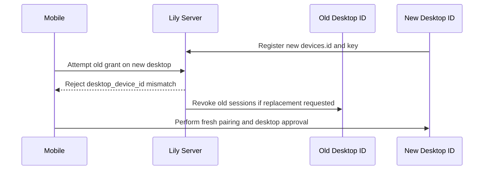
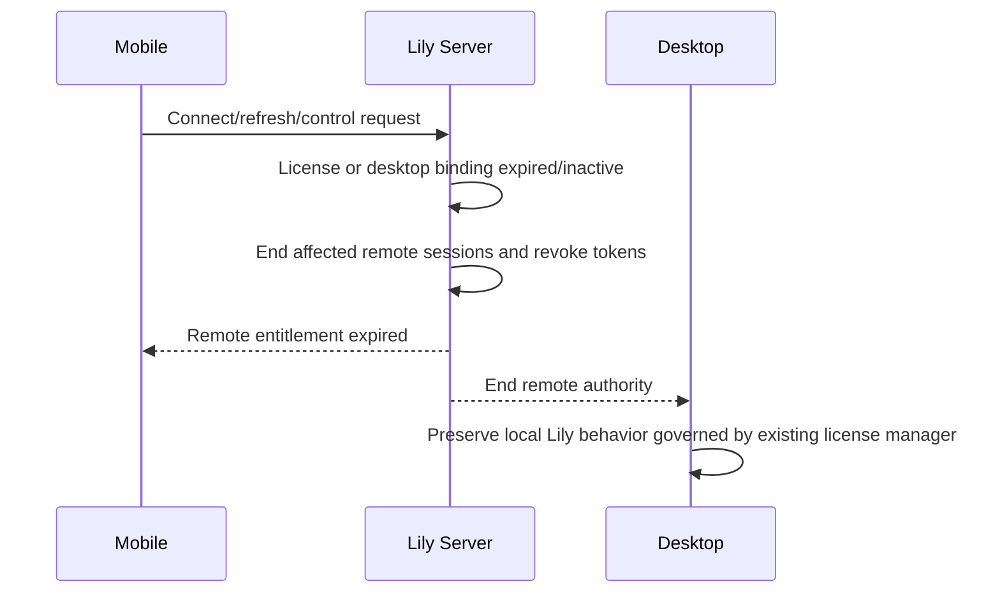
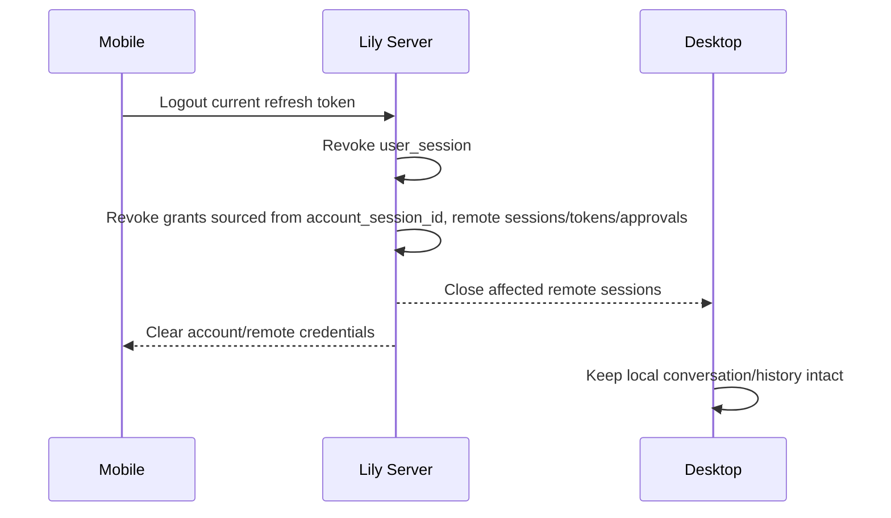

# Lily Mobile Command Pro Authentication And Identity Contract

## 1. Identity Boundaries

This contract owns authentication and identity semantics. Persistence is defined by [the data model](mobile-command-data-model.md); permission consequences are defined by [the permission and threat model](mobile-command-permission-threat-model.md).

The authorization subject is the tuple `(user_id, account_session_id, mobile_device_id, desktop_device_id, pairing_grant_id, license_id)`. Every element is revalidated on remote session creation, refresh, and reconnect. A signature authenticates a device key, not a user, license, pairing, remote permission, or command by itself.

| Identity | Canonical representation | Meaning | Must not be confused with |
|---|---|---|---|
| user/account | `users.id` | human account principal | phone number, license, device |
| license | `licenses.id` via active `license_devices` | current entitlement context | user identity or possession authority |
| desktop device | unified `devices.id` + role `desktop` | Lily desktop installation | fingerprint or license binding |
| mobile device | unified `devices.id` + role `mobile` | mobile installation | user or phone handset ownership claim |
| device key | active Ed25519 key for `devices.id` | proof of installation-held private key | account login or paired grant |
| account session | `user_sessions.id` | login/refresh state bound to user and device | remote session or Lily conversation |
| pairing challenge | `mobile_pairing_challenges.id` | one-time desktop invitation | paired authority |
| paired grant | `mobile_pairing_grants.id` | desktop-approved relationship | standing control permission |
| remote session | `mobile_remote_sessions.id` | bounded online channel authority | `user_sessions`, local Lily session, conversation |
| TURN credential | ephemeral ICE credential | relay authorization for one remote session | application access/refresh token |

Generic `account_id` is not persisted; where old prose says account ID it maps to `user_id = users.id`. `desktop_device_id` and `mobile_device_id` are typed relation names that both reference `devices.id`.

## 2. Credential Contract

| Credential | Issuer / audience | Binding and claims | TTL | Storage | Rotation | Replay defense | Revocation / offline behavior |
|---|---|---|---:|---|---|---|---|
| Account access token (existing) | Lily server / account APIs | signed `typ=access`, `sub=user_id`, `sid=account_session_id`, `did=device_id`, scopes, `iat`, `exp` | 15 min | mobile secure memory only; never persistent logs | mint on refresh; no silent extension | MAC verification, expiry, route scope; mutating device routes also require device signature/nonce | reject if expired, malformed, wrong scope/device, or backing session revoked; no offline authority |
| Account refresh token — current baseline | Lily server / current `/api/auth/session/refresh` | opaque random secret; hash uniquely identifies `user_sessions`; request signed by the same `device_id` | sliding 30 days: `SESSION_RENEWAL_TTL_MS = 30 * 24 * 60 * 60 * 1000` in `server/src/services/account-auth.js:9` | plaintext in the current client credential store; server stores HMAC hash | current route reuses the same refresh token/hash/version and extends `expires_at`; this is recorded behavior, not the Mobile Command target | unique hash, signed request, five-minute skew, per-device nonce and device match | logout, account/session/device revoke, or expiry; offline storage grants no authority |
| Account refresh token — planned Mobile rotation | Lily server / Mobile-capable `/api/auth/session/refresh` response contract | same account-session/device binding; request includes the old token whose hash and current `refresh_token_version` must match the locked row | sliding 30 days, preserving the current TTL constant | plaintext only in Keychain/Keystore; server stores the current HMAC hash plus invalidated hash tombstones in `user_session_refresh_token_history`; no plaintext | rotate on every successful Mobile refresh: in one transaction insert old hash/version tombstone, replace current hash, increment version, and return the new refresh token with the new access token | signed request and nonce plus compare-and-set on old hash/version; current-hash miss queries unexpired unique tombstone to locate the session; match revokes the account session and its remote grants | all baseline triggers plus old-token replay; tombstones purge at their original `expires_at`; legacy non-Mobile behavior remains unchanged until its separately versioned migration |
| Desktop device signature | desktop installation / Lily server and paired mobile verifier | Ed25519 signature over canonical method, path, RFC3339 timestamp, nonce, body hash; `device_id`, key generation | request only; ±5 min skew | private key OS credential store; public key server + paired trust record | monotonic generation; old key signs new key or desktop approval/re-pair | `request_nonces(device_id,nonce)` retained 10 min; body/path binding | key/device revoke rejects; offline server routes unavailable; local Lily unaffected |
| Mobile device signature | mobile installation / Lily server and paired desktop | same canonical envelope, plus remote-session and command identifiers in signed body | request/event only; ±5 min skew | private key Keychain/Keystore; PWA non-exportable WebCrypto only when supported | same monotonic rule; rollback generation rejected | nonce is scoped to mobile `devices.id`; remote event additionally binds session, desktop, sequence/idempotency | revoke ends grants/sessions; offline cannot gain authority; already displayed local content remains read-only |
| Pairing challenge token | Lily server after signed/authenticated desktop request / one mobile consume endpoint | opaque 256-bit token; server hash binds `pairing_id`, `user_id`, account session, desktop device, protocol | 5 min, one use | plaintext only in QR/in-memory desktop; hash at server | never rotated; create a new challenge | atomic `pending -> consumed`; token hash unique; consuming request signed by mobile key | cancel, consume, expiry, desktop/account session revoke; no offline consume |
| Pending paired grant | Lily server / named desktop and mobile | database capability record, not bearer secret; binds full subject tuple and license snapshot | desktop approval within 2 min | server DB; local UIs keep only ID/status | approval creates active state; replacement creates a new grant | compare-and-set approval and unique live pair prevent approval race | deny/timeout/account session or device/license invalidation; no offline authority |
| Paired-device grant | Lily server after desktop approval / remote-session creation | non-bearer record binding user/account session/devices/license/status | until revoked; revalidate at every use | server DB; desktop caches ID/status only | re-pair for device or account change; key rotation does not transfer identities | no secret to replay; requests still require account token + mobile signature | logout, either device revoke, user-device inactive, license invalid, risk action; offline cannot create session |
| Remote access token | Lily server / signaling and command APIs for exactly one remote session | signed bearer with `typ=remote_access`, remote session, full subject tuple, `access_token_generation`, scopes, `iat`,`exp` | 5 min | mobile memory and desktop process memory; never disk | minted from one-time remote refresh token; mint uses the locked session's current generation | every request loads the session and requires active, unexpired, exact subject tuple and token generation equality; mutations also require device signature | atomically incrementing `mobile_remote_sessions.access_token_generation` revokes every access token of the prior generation for that session; ending the session also rejects all generations; no per-token denylist or offline authority |
| Remote refresh token | Lily server / remote token refresh endpoint only | opaque random secret; stored hash binds remote session and monotonically increasing generation | 30 min, one use; session max 12 h | mobile secure store; server hash only | atomic consume issues next generation | used token marked `used_at`; reuse revokes entire family/session | all remote revocation triggers; unavailable offline and never falls back to account refresh token |
| TURN credential | Lily server credential endpoint / configured TURN realm only | ephemeral username includes remote session ID, peer role, expiry, random ID; password derived/signed for configured realm | 10 min and no later than remote session expiry | peer memory/ICE config only; TURN verifies, server need not persist plaintext | reissue only after full remote authorization | TURN nonce/integrity + expiry; username bound to session/role | remote-session end and short expiry; active allocation is force-closed when supported; TURN failure degrades to Chat Only, not another unapproved provider |

External provider selection is outside this contract. It defines credential shape and lifecycle for whichever TURN deployment is later accepted; it does not decide managed versus self-hosted TURN.

## 3. Authorization Rules

1. Composite FK `(account_session_id,user_id,mobile_device_id)` on the grant references explicit unique `user_sessions(id,user_id,device_id)`; the same transaction locks that account session and requires unrevoked, unexpired state.
2. The transaction locks both `(user_id,device_id)` `user_devices` rows and requires `status='active'`; it locks both `mobile_device_roles` rows and requires the desktop/mobile roles to be distinct and correct. These mutable predicates cannot be FKs, so failure rolls back.
3. Composite FK `(license_id,desktop_device_id)` on the grant references existing unique `license_devices(license_id,device_id)`; the transaction locks that binding and `licenses.id` and requires both statuses active and license unexpired. A mobile binding cannot substitute.
4. Unique grant key `(id,user_id,account_session_id,desktop_device_id,mobile_device_id,license_id)` is the target of the remote session's composite FK, making redundant tuple drift uncommittable.
5. Unique remote-session key `(id,mobile_device_id)` is the target of every approval's composite FK, making cross-device approval rows uncommittable.
6. The remote session is a separate row and token audience. It never inherits arbitrary account scopes, a local conversation ID, or standing Sensitive Ops permission.
7. Every remote-token request reads the remote session and requires `status='active'`, `expires_at>now()`, matching subject tuple, and matching `access_token_generation`. Server checks route/routing authority; desktop repeats grant, signature, session, permission, approval, and expiry checks before local effects.
8. Any mismatch fails safe for remote authority while leaving local Lily chat, history, tools, and existing license behavior unchanged.

## 4. Security-Critical Sequences

### 4.1 Initial pairing and desktop approval

```mermaid
sequenceDiagram
  participant U as User
  participant D as Desktop Lily
  participant S as Lily Server
  participant M as Mobile
  U->>D: Start pairing
  D->>S: Account access + desktop-signed challenge request
  S->>S: Validate user_session, user_device, desktop role, license binding
  S-->>D: One-time QR token (5 min)
  M->>M: Generate/retrieve Ed25519 device key
  M->>S: Consume token + account access + mobile-signed device data
  S->>S: Same user; atomic consume; create pending grant
  S-->>D: Approval request bound to grant/mobile key fingerprint
  U->>D: Approve once
  D->>S: Desktop-signed compare-and-set approval
  S->>S: Revalidate tuple/license; activate grant; audit
  S-->>M: Pairing active (no standing control permission)
```

The grant is never active merely because the QR token was consumed. A deny, timeout, concurrent decision, audit failure, or tuple change leaves it non-active.

### 4.2 Mobile reconnect

```mermaid
sequenceDiagram
  participant M as Mobile
  participant S as Lily Server
  participant D as Desktop
  M->>S: Access token + mobile signature + active grant ID
  S->>S: Revalidate account session, both devices, grant, key generation, license
  S->>D: Desktop-signed rendezvous request
  D->>D: Revalidate grant and local policy
  D-->>S: Accept
  S-->>M: 5 min remote access + one-time 30 min refresh
  M->>D: Connect with remote session tuple
  D->>D: Verify tuple/signature/session; default Chat Only
```

Reconnect after revocation creates no session and does not revive cached permissions.

### 4.3 Account access refresh

```mermaid
sequenceDiagram
  participant M as Mobile
  participant S as Lily Server
  participant DB as PostgreSQL
  M->>S: Old refresh token + observed version + matching device + signed nonce
  S->>DB: BEGIN; SELECT current user_session WHERE old hash FOR UPDATE
  alt current hash found
    DB-->>S: Stored old hash/version, device, expiry, revoked_at
    S->>S: Verify old hash, version, active session, 30-day expiry, device signature/binding
    S->>S: Generate new refresh token/hash and 15 min access token
    S->>DB: Insert old hash/version tombstone with original expires_at
    S->>DB: CAS current old hash/version; set new hash, version+1, last_seen_at, sliding expiry
    DB-->>S: Exactly one row updated; COMMIT
    S-->>M: New access token + new refresh token + new version
  else current hash not found
    S->>DB: Find unexpired tombstone by old token hash
    alt tombstone found (rotated-token replay)
      DB-->>S: Owning session_id and old version
      S->>DB: Revoke account session with refresh_replay reason; revoke sourced grants/sessions; audit
      S-->>M: SESSION_REVOKED; full login required
    else no tombstone
      S-->>M: SESSION_EXPIRED; no identity disclosed
    end
  end
```

The current-hash lookup itself is locking. A concurrent duplicate waits; after the winner commits, PostgreSQL rechecks the predicate, the loser finds no current row, and it follows the tombstone replay branch. Any other active-session, expiry, device, signature, version, tombstone-insert, or CAS failure rolls back token mutation and returns the bounded session/device error. The old tombstone is inserted before the current hash is replaced within the same transaction, so there is no committed state where the old hash is neither current nor queryable. The current baseline route verifies the same identity fields but returns only a new access token and keeps the existing refresh hash/version. Mobile Command requires the planned compare-and-set branch above; clients must not assume rotation exists until the versioned response advertises and returns `refreshToken` plus `refreshTokenVersion`. An account refresh token cannot refresh a remote token, and a remote refresh token cannot refresh an account session.

The Mobile client and desktop service must each serialize account refresh through a per-account-session single-flight operation. All waiters consume the one successful response and persist the returned refresh token/version atomically before another refresh begins. Concurrent use of the same token by a second process/request is deliberately treated as a security replay and revokes the account session; this fail-safe is not softened into a race grace period. Network retry logic must not resend a refresh token after the server may have committed its rotation: it first uses the single-flight result, and if delivery is indeterminate it requires full login instead of replaying the old token.

### 4.4 Device-key rotation

```mermaid
sequenceDiagram
  participant M as Mobile
  participant S as Lily Server
  participant D as Paired Desktop
  M->>M: Generate generation N+1 key
  M->>S: Rotation statement signed by active generation N and N+1
  S->>S: Require N current; reject generation rollback/reuse
  S->>D: Rotation notice with old/new fingerprints
  D-->>S: Acknowledge trusted tuple
  S->>S: Transactionally retire N; activate N+1; update compatibility key
  S-->>M: Rotation committed
```

If generation N is unavailable, rotation requires desktop approval or re-pairing. It never silently replaces the key through the existing upsert path.

### 4.5 Mobile-device revocation

```mermaid
sequenceDiagram
  participant U as User
  participant A as Authorized Client
  participant S as Lily Server
  participant D as Desktop
  U->>A: Revoke mobile device
  A->>S: Authenticated signed revoke
  S->>S: Revoke user_device, key, grants, sessions, tokens, approvals; append audit
  S-->>D: Immediate revoke event
  D->>D: Close channels and remove control authority
  S-->>A: Revocation complete
```

Audit failure blocks completion of a sensitive revoke transaction only when safe atomic recording is impossible; the server must then quarantine/deny the device immediately and retry durable audit.

### 4.6 Desktop replacement



Fingerprint or license recovery may preserve local licensing under existing rules; it never transfers a paired grant or remote permission.

### 4.7 Expired license



The server may use the existing same-device valid-license fallback for configuration, but remote authority is reissued only after the selected `license_id` is explicitly rebound/revalidated for the grant.

### 4.8 Account sign-out



Signing out one account session does not delete other valid account sessions unless the user selected global sign-out.

### 4.9 Stolen remote token rejection

```mermaid
sequenceDiagram
  participant X as Attacker
  participant S as Lily Server
  participant D as Desktop
  participant M as Mobile
  X->>S: Stolen remote access token + forged/missing device signature
  S-->>X: Reject signature/device binding
  M->>S: Report suspected access-token theft
  S->>S: Atomically increment session access_token_generation
  X->>S: Replay stolen prior-generation access token
  S-->>X: Reject generation mismatch
  X->>S: Replay used remote refresh token
  S->>S: Detect used generation; revoke token family/session; audit
  S-->>D: Close remote session
  S-->>M: Re-authentication and fresh session required
```

Bearer possession alone never authorizes a mutating command. Read-only projection is still bound to audience, tuple, current session state, TLS, and short expiry.

## 5. Clock, Replay, Rotation, And Offline Rules

- The database clock is authoritative for expiry, grant state, cleanup, and audit order. Clients display server-provided expiry and do not extend authority from their own clock.
- Signed requests use RFC 3339 timestamps compatible with current verification, a five-minute skew window, and nonce retention of ten minutes. Remote DataChannel envelopes additionally carry a per-session monotonic sequence; a reconnect resumes from an acknowledged cursor and cannot reset sequence under the same remote session.
- A nonce is unique per unified `device_id`; a payload signed for desktop A contains `desktop_device_id=A` and is invalid for desktop B even if the mobile key is the same.
- Key generation strictly increases. Servers and desktops persist the last accepted generation and reject older keys even when a stale backup restores them.
- Remote access-token generation is server state, not a client counter. Each request compares the signed claim with the locked/current `mobile_remote_sessions.access_token_generation`; logout, device/grant/license/key risk revocation, or suspected token theft atomically increments it. That increment invalidates all access tokens minted for the previous generation of that session without a per-token denylist.
- No credential grants offline command, control, approval, pairing, refresh, TURN allocation, or entitlement. Network loss may preserve already-rendered read-only data; local desktop Lily continues independently.

## 6. Compatibility And Failure Contract

Current account access, account refresh, web session, Ed25519 request signing, nonce, and license fallback behavior remain compatible. New remote credentials are additive audiences and cannot be accepted by existing account endpoints. Older clients that do not understand the remote contract see the feature disabled. Unknown identity state, unavailable replay protection, missing audit for sensitive authority, stale key generation, or license ambiguity rejects remote authority explicitly; none may downgrade the desktop model, tools, local conversation, or local license flow.
