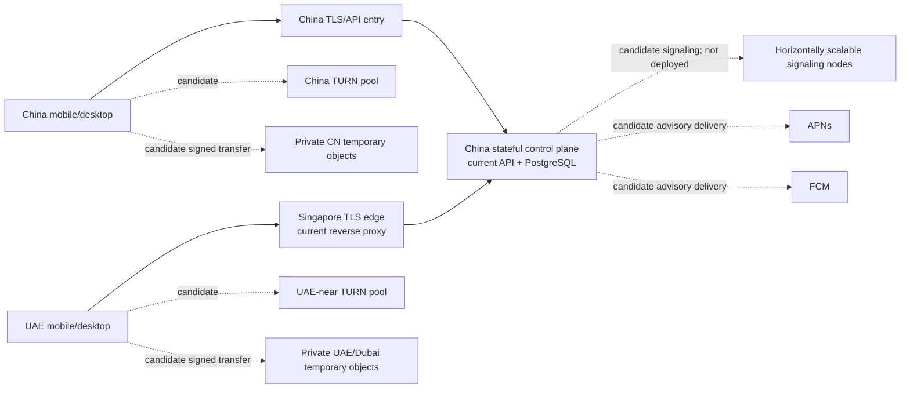

# Lily Mobile Command Pro Infrastructure Deployment Evidence

## 1. Status And Scope

- Spec: MC-SPEC-023
- Status: **evidence-needed**
- Evidence date: 2026-07-12
- Scope: candidate deployment topology and the evidence required to accept MC-ADR-004, MC-ADR-009, and MC-ADR-010.
- Non-claim: this document does not prove that signaling, TURN, push, private temporary storage, regional data planes, dashboards, or kill switches are deployed.

Mobile Command infrastructure release is **BLOCKED**. Provider names below are candidates, not selections. A candidate becomes accepted only after the listed account/configuration artifacts, regional tests, security/privacy approval, load evidence, and quote are attached to the ADR.

## 2. Audited Current Baseline

| Fact | Evidence status | Operational consequence |
|---|---|---|
| `lilych.lilywb.cn` serves the stateful API/web workload from Alibaba ECS in China; PostgreSQL is local to that host | VERIFIED-REPOSITORY in `memory/server-deploy-flow.md` | A future signaling/API control plane may extend this deployment, but no Mobile Command route or capacity is proven |
| `lilyxinjiapo.lilywb.cn` terminates TLS on a Singapore host and proxies API/web/LLM traffic to China with `X-Lily-Region: uae` | VERIFIED-REPOSITORY | This is an edge reverse proxy, not a UAE stateful deployment or data-residency proof |
| Qiniu bucket/domain support public release artifacts and feedback/contact attachment flows | VERIFIED-REPOSITORY in deploy scripts and `server/src/services/qiniu-upload.js` | The existing bucket/domain is **not approved** for private Mobile Command uploads, audio, screenshots, or artifacts |
| No Mobile Command signaling, TURN, push, or private temporary-object service is implemented/deployed | VERIFIED-REPOSITORY absence; implementation specs remain planned | Release and production enablement remain blocked |

No production system was accessed for this evidence record.

## 3. Candidate Regional Topology



Candidate rules:

- Stateful authority remains server-side; an edge may terminate TLS and proxy but may not invent authorization.
- Signaling nodes must be stateless except for bounded connection state; shared session/revocation state needs an accepted durable/cache design before horizontal scale.
- Connection draining must stop new sessions, preserve existing WebSockets for a configured drain window, and then force canonical reconnect. The window is **UNVERIFIED**; required artifact: measured reconnect/drain test with client versions and loss/error results.
- Region failure disables sensitive remote capability and preserves Chat Only/local Lily. Cross-region storage or state failover is prohibited until approved for residency and deletion semantics.

## 4. Provider Candidate Evidence

| Capability | Candidate evidence | Current result | Exact acceptance artifacts |
|---|---|---|---|
| TURN | Twilio Network Traversal Service and self-hosted coturn have official product/project documentation | **UNVERIFIED**; no Lily account, enabled regions, credential configuration, representative relay tests, abuse controls, capacity result, or quote | account/tenant identifier (redacted); enabled-region console export; credential issuer config; CN/UAE UDP/TCP/TLS test matrix; concurrent-session/bandwidth load report; abuse/rate-limit test; DPA/subprocessor review; dated quote |
| iOS push | Apple Push Notification service is the platform candidate | **UNVERIFIED**; no Lily App ID, entitlement, environment credentials, token lifecycle test, or delivery evidence | App ID/team ownership; entitlement/profile export; secret-store record; sandbox/production token rotation and revoke test; payload privacy review; delivery/expiry test; Apple operational owner sign-off |
| Android push | Firebase Cloud Messaging is the candidate outside constrained China devices | **BLOCKED** for China Android devices without Google Play services; globally **UNVERIFIED** | Firebase project ownership; service-account audience/role export; supported-device matrix; China vendor-device tests; accepted no-push/poll or alternate-provider decision; payload privacy review; token revoke/rotation test; dated quota/price evidence |
| CN temporary objects | Dedicated private Qiniu CN bucket or Alibaba OSS CN region | **UNVERIFIED**; current public Qiniu bucket is not acceptable evidence | Lily-owned account/bucket ID; private ACL and public-access-block export; region; KMS/SSE settings; signed URL policy; lifecycle rule; deletion/versioning proof; access-log redaction; malware scan path; quota/load test; DPA; quote |
| Singapore temporary objects | Dedicated private Qiniu Singapore bucket candidate | **UNVERIFIED** | same artifacts as above plus Lily account availability, Singapore region console evidence, UAE cross-border approval, latency/load and egress quote |
| UAE temporary objects | Alibaba Cloud OSS Dubai candidate; Qiniu evidence has no proven UAE region | **UNVERIFIED**; no Lily account/configuration/quote | Lily-owned Alibaba account/bucket; Dubai region console export; private ACL/public-access block; KMS/SSE; lifecycle/deletion/versioning proof; signed URL policy; residency/DPA approval; load report; egress/storage/API quote |

Official candidate references: [Twilio Network Traversal](https://www.twilio.com/docs/stun-turn), [coturn](https://github.com/coturn/coturn), [APNs overview](https://developer.apple.com/notifications/), [FCM documentation](https://firebase.google.com/docs/cloud-messaging), [Qiniu object storage](https://www.qiniu.com/products/kodo), and [Alibaba Cloud OSS regions](https://www.alibabacloud.com/help/en/oss/user-guide/regions-and-endpoints). These sources prove candidate capability only, not Lily deployment suitability.

## 5. Trust Boundaries, Secrets, And Rotation

| Secret/credential | Holder and audience | Delivery | Rotation/revocation evidence gate |
|---|---|---|---|
| TLS private keys | edge/control-plane secret store; audience is named domain listener | never client-delivered | **UNVERIFIED**: certificate inventory, expiry alert, issuance/renewal and emergency revoke drill |
| TURN root/API secret | credential issuer only; audience is selected TURN tenant/service | derives session-bound credentials; never shipped in app | **BLOCKED**: selected provider/config plus rotation-with-active-session test |
| TURN ephemeral credential | one account + remote session + ICE service | authenticated response; max TTL remains a proposed contract, not measured | **UNVERIFIED**: issuer implementation, audience validation, expiry/replay/revocation test |
| APNs signing key/certificate | push worker; audience Apple APNs + app topic/environment | server secret store only | **BLOCKED**: Lily App ID/key ownership and rotation drill |
| FCM service credential | push worker; audience exact Firebase project/API | workload identity or secret store; never mobile bundle | **BLOCKED**: Lily Firebase project/IAM export and revoke drill |
| Storage access key/KMS grant | transfer service; audience exact private bucket/region | workload identity preferred; no client long-lived key | **BLOCKED**: selected Lily account/bucket, least-privilege policy and rotation drill |
| Signed object URL/token | one object/action/account/device, short expiry | returned after authorization | **UNVERIFIED**: implementation proving audience binding, replay rejection, expiry, revocation and redacted logs |

Every long-lived secret needs an owner, environment (`dev`, `staging`, `production`), audience, creation date, last/next rotation, emergency revocation command, and audit record. Missing metadata blocks rollout. Rotation must overlap only as long as needed for an observed zero-downtime test; no universal shared secret may be baked into web/native bundles.

## 6. Capacity And Cost Model

No numeric threshold is accepted. For each low/expected/high scenario, operations must provide these dated inputs:

- `C`: peak concurrent remote sessions by region;
- `r`: relay ratio from representative networks;
- `b`: average bidirectional relayed bitrate in Mbps;
- `h`: average session hours; `S`: monthly sessions;
- `w`: peak WebSocket connections; `m`: signaling messages/second; `p`: push notifications/month;
- `u`: uploaded GB/month; `d`: downloaded GB/month; `o`: average retained object GB; `q`: object API operations/month;
- provider unit prices, included allowances, taxes, minimums, and cross-region/Internet egress.

Required calculations:

```text
peak TURN Mbps = C × r × b × headroom_factor
monthly TURN GB = S × h × 3600 × r × b / 8 / 1000
signaling nodes = ceil(max(w / tested_ws_per_node, m / tested_msgps_per_node) × headroom_factor)
monthly storage cost = o × storage_price + q × request_price + (u + d) × applicable_transfer_prices
monthly push cost = p × provider_unit_price + platform/minimum charges
monthly total = compute + database/cache + TURN + storage + egress + push + telemetry + support/minimums + tax
```

`headroom_factor`, tested node limits, unit prices, budget, warning threshold, hard cap, and degradation action are **BLOCKED** until finance and operations attach a dated quote, load methodology/results, traffic assumptions, and approved budget. Cost runaway must first disable relay/upload for affected scope while preserving Chat Only; an unimplemented kill switch cannot be treated as a cap.

## 7. Backup, DR, And Dependency Failure

- Temporary objects must be excluded from backups unless privacy explicitly approves a bounded encrypted recovery copy. Lifecycle expiry is not deletion proof until object versions, multipart remnants, replicas and backups are demonstrated absent or expired.
- Stateful control-plane recovery point/recovery time objectives are **UNVERIFIED**. Required artifact: backup inventory, restore drill, measured RPO/RTO, regional dependency map, and privacy-approved restore/deletion reconciliation.
- TURN outage: stop issuing credentials, show recoverable Live Control failure, preserve Chat Only.
- Push outage: queue only the strict opaque advisory-intent allowlist governed by [MC-SPEC-024](mobile-command-privacy-retention-compliance.md), with accepted expiry/collapse/dedupe/deletion and regional evidence, or rely on reconnect/poll. The queue cannot contain notification, task, message, file, command or approval content and push failure never blocks commands or approvals.
- Storage outage: reject new transfers explicitly, preserve local draft/file, and never inject partial/unverified bytes into Lily.
- Edge outage: clients may use only an accepted signed/bootstrap fallback; no guessed endpoint or policy downgrade.

## 8. Acceptance Gate

MC-SPEC-023 and MC-ADR-004/009/010 stay `evidence-needed`/`proposed` until every selected region has provider/account/config evidence, security and privacy approval, representative load/failure tests, a dated quote/budget, secret rotation proof, deletion proof, and rollback/kill-switch verification. Candidate documentation alone is not acceptance.
