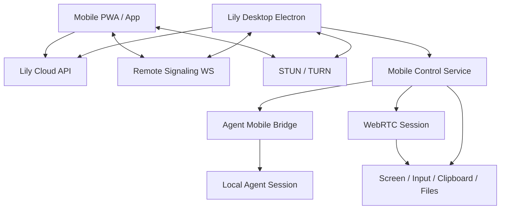

# Lily Mobile Command Pro 落地文档

## 1. 目标

Lily Mobile Command Pro 是 Lily Workbench 的手机端远程指挥能力。它不是传统远程桌面工具，而是一个 chat-first 的移动控制平面：

- 默认通过手机向电脑端 Lily agent 发送自然语言、语音、图片和文件任务。
- 电脑端 agent 在本机执行任务，手机端查看流式回复、工具进度、确认请求和结果文件。
- 只有在 agent 需要用户介入、查看屏幕或手动操作时，才进入 WebRTC 远程查看/控制。
- 任意远控能力失败时，必须降级到今天的电脑端 Lily 基线能力，不影响本地会话、工具、模型和历史。
- 任意权限判断失败时，必须拒绝高风险控制或敏感动作，不能默认放行。

上线版一次性交付完整生产能力，不按 MVP 对外发布。内部开发仍按依赖顺序分阶段合入。

## 2. 非目标

- 不做一个绕开 Lily agent 的纯远程桌面产品。
- 不把手机端做成复杂功能面板；手机端主入口仍是对话。
- 不把屏幕流或输入控制走自研视频协议；实时控制使用 WebRTC。
- 不让服务端保存屏幕内容、输入内容、剪贴板明文或文件正文。
- 不在远控失败时创建第二套 agent、第二套历史或不可追踪的临时会话。
- 不默认开放全桌面控制。

## 3. 用户体验

### 3.1 典型流程

1. 用户在电脑端 Lily 打开“手机连接”入口，生成二维码。
2. 手机扫码登录并配对当前电脑。
3. 电脑端确认绑定此手机。
4. 手机端默认进入 Command 页面。
5. 用户用语音或文字发送任务：`帮我把桌面上的合同转成 PDF，检查签名页，然后发我手机。`
6. 电脑端 Lily 当前会话收到消息，agent 开始执行。
7. 手机端显示 agent 流式回复、工具进度、文件结果和必要确认。
8. 如果需要人工介入，手机端进入 Live Control。
9. 默认只能查看/控制 Lily 窗口；全桌面控制必须临时授权。
10. 退出控制、断线、锁屏或超时后自动降回 Chat Only。

### 3.2 手机端页面

- 手机端名称和 logo 必须与桌面端 Lily Workbench / 智能工作台一致。手机端可以作为 `Lily Workbench Mobile` / `智能工作台手机端` 出现，但不能另起独立品牌、独立 logo 或独立图标风格。
- 手机端 PWA manifest、iOS home-screen icon、Android launcher icon、启动页、通知图标和站内 logo 必须从桌面端 `resources/icon-source.png`、`resources/icon.png`、`resources/icon.ico`、`resources/icon.icns`、`resources/.iconset/` 派生。

- Command：默认页。语音优先输入，支持点按说话、按住说话、实时/近实时转写、转写后编辑、继续补说；同时保留文字、拍照、上传文件、查看流式回复、工具卡、结果文件和确认卡。
- Live Control：WebRTC 屏幕流、触控板、虚拟键盘、快捷键、剪贴板请求、退出控制。
- Devices：已绑定电脑、在线状态、最近活动、重命名、撤销绑定。
- Files：当前任务产物和最近传输文件。
- Approvals：高风险动作确认队列。

手机端 UI 是观测和安全外壳，不是业务操作主界面。业务动作尽量通过自然语言任务完成。

## 4. 总体架构



### 4.1 三条通道

Agent Command 通道：

- 手机发自然语言、语音转写文本、图片、文件。
- 服务端只做认证、路由和在线状态。
- 电脑端将消息注入目标 Lily session。
- agent 输出、工具进度、结果文件回传手机。

WebRTC Media 通道：

- 手机和电脑建立 PeerConnection。
- 传输 Lily 窗口或桌面视频流。
- 服务端只做 signaling 和 TURN 凭证签发。

WebRTC DataChannel 通道：

- 传输 pointer、keyboard、clipboard request、health stats。
- 每个事件都在电脑端经过权限策略判断。

## 5. 手机端技术架构

上线版建议采用 Web-first + Native Capability Shell：界面、路由、状态、协议、WebRTC 和业务逻辑保持 Web/PWA 化，但在 iOS/Android 上用轻量原生壳暴露底层能力。不要用 Swift/Kotlin 重写两套业务 UI；原生层只做 Web 做不好或不稳定的能力适配，例如后台上传、系统 push、分享入口、安全密钥、文件选择和权限桥接。

### 5.1 技术栈建议

| 层 | 建议 |
|---|---|
| UI | React + TypeScript |
| 构建 | Vite 或 Next.js app shell |
| 状态 | Zustand 或 Redux Toolkit |
| 数据请求 | fetch wrapper + typed API client |
| 实时通道 | WebSocket client |
| WebRTC | Browser WebRTC APIs |
| 上传 | resumable upload queue |
| 本地存储 | IndexedDB + WebCrypto |
| PWA | Service Worker + Web App Manifest |
| 原生能力壳 | Capacitor 优先，必要时自研极薄 native bridge |

如果 `web/` 已有 Next.js 站点，手机端可以作为独立 route group 或独立 app 包存在；不要把远控状态机塞进营销页组件。原生壳加载同一套 Web app bundle，不拥有业务状态机。

### 5.1.1 原生能力壳边界

原生层只允许提供 capability adapter，不允许承载业务流程：

| 能力 | Web/PWA | 原生能力壳 |
|---|---|---|
| UI/路由/状态 | 拥有 | 不拥有 |
| Agent command | 拥有 | 只提供网络环境和通知唤醒 |
| WebRTC | 默认使用浏览器 API | 必要时提供音视频会话保活和权限提示 |
| 文件上传 | 分片队列和状态机 | 后台上传、系统文件选择、分享入口 |
| Push | Web Push 能用则用 | iOS/Android 系统 push |
| 密钥 | WebCrypto/IndexedDB | Keychain / Android Keystore |
| 扫码 | Web Camera API | 系统相机扫码兜底 |
| 权限 | 展示和流程 | 系统权限申请/状态读取 |

禁止事项：

- 不在原生层实现一套独立聊天 UI。
- 不在原生层保存 Lily conversation 状态。
- 不在原生层直接拼接 remote protocol。
- 不让原生层绕过 Web 侧 permission-policy 和 approval flow。
- 不把原生 bridge 做成任意命令执行入口。

原生 bridge 调用必须是白名单 API，例如：

```ts
type NativeBridge = {
  secureKey: {
    generateDeviceKey(): Promise<{ publicKey: string; keyHandle: string }>;
    sign(keyHandle: string, payload: string): Promise<string>;
    deleteDeviceKey(keyHandle: string): Promise<void>;
  };
  upload: {
    startBackgroundUpload(request: NativeUploadRequest): Promise<NativeUploadHandle>;
    getUploadStatus(handle: string): Promise<NativeUploadStatus>;
    cancelUpload(handle: string): Promise<void>;
  };
  push: {
    register(): Promise<{ pushToken: string; platform: 'ios' | 'android' }>;
    unregister(): Promise<void>;
  };
  share: {
    getPendingSharedFiles(): Promise<SharedFile[]>;
  };
  permissions: {
    getCameraStatus(): Promise<PermissionStatus>;
    requestCamera(): Promise<PermissionStatus>;
    getNotificationStatus(): Promise<PermissionStatus>;
    requestNotifications(): Promise<PermissionStatus>;
  };
};
```

所有 bridge 返回值都必须进入 Web 侧 typed adapter，再进入状态机；React 组件不能直接调用 native bridge。

### 5.2 App 端目录建议

```text
web/mobile-command/
  app/
    App.tsx
    routes/
      CommandRoute.tsx
      LiveControlRoute.tsx
      DevicesRoute.tsx
      FilesRoute.tsx
      ApprovalsRoute.tsx
  components/
    chat/
    live/
    files/
    approvals/
    devices/
  services/
    api-client.ts
    auth-client.ts
    pairing-client.ts
    device-client.ts
    remote-session-client.ts
    signaling-client.ts
    webrtc-client.ts
    data-channel-client.ts
    upload-client.ts
    download-client.ts
    push-client.ts
  state/
    auth-store.ts
    device-store.ts
    command-store.ts
    remote-session-store.ts
    live-control-store.ts
    upload-store.ts
    approval-store.ts
  domain/
    protocol.ts
    permissions.ts
    upload-state-machine.ts
    webrtc-state-machine.ts
    retry-policy.ts
    risk-labels.ts
  storage/
    secure-device-key.ts
    indexed-db.ts
    upload-drafts.ts
  telemetry/
    mobile-events.ts
```

边界：

- React components 只负责渲染和事件绑定。
- `domain/` 放纯状态机和判断逻辑，必须可单测。
- `services/` 放 HTTP、WebSocket、WebRTC 和浏览器 API 适配。
- `state/` 只组合状态，不直接实现协议细节。
- `storage/` 负责 IndexedDB、key material 和本地草稿。

### 5.3 手机端核心状态机

Remote session state：

```text
idle
pairing
paired
desktop_offline
chat_ready
live_connecting
live_observing
control_app
control_desktop
reconnecting
permission_pending
ended
error_recoverable
error_final
```

WebRTC state：

```text
new
signaling
ice_gathering
connecting
connected
degraded
reconnecting
failed
closed
```

Upload state 使用第 15.1 节状态机。三个状态机互相引用但不能混在一个全局 reducer 里。

### 5.4 App 端启动流程

1. 加载本地 device key 和 account session。
2. 拉取 feature config。
3. 获取已绑定 desktop devices。
4. 建立 command WebSocket。
5. 恢复最近 remote session 状态。
6. 查询未完成上传和待确认 approvals。
7. 进入 Command 页面。

任一步失败：

- 认证失败：进入登录。
- config 不支持 mobile control：隐藏远控入口。
- WebSocket 失败：显示离线，但允许查看本地历史和重试。
- 上传恢复失败：显示可恢复错误，不阻塞 chat。

### 5.5 App 端安全存储

- 手机设备私钥由 WebCrypto 生成。
- PWA 优先使用 non-exportable CryptoKey；如平台不支持，降级为加密后的 IndexedDB key，并标记安全等级。
- 带原生能力壳的版本必须使用 Keychain / Android Keystore，并只向 Web 层暴露 `keyHandle` 和签名结果，不暴露私钥。
- device key 丢失时，该手机绑定失效，需要重新配对。
- 不在 localStorage 存 access token、device private key 或长期 refresh token。

### 5.6 App 端网络层

`api-client.ts` 要统一处理：

- auth header。
- device signature。
- request id。
- idempotency key。
- timeout。
- retry policy。
- typed error code。
- server clock skew。

写请求默认不自动重试，除非带 idempotency key。读请求可以有限重试。

WebSocket 需要：

- 心跳。
- 指数退避重连。
- session resume。
- message ack。
- backpressure。
- foreground/background 状态感知。

### 5.7 Command 页面架构

Command 页面数据来源：

- command WebSocket：agent stream、tool progress、approval、artifact。
- HTTP：历史消息、设备状态、文件列表。
- upload queue：本地上传进度。

组件：

- `CommandComposer`：语音优先输入、文字编辑、拍照、文件选择。
- `StreamTranscript`：流式回复和工具进度。
- `ApprovalCard`：敏感动作确认。
- `ArtifactList`：结果文件。
- `ConnectionBanner`：电脑在线、离线、重连、降级。

Command 页面不能直接调用 WebRTC 或 OS control API；只通过 `remote-session-store` 请求模式变化。

Command composer 交互要求：

- 手机端默认突出语音输入，文字输入保留但不喧宾夺主。
- 语音不是录音附件，而是转成可编辑命令草稿。
- 用户可以“说一段 -> 改几个字 -> 继续说 -> 发送”。
- 语音失败保留已有草稿，降级到文字输入。
- 高风险语音命令仍走 approval，不允许直接越权执行。

### 5.8 Live Control 页面架构

组件：

- `VideoSurface`：显示 remote video track。
- `TouchLayer`：把触摸转换成规范化 pointer events。
- `KeyboardBar`：输入、快捷键、Esc、Enter、复制、粘贴。
- `PermissionBanner`：当前权限和剩余 TTL。
- `ControlToolbar`：退出控制、切换 App/Desktop、缩放。
- `StatsOverlay`：调试模式下显示 RTT、fps、packet loss。

触控映射：

- 单指移动：pointer move。
- 单指点击：left click。
- 双指滑动：scroll。
- 双指缩放：仅改变手机端显示缩放，不发送 OS pinch，除非明确开启。
- 长按：右键或上下文菜单，按平台适配。

坐标：

- 手机端只发送 0-1 归一化坐标和目标 surface id。
- 桌面端根据实际 capture source 映射到窗口或屏幕。
- 手机端不发送绝对屏幕坐标。

### 5.9 App 端上传队列

上传队列职责：

- 文件选择、拍照文件、分享入口文件统一入队。
- 计算 sha256。
- 分片。
- 暂停/继续。
- 后台恢复。
- 缺失 chunk 查询。
- 上传完成后等待 desktop staging。
- 上传失败分类为 recoverable / final。

PWA 限制：

- iOS Safari 后台上传不可靠，必须在 UI 上显示风险。
- 页面关闭后只能依赖 IndexedDB 恢复元数据，不能保证未完成传输继续。
- 带原生能力壳的版本启用稳定后台上传，但上传状态仍回写 Web 侧 upload state machine。

### 5.10 App 端 push 和通知

通知类型：

- `approval_required`
- `task_completed`
- `desktop_offline`
- `remote_control_revoked`
- `file_ready`

通知点击后必须深链到对应 remote session / Lily session。通知正文不能包含敏感文件内容或屏幕内容。

### 5.11 App 端离线体验

- 可查看最近设备列表和最近任务摘要缓存。
- 可编辑待发送草稿。
- 不允许显示“已发送”直到服务端 ack。
- 离线期间选择的文件只存在本地上传队列，恢复在线后再请求用户确认发送。

### 5.12 App 端错误模型

统一错误结构：

```ts
type MobileCommandError = {
  code: string;
  category: 'auth' | 'network' | 'permission' | 'desktop' | 'webrtc' | 'upload' | 'server';
  recoverable: boolean;
  userMessageKey: string;
  retryAfterMs?: number;
  correlationId?: string;
};
```

UI 显示用户可理解的中文/英文文案；日志保留 error code 和 correlation id。

## 6. 权限模型

### 6.1 权限等级

| Level | 名称 | 能力 |
|---|---|---|
| 0 | Offline | 无远程连接 |
| 1 | Chat Only | 发送 agent 消息、上传文件、查看回复和结果 |
| 2 | Observe App | 查看 Lily 窗口 |
| 3 | Control App | 控制 Lily 窗口 |
| 4 | Observe Desktop | 查看整个桌面 |
| 5 | Control Desktop | 控制整个桌面 |
| 6 | Sensitive Ops | 删除、外发、终端、安装、系统设置等敏感动作 |

默认绑定后只有 Level 1。Level 2 以上按 session 临时授权。Level 6 永远是具体动作级确认，不能长期授权。

### 6.2 自动降权

以下情况必须自动撤销 Level 2 以上权限：

- 手机 WebSocket 或 WebRTC 断线。
- 电脑锁屏、休眠、切换系统用户。
- 远控会话超过 TTL。
- 用户 10 分钟无输入。
- 电脑端用户点击停止远控。
- 权限策略模块异常。
- audit 写入失败且当前动作为敏感动作。

### 6.3 高风险动作

以下动作必须触发确认：

- 删除或覆盖用户文件。
- 发送邮件、消息、表单提交。
- 上传文件到外部服务。
- 运行 shell、PowerShell、脚本或安装程序。
- 安装软件或修改系统设置。
- 读取/写入剪贴板敏感内容。
- 进入支付、转账、账号安全等页面的操作。

确认卡必须说明：

- 将执行什么。
- 影响哪些文件、账号或外部服务。
- 来源任务和当前设备。
- 授权范围：一次性或短时 TTL。

## 7. 桌面端模块

新增目录：

```text
src/main/mobile-control/
  index.js
  mobile-control-service.js
  pairing-service.js
  device-registry.js
  cloud-relay-client.js
  signaling-client.js
  rtc-session-manager.js
  screen-capture-service.js
  input-control-service.js
  clipboard-bridge.js
  file-transfer-service.js
  agent-mobile-bridge.js
  permission-policy.js
  approval-service.js
  audit-log-service.js
  remote-health-service.js
  protocol.js
```

职责边界：

- `mobile-control-service.js`：生命周期编排。启动、停止、重连、绑定各服务。不写协议判断和 OS 操作。
- `pairing-service.js`：生成配对 token、二维码 payload、消费配对结果。
- `device-registry.js`：本地保存已绑定手机 public key、设备名、撤销状态和最后使用时间。
- `cloud-relay-client.js`：桌面到服务端 WebSocket。收发 command、presence、approval、session 事件。
- `signaling-client.js`：WebRTC offer/answer/ICE 的信令适配。
- `rtc-session-manager.js`：创建 PeerConnection、管理 tracks、DataChannel、重连和关闭。
- `screen-capture-service.js`：Lily 窗口采集、桌面采集、分辨率/帧率控制、隐私遮罩。
- `input-control-service.js`：鼠标、键盘、滚动输入注入。调用前必须经过 `permission-policy`。
- `clipboard-bridge.js`：剪贴板读写请求，默认敏感，需要确认。
- `file-transfer-service.js`：手机上传文件落到 Lily 文件暂存，结果文件生成可下载链接。
- `agent-mobile-bridge.js`：手机消息进入 Lily session；agent 输出投递回手机。
- `permission-policy.js`：纯逻辑权限判断，必须可单测。
- `approval-service.js`：确认请求、TTL、一次性授权、撤销。
- `audit-log-service.js`：本地审计日志和服务端摘要同步。
- `remote-health-service.js`：延迟、丢包、重连次数、权限状态、故障原因。
- `protocol.js`：事件 schema、版本、校验和 idempotency key 规范。

不要把以上职责塞进 `ipc-handlers.js`、`agent-session.js` 或 renderer 大文件。

## 8. 服务端模块

新增或扩展：

```text
server/src/routes/public/mobile-pairing.js
server/src/routes/public/mobile-devices.js
server/src/routes/public/remote-sessions.js
server/src/routes/public/remote-signaling.js
server/src/routes/public/remote-turn.js
server/src/services/mobile-device-service.js
server/src/services/remote-session-service.js
server/src/services/remote-signaling-service.js
server/src/services/remote-audit-service.js
```

服务端职责：

- 设备绑定、撤销、在线状态。
- 配对 token 生成和消费。
- 手机与电脑之间的 signaling。
- TURN 短期凭证签发。
- 远程 session 生命周期。
- 审计摘要入库。
- 限流、风控、版本兼容。

服务端不负责：

- 保存屏幕帧。
- 保存输入内容。
- 保存剪贴板明文。
- 执行 agent 任务。
- 代替电脑端做权限放行。

## 9. 数据库设计

```sql
CREATE TABLE mobile_devices (
  id TEXT PRIMARY KEY,
  account_id TEXT NOT NULL,
  desktop_device_id TEXT NOT NULL,
  device_name TEXT NOT NULL,
  public_key TEXT NOT NULL,
  platform TEXT,
  trusted_at INTEGER NOT NULL,
  last_seen_at INTEGER,
  revoked_at INTEGER,
  created_at INTEGER NOT NULL,
  updated_at INTEGER NOT NULL
);

CREATE TABLE remote_pairing_tokens (
  token_hash TEXT PRIMARY KEY,
  account_id TEXT NOT NULL,
  desktop_device_id TEXT NOT NULL,
  expires_at INTEGER NOT NULL,
  consumed_at INTEGER,
  created_at INTEGER NOT NULL
);

CREATE TABLE remote_sessions (
  id TEXT PRIMARY KEY,
  account_id TEXT NOT NULL,
  desktop_device_id TEXT NOT NULL,
  mobile_device_id TEXT NOT NULL,
  permission_level INTEGER NOT NULL,
  started_at INTEGER NOT NULL,
  ended_at INTEGER,
  end_reason TEXT,
  created_at INTEGER NOT NULL,
  updated_at INTEGER NOT NULL
);

CREATE TABLE remote_session_permissions (
  id TEXT PRIMARY KEY,
  remote_session_id TEXT NOT NULL,
  capability TEXT NOT NULL,
  permission_level INTEGER NOT NULL,
  expires_at INTEGER NOT NULL,
  revoked_at INTEGER,
  created_at INTEGER NOT NULL
);

CREATE TABLE remote_audit_events (
  id TEXT PRIMARY KEY,
  account_id TEXT NOT NULL,
  remote_session_id TEXT,
  desktop_device_id TEXT NOT NULL,
  mobile_device_id TEXT,
  event_type TEXT NOT NULL,
  risk_level TEXT NOT NULL,
  summary TEXT NOT NULL,
  created_at INTEGER NOT NULL
);
```

迁移要求：

- 所有表 additive。
- 老服务端没有这些表时，老客户端行为不变。
- 老桌面端没有 mobile config 时，不启动 mobile-control service。

## 10. API 合同

### 10.1 配对

`POST /public/mobile/pairing/start`

请求：

```json
{
  "desktopDeviceId": "desktop_123"
}
```

响应：

```json
{
  "pairingId": "pair_123",
  "qrPayload": "lily://pair?...",
  "expiresAt": 1783820000000
}
```

`POST /public/mobile/pairing/consume`

请求：

```json
{
  "pairingToken": "one-time-token",
  "mobileDeviceName": "iPhone 16",
  "mobilePublicKey": "base64..."
}
```

响应：

```json
{
  "mobileDeviceId": "mobile_123",
  "desktopDeviceId": "desktop_123",
  "requiresDesktopApproval": true
}
```

### 10.2 设备

`GET /public/mobile/devices`

返回绑定设备、在线状态、最后活动时间。

`DELETE /public/mobile/devices/:id`

撤销手机设备。撤销后所有 active remote sessions 必须结束。

### 10.3 远控会话

`POST /public/remote/sessions`

请求：

```json
{
  "desktopDeviceId": "desktop_123",
  "mobileDeviceId": "mobile_123",
  "requestedLevel": 1
}
```

响应：

```json
{
  "remoteSessionId": "rs_123",
  "permissionLevel": 1,
  "expiresAt": 1783820000000
}
```

`POST /public/remote/sessions/:id/permissions`

请求：

```json
{
  "requestedLevel": 5,
  "reason": "用户请求全桌面控制",
  "ttlSeconds": 600
}
```

响应：

```json
{
  "status": "pending_desktop_approval",
  "approvalId": "appr_123"
}
```

### 10.4 Signaling

`GET /public/remote/signaling/ws`

WebSocket 消息：

```json
{
  "version": 1,
  "id": "evt_123",
  "type": "webrtc.offer",
  "remoteSessionId": "rs_123",
  "fromDeviceId": "mobile_123",
  "toDeviceId": "desktop_123",
  "timestamp": 1783820000000,
  "payload": {}
}
```

### 10.5 TURN

`POST /public/remote/turn-credentials`

响应短期凭证：

```json
{
  "iceServers": [
    {
      "urls": ["stun:stun.example.com:3478"]
    },
    {
      "urls": ["turn:turn.example.com:3478"],
      "username": "short-lived-user",
      "credential": "short-lived-secret"
    }
  ],
  "expiresAt": 1783820000000
}
```

## 11. 事件协议

本节是跨能力的产品事件目录；wire syntax 以 `docs/schemas/mobile-command-events.schema.json` 为准。`agent.*`、permission/question/approval、queue、artifact 和 turn lifecycle 的含义、字段转发/脱敏与重连规则不在此重复定义，统一引用 [MC-SPEC-008 Agent Bridge Contract](mobile-command-agent-bridge-contract.md#5-event-projection-contract)。

统一 envelope：

```json
{
  "version": 1,
  "id": "evt_123",
  "idempotencyKey": "idem_123",
  "type": "agent.message",
  "remoteSessionId": "rs_123",
  "deviceId": "mobile_123",
  "timestamp": 1783820000000,
  "signature": "base64...",
  "payload": {}
}
```

事件类型：

```text
agent.message
agent.stream.delta
agent.tool.started
agent.tool.progress
agent.tool.completed
agent.artifact.created

screen.subscribe
screen.unsubscribe
screen.source.changed

control.pointer.move
control.pointer.down
control.pointer.up
control.pointer.scroll
control.keyboard.type
control.keyboard.shortcut

clipboard.read.request
clipboard.write.request

file.upload.started
file.upload.completed
file.download.requested

permission.request
permission.granted
permission.denied
permission.revoked

approval.required
approval.granted
approval.denied

health.ping
health.stats
session.ended
```

协议规则：

- `version` 必须存在；未知 major version 拒绝。
- `idempotencyKey` 必须用于可重试写操作。
- 所有 mobile-originated 事件必须签名。
- 所有控制事件必须绑定 remote session。
- 电脑端必须重新做权限判断，不能信任服务端判断。
- 未知事件类型 fail loud，不进入 ad-hoc fallback。

## 12. WebRTC 设计

### 12.1 PeerConnection

- 局域网优先 P2P。
- 公网使用 STUN。
- 打洞失败使用 TURN。
- TURN 凭证短期有效。
- 服务端只传 signaling，不处理媒体内容。

### 12.2 视频参数

App Observe / Control：

- 宽度上限 1280。
- 15-24 fps。
- 优先低延迟。

Desktop Observe / Control：

- 宽度上限 1920。
- 24-30 fps。
- 弱网自动降到 720p / 10 fps。

### 12.3 DataChannel

```text
control     pointer / keyboard / scroll
clipboard   clipboard request and response metadata
health      ping / stats / reconnect hints
file-meta   file transfer metadata
```

大文件不走 DataChannel，使用 resumable HTTP upload/download。

## 13. 屏幕采集与输入注入

### 13.1 Windows

屏幕采集：

- 第一版可使用 Electron `desktopCapturer`。
- 后续高性能路径使用 Windows Graphics Capture。

输入注入：

- 使用 Win32 `SendInput` native helper。
- native helper 必须只接受规范化协议，不接受任意脚本。

### 13.2 macOS

屏幕采集：

- ScreenCaptureKit 或 Electron 能力。

输入注入：

- CGEvent。
- 必须检测 Accessibility 权限。
- 权限缺失时降级到 Observe，不影响 Chat。

### 13.3 Linux

屏幕采集：

- PipeWire / portal。

输入注入：

- Wayland 下能力受限，必须明确提示。
- 不允许 silently claim control succeeded。

## 14. Agent Bridge

Agent Bridge 的注入、并发、幂等、取消归属、事件投影、推理可见性、工具生命周期、permission/question eligibility、artifact 终局推导、重连快照、terminal 映射和失败矩阵，以 [MC-SPEC-008 Agent Bridge Contract](mobile-command-agent-bridge-contract.md) 为唯一规范来源。

产品摘要：手机命令必须绑定一个明确存在的 Lily session，并经 [MC-SPEC-008 planned admission/dispatch state machine](mobile-command-agent-bridge-contract.md#33-exactly-once-admission-at-most-one-automatic-dispatch-attempt) 进入唯一的本地历史。idle admission 只原子附着到 durable FIFO/idle-turn input record，不声称已经 started。合同只保证 exactly-once admission 和 at-most-one automatic dispatch attempt；当前 steer queue 也可能进入 `dispatch_unknown`、没有已确认 turn，手机必须可见，绝不自动重放。重连由 bridge 编排授权 snapshot 请求/组装，event-projector 负责 durable journal/high-water/atomic cursor cut；不能使用当前内存 `RuntimeEventBus.seq`。普通 desktop/remote 消息按 durable commit order FIFO，device revoke 只取消该设备尚未 dispatch 的 admitted 项。relay 或 bridge 失败不影响本地 Lily，且不能伪造执行、完成或授权。

## 15. 文件传输

手机到电脑：

- 小文件可直接上传到服务端临时对象，再由桌面端拉取。
- 大文件使用分片上传。
- 桌面端落入 Lily file staging。
- 文件必须带来源 remote session、mobile device 和任务 id。
- 每个上传必须有 `uploadId`、`idempotencyKey`、`sha256`、`sizeBytes`、`originalName`、`mimeType`、`chunkSize`、`chunkIndex`、`chunkSha256`。
- 手机端重试同一个 `idempotencyKey` 时，服务端必须返回已有上传状态，不能创建重复文件。
- 桌面端拉取完成后必须重新校验 `sha256`，校验失败则删除临时文件并返回 recoverable error。
- 文件进入 agent 前必须走现有 attachment / file staging 机制，不能直接把临时路径塞进模型上下文。

电脑到手机：

- agent 产物进入 artifact registry。
- 手机端拿到短期下载 URL。
- 服务端不长期保存用户文件，除非产品明确开启云同步。
- 下载 URL 必须短期有效，并绑定 account、mobile device、artifact id。
- 如果产物只存在电脑本地，手机下载应通过桌面端代理上传到临时对象存储，完成后自动清理。
- 对超大产物提供压缩或分卷选项，但 agent 侧结果仍保持原始文件引用。

安全：

- 文件名规范化。
- 禁止路径穿越。
- 上传大小限制。
- MIME sniffing。
- 可执行文件默认需要确认。
- 可执行文件、脚本、Office 宏文件、压缩包内可执行内容必须标记为 high risk。
- 服务端对象存储路径不得包含原始文件名，只能使用 opaque object key。
- 文件名仅作为展示 metadata 保存，展示时进行 HTML escaping。
- 上传到服务端的临时对象必须设置 TTL；过期清理不影响已经成功 staged 到电脑端的本地副本。
- 手机拍照上传需要保留 EXIF 策略：默认移除定位信息，除非用户明确要求保留。

### 15.1 上传状态机

```text
created
uploading
uploaded
verified
desktop_pull_pending
desktop_pulled
staged
attached_to_turn
failed_recoverable
failed_final
expired
```

状态规则：

- `created` 到 `uploaded` 可由手机端分片推进。
- `uploaded` 到 `verified` 只能由服务端校验后推进。
- `verified` 到 `desktop_pulled` 只能由桌面端确认。
- `desktop_pulled` 到 `staged` 只能由桌面端 file staging 成功后确认。
- `attached_to_turn` 之后才允许 agent 读取文件。
- `failed_recoverable` 可重试；`failed_final` 只能重新上传。

### 15.2 弱网和后台

- 手机端上传必须支持暂停、继续、重试。
- 手机切后台时，PWA 能力有限；必须显示“上传可能暂停”的状态，不得假装继续。
- 原生 App 包装版本可使用系统后台上传能力。
- 弱网重试使用指数退避，并保留用户可见进度。
- 网络恢复后先查询 upload status，再补传缺失 chunk。
- 同一个文件重复上传时，可通过 `sha256 + sizeBytes` 做秒传，但必须重新绑定当前 remote session 和任务。

### 15.3 限额

默认限额建议：

| 项 | 默认值 |
|---|---|
| 单文件大小 | 500 MB |
| 单任务总上传 | 2 GB |
| 单设备每日上传 | 10 GB |
| 临时对象 TTL | 24 小时 |
| 未绑定任务的 staged 文件 TTL | 2 小时 |

超过限额时：

- 手机端明确提示。
- 已上传分片按 TTL 清理。
- 不影响本地 Lily 和当前会话。

### 15.4 冲突与命名

- 手机上传文件不直接写入用户目标目录，先进入 Lily staging。
- 如果 agent 要覆盖电脑本地同名文件，必须走敏感确认。
- 展示名冲突时使用 `name (mobile 1).ext` 之类的展示名，但内部 artifact id 不变。
- 任何路径都由桌面端生成，不能信任手机端传入路径。

### 15.5 扫描与内容风险

- 服务端可做轻量 MIME 和扩展名检查，但不能作为唯一安全依据。
- 桌面端在打开、执行、解压、宏处理前必须重新做风险判断。
- 压缩包默认不自动解压到用户目录；解压进入 staging，并限制总展开大小和文件数量。
- 对 Office 宏文档，默认按普通文件交给 agent/文档工具分析，不自动执行宏。

### 15.6 清理

- 服务端定时清理 expired / failed / unclaimed 临时对象。
- 桌面端定时清理未绑定任务的 remote staged 文件。
- 清理任务失败必须可重试，并记录 audit summary。
- 清理不能删除已经进入 artifact registry 或用户明确保存的位置。

## 16. 审计

本地审计必须记录：

- 设备绑定和撤销。
- 远控会话开始/结束。
- 权限提升/撤销。
- 屏幕源切换。
- 控制模式变化。
- 敏感动作请求和确认结果。
- 文件上传/下载摘要。

服务端审计只保存摘要：

- 不保存屏幕帧。
- 不保存输入明文。
- 不保存剪贴板明文。
- 不保存文件正文。

审计失败策略：

- 普通 chat 可以继续。
- 敏感动作必须拒绝执行。

## 17. 配置与发布开关

建议服务端下发 additive config：

```json
{
  "mobileControl": {
    "enabled": true,
    "mobileCommandEnabled": true,
    "webrtcEnabled": true,
    "appControlEnabled": true,
    "desktopControlEnabled": false,
    "sensitiveOpsEnabled": true,
    "turnEnabled": true,
    "maxSessionTtlSeconds": 3600,
    "controlIdleTimeoutSeconds": 600
  }
}
```

开关原则：

- 可以远程关闭 Desktop Control。
- 可以远程关闭 WebRTC。
- 关闭远控不影响 Chat Only。
- 老客户端忽略未知字段。
- 缺少 `mobileControl` 时保持今天行为。

## 18. Fail-Open / Fail-Safe 矩阵

| 故障 | 行为 |
|---|---|
| mobile config 缺失 | 不启动远控服务，桌面端保持今天行为 |
| pairing token 过期 | 配对失败，可重新生成 |
| 服务端无法连接 | 本地 Lily 完全可用 |
| relay 断开 | 本地任务继续，手机显示重连 |
| signaling 失败 | Chat Only 继续 |
| TURN 获取失败 | 尝试 P2P；失败则只关闭 Live Control |
| WebRTC 建连失败 | 不影响 agent command |
| 屏幕采集失败 | 降级到 Chat Only 或 Observe unavailable |
| 输入注入失败 | 降级到 Observe |
| permission-policy 异常 | 拒绝控制，保留 Chat Only |
| audit 写入失败 | 普通 chat 继续；敏感动作拒绝 |
| agent bridge 失败 | 按 [MC-SPEC-008 失败矩阵](mobile-command-agent-bridge-contract.md#7-failure-matrix) 处理：本地 Lily 继续，消息按幂等状态恢复且不伪造完成 |
| 手机断线 | 撤销控制权限 |
| 电脑锁屏 | 停止屏幕流和输入控制 |
| 老服务端 | 新功能不可用，旧功能不变 |

## 19. 测试计划

新增自动测试：

```text
scripts/test-mobile-pairing.mjs
scripts/test-mobile-device-registry.mjs
scripts/test-remote-session-permissions.mjs
scripts/test-remote-agent-bridge.mjs
scripts/test-remote-fail-open.mjs
scripts/test-remote-audit-log.mjs
scripts/test-remote-input-protocol.mjs
scripts/test-remote-signaling-contract.mjs
scripts/test-remote-file-transfer.mjs
scripts/test-remote-session-isolation.mjs
```

关键断言：

- 过期 pairing token 不能消费。
- pairing token 不能重复消费。
- revoked mobile device 不能创建 remote session。
- 默认 permission level 是 Chat Only。
- 未授权 pointer/keyboard 事件被拒绝。
- Desktop Control 必须电脑端确认。
- 手机断线后控制权限撤销。
- permission-policy 抛错时拒绝控制。
- audit 写入失败时敏感动作拒绝。
- WebRTC/signaling 失败不影响本地 Lily 会话。
- 手机消息只进入目标 session。
- bridge 失败不会写入假的 assistant 完成消息。
- 老 config 缺少 `mobileControl` 时启动流程不变。

手动 QA：

- Windows 局域网 P2P。
- Windows 公网 TURN。
- macOS 屏幕权限缺失和授权后恢复。
- 手机锁屏/切后台/弱网。
- 电脑锁屏/休眠/唤醒。
- 多手机绑定、撤销、重新绑定。
- 同一账号多电脑在线。

## 20. 生产级边界清单

以下细节必须在实现评审时逐项确认，不能留到上线后补。

### 20.1 多设备和并发

- 同一手机同时只能控制一台电脑，但可以查看多台电脑在线状态。
- 同一电脑同一时间只能有一个 active control session。
- 多台手机可同时保持 Chat Only，但 Control App / Control Desktop 需要互斥锁。
- 新控制会话申请时，已有控制者和电脑端用户都应看到冲突提示。
- 电脑端用户拥有最高优先级，可以立即踢掉所有远控会话。

### 20.2 会话绑定

会话选择、不存在处理、断线恢复以及“绝不创建第二份隐藏历史”的规范由 [MC-SPEC-008 Agent Bridge Contract](mobile-command-agent-bridge-contract.md#2-non-negotiable-invariants) 统一定义。本文件仅保留产品结论：历史任务继续操作同一 Lily conversation；目标失效时由用户显式选择或创建任务，remote session 断线不改变本地历史。

### 20.3 手机语音

- 语音输入可以先由手机端转写，也可以上传音频给 Lily 侧转写。
- 转写结果进入 agent 前必须让用户可见并可编辑，除非用户开启“直接发送语音命令”。
- 音频临时文件按文件上传 TTL 清理。
- 语音权限缺失只影响语音输入，不影响文字 command。
- 语音交互要做到低摩擦：默认 composer 直接可说，支持点按/按住两种模式，转写结果可编辑、可追加、可一键发送。
- 短语音不进入额外确认页；长语音自动整理成可读段落。
- 转写失败、弱网或权限异常不能清空用户已有草稿。

### 20.4 通知与唤醒

- 手机端需要 push 通知：任务完成、需要确认、远控断开、文件可下载。
- 电脑端离线时，手机端不能假装已发送到电脑；应显示 queued / unreachable。
- 如果支持远程唤醒电脑，必须单独设计，不纳入默认能力。
- 电脑端 Lily 未运行时，服务端只能显示离线或等待桌面端上线，不能远程执行任务。

### 20.5 剪贴板

- 默认允许手机写入 Lily 窗口内文本输入，不默认允许读电脑剪贴板。
- 读取电脑剪贴板必须确认。
- 写入电脑系统剪贴板需要 Control App 或以上权限。
- 剪贴板内容不进入服务端日志。
- 大文本粘贴应通过 DataChannel 分片，并限制大小。

### 20.6 隐私遮罩

- 全桌面共享时，电脑端显示明显状态条或边框。
- 密码框、系统通知、系统钥匙串/凭据窗口应尽量遮罩；无法可靠遮罩时要提示用户。
- 切换屏幕源时必须重新确认 Observe Desktop / Control Desktop。
- 多显示器场景默认共享 Lily 所在屏幕，不默认共享全部屏幕。

### 20.7 国际化和无障碍

- 手机端所有安全确认文案需要中英双语 key。
- 关键按钮必须适配触屏尺寸。
- Live Control 需要横屏和竖屏布局。
- 远控状态不能只靠颜色表达。

### 20.8 观测与运维

- 需要统计连接成功率、WebRTC 建连耗时、TURN 使用率、断线原因、上传失败原因。
- telemetry 只记录状态和错误码，不记录屏幕、输入、文件正文。
- 每个 remote session 要有 correlation id，贯穿手机、服务端、桌面端日志。
- 线上问题排查以用户授权的诊断包为准，默认不上传本地详细日志。

### 20.9 兼容与升级

- 新桌面端连接老服务端：mobile control disabled，桌面原功能正常。
- 老桌面端连接新服务端：服务端不展示远控入口。
- 新手机端连接老桌面端：显示“需要升级电脑端 Lily”。
- 协议新增字段必须 additive；删除或改语义需要 major version。

### 20.10 滥用防护

- pairing、session 创建、signaling、上传都需要限流。
- 多次失败配对后短时冷却。
- 异常 TURN 流量触发风控并只关闭 Live Control。
- 可疑设备撤销后，所有 token 和 active sessions 立即失效。

## 21. 开发顺序

对外一次上线，但内部按以下顺序开发：

1. 定义 `protocol.js`、权限常量和纯逻辑 permission-policy。
2. 加服务端表和 additive routes。
3. 加桌面端 `mobile-control-service` 空壳和 config gate。
4. 加 pairing 和 device registry。
5. 加 cloud relay 和 remote session lifecycle。
6. 加 agent-mobile-bridge。
7. 加手机 Command PWA。
8. 加 WebRTC signaling 和 TURN credentials。
9. 加 screen capture。
10. 加 DataChannel control protocol。
11. 加 input-control-service。
12. 加 approval-service 和 audit-log-service。
13. 加 file-transfer-service。
14. 做弱网、断线、恢复和权限撤销。
15. 跑全量测试、手动 QA、灰度发布。

## 22. Capability Gate 注册建议

新增能力向量应写入 `CAPABILITY-GATE.md`：

```text
Mobile remote control failures must not weaken local Lily sessions or silently allow risky actions.
Guard: test-remote-fail-open.mjs + test-remote-session-permissions.mjs + test-remote-agent-bridge.mjs.
WebRTC/signaling/input failures degrade to Chat Only or Observe, never break local agent execution.
Permission/audit failures reject sensitive control, never default allow.
```

## 23. 上线验收

必须全部满足：

- 手机扫码绑定和撤销稳定。
- 手机远程 Chat 在公网可用。
- agent stream、tool progress、artifact 能在手机显示。
- 局域网 WebRTC 可用。
- TURN WebRTC 可用。
- Lily App Control 可用。
- Desktop Control 需要显式授权。
- 断线/锁屏/超时自动撤权。
- 高风险动作有确认和审计。
- 服务端不保存屏幕内容。
- 老客户端、老服务端、缺失配置均保持基线行为。
- 最小相关测试通过。

## 24. 发布策略

发布开关分层：

1. 内部账号开启 Chat Only。
2. 内部账号开启 App Observe / App Control。
3. 内部账号开启 Desktop Control。
4. 白名单用户开启 Chat Only + App Control。
5. 小比例灰度 Desktop Control。
6. 根据审计和故障率扩大范围。

紧急 kill switch：

- 关闭 `desktopControlEnabled`：保留 Chat Only。
- 关闭 `webrtcEnabled`：保留 mobile command。
- 关闭 `mobileCommandEnabled`：桌面端 Lily 保持原样。

## 25. 关键原则

- 手机端是 Lily 的移动指挥台，不是功能面板堆叠。
- 自然语言 agent 执行是主路径，远程桌面是人工介入兜底。
- 远控失败不能破坏本地 Lily。
- 权限失败不能放行高风险动作。
- 服务端负责路由和审计摘要，不拥有用户屏幕。
- 所有新增能力必须有 fail-open / fail-safe 测试。

## 26. AI 实施完整性审计

本文件已经足够用于产品和架构评审，也足够让工程团队拆 Epic。但如果目标是“交给 AI 后直接生成可上线实现”，还不够。原因是 AI 直接实施需要字段级合同、模块级验收、错误码全集和平台适配细节，否则会在实现时自行猜测，容易做出不兼容或不安全的默认行为。

### 26.1 已覆盖到可开工的部分

- 产品定位和非目标。
- Chat-first + WebRTC fallback 的总架构。
- 手机端 Web-first + Native Capability Shell 的技术方向。
- 桌面端、服务端、手机端模块边界。
- 权限等级、高风险动作、自动降权。
- 文件上传的生产边界：分片、幂等、校验、弱网、限额、清理。
- WebRTC、DataChannel、screen/input 的高层设计。
- 配对、设备、remote session 的 API 草案。
- fail-open / fail-safe 矩阵。
- 测试文件建议和关键断言。
- 发布开关和灰度策略。

### 26.2 仍不足以直接生成上线代码的缺口

必须补齐以下合同后，AI 才能稳定地按同一目标实现：

1. 字段级协议 schema。
   - HTTP request/response 需要完整 JSON Schema 或 OpenAPI。
   - WebSocket event、DataChannel event、native bridge event 需要 discriminated union。
   - 每个字段要标 required/optional、长度、范围、版本兼容策略。

2. 错误码全集。
   - `PAIRING_TOKEN_EXPIRED`、`DEVICE_REVOKED`、`PERMISSION_DENIED`、`WEBRTC_TURN_FAILED` 等需要统一命名。
   - 每个错误码要定义 recoverable、用户文案 key、是否重试、是否上报。

3. 权限策略真值表。
   - 每个事件类型在每个 permission level 下是否允许。
   - App source / desktop source / clipboard / upload / terminal / file overwrite 的例外规则。
   - audit 失败、permission-policy 抛错、session stale 时的固定结果。

4. 威胁模型。
   - 需要列攻击者：恶意手机、被盗 token、恶意服务端、中间人、旧客户端、重放请求、恶意文件。
   - 需要列防护：签名、nonce、TTL、idempotency、replay cache、key rotation、revocation。
   - 需要列剩余风险和产品提示。

5. Native Capability Shell 详细合同。
   - iOS/Android bridge 方法完整 schema。
   - Keychain / Android Keystore 存储策略。
   - 后台上传、push、分享入口、扫码、权限申请的系统差异。
   - bridge 调用的权限白名单和错误码。

6. 桌面端 OS adapter 详细方案。
   - Windows/macOS/Linux 的 screen capture 和 input injection 具体实现库或 native helper。
   - 权限检测、安装/签名、公证、辅助功能授权流程。
   - 多显示器、DPI scaling、窗口坐标映射。

7. WebRTC 连接策略细节。
   - ICE candidate 策略、重连状态机、TURN credential 刷新。
   - bitrate/fps adaptation 规则。
   - browser compatibility matrix。
   - 数据通道 backpressure 和消息丢弃策略。

8. 数据库 migration 与索引。
   - 表结构需要补唯一索引、外键或应用层约束、TTL 清理查询索引。
   - 需要定义 account/license/device 的真实关联字段，不能只用草案字段。

9. UI 交互规格。
   - 每个页面空态、加载态、错误态、断线态、权限态。
   - 远控时横屏/竖屏手势细节。
   - 确认卡文案、风险等级、按钮规则。

10. 测试用例全集。
    - 当前只有测试文件和关键断言。
    - 需要 Given/When/Then 用例、mock contract、fixture、端到端手动 QA runbook。

### 26.3 建议拆出的实施子文档

为了让 AI 能直接完成顶级方案，下一步应拆出这些文档：

- [Mobile Command Protocol Schema](mobile-command-protocol-schema.md)
- [Mobile Command Permission And Threat Model](mobile-command-permission-threat-model.md)
- [Mobile Command Native Capability Shell](mobile-command-native-shell.md)
- [Mobile Command WebRTC Runbook](mobile-command-webrtc-runbook.md)
- [Mobile Command File Transfer Contract](mobile-command-file-transfer-contract.md)
- [Mobile Command UI Spec](mobile-command-ui-spec.md)
- [Mobile Command Test Plan](mobile-command-test-plan.md)
- [Mobile Command Repo Implementation Map](mobile-command-repo-implementation-map.md)
- [Mobile Command Voice Input Contract](mobile-command-voice-input.md)
- [Mobile Command Desktop OS Adapters](mobile-command-desktop-os-adapters.md)
- [Mobile Command Brand Assets](mobile-command-brand-assets.md)
- [Mobile Command Build And Release](mobile-command-build-release.md)
- [Mobile Command Ops Runbook](mobile-command-ops-runbook.md)
- [Mobile Command Test Cases](mobile-command-test-cases.md)
- [Mobile Command ASR Provider Spike](mobile-command-asr-provider-spike.md)
- [Mobile Command OS Helper Spike](mobile-command-os-helper-spike.md)
- [Mobile Command Icon Generation Script](mobile-command-icon-generation-script.md)
- [Machine-readable OpenAPI draft](schemas/mobile-command.openapi.yaml)
- [Machine-readable event schema draft](schemas/mobile-command-events.schema.json)
- [Machine-readable native bridge schema draft](schemas/mobile-command-native-bridge.schema.json)

每份子文档都要包含：

- 输入/输出 schema。
- 状态机。
- 错误码。
- 安全约束。
- fail-open / fail-safe 行为。
- 自动测试名称和验收断言。

### 26.4 直接实施前的完成定义

只有满足以下条件，才能说“AI 可以直接实现上线版”：

- API、WebSocket、DataChannel、native bridge 都有字段级 schema。
- 权限策略有可执行真值表。
- 所有错误码有统一分类和用户文案 key。
- 每个模块有 owner、输入、输出、持久化、失败行为。
- 每个安全边界有威胁模型和测试。
- 每个平台的能力差异有明确降级。
- 每个上线验收项对应至少一个自动测试或手动 QA case。
