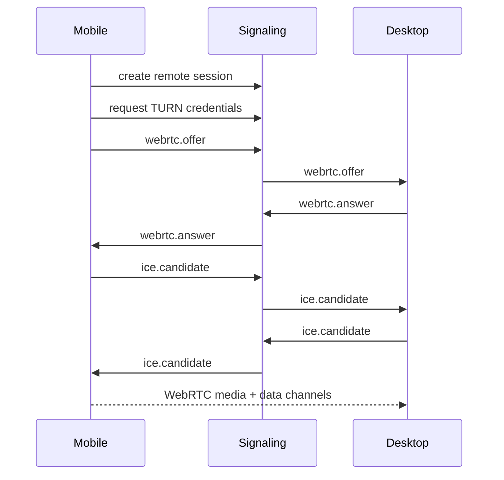

# Lily Mobile Command Pro WebRTC Runbook

## 1. Purpose

This document defines the production WebRTC behavior for Lily Mobile Command Pro: connection setup, signaling, ICE/TURN, media constraints, DataChannel backpressure, reconnect, weak network behavior, and QA.

WebRTC failure must degrade to Chat Only. It must not break local Lily agent execution.

## 2. Session Modes

| Mode | Source | Input | Permission |
|---|---|---|---|
| App Observe | Lily window | none | Observe App |
| App Control | Lily window | Lily window only | Control App |
| Desktop Observe | selected screen | none | Observe Desktop |
| Desktop Control | selected screen | selected screen | Control Desktop |

Mode changes require permission re-check. Switching from app to desktop source requires approval.

## 3. Signaling Flow



Rules:

- Signaling messages use `WsEnvelope`.
- Offer includes requested mode and source.
- Desktop may downgrade source if permission does not allow requested source.
- Unknown signaling messages are rejected and logged.

## 4. ICE And TURN

### 4.1 ICE Servers

Desktop and mobile both receive the same short-lived `iceServers` set:

- STUN first.
- TURN UDP.
- TURN TCP fallback.
- TURN TLS fallback if needed.

TURN credentials:

- TTL max 30 minutes.
- Bound to account and remote session.
- Refreshed before expiry during long sessions.

### 4.2 Candidate Policy

- Default: all candidates.
- Corporate/firewall mode: relay-only if P2P fails twice.
- Do not expose local IP telemetry beyond connection type and error code.

### 4.3 Connection Timeout

| Phase | Timeout |
|---|---:|
| signaling offer to answer | 10 seconds |
| ICE connecting | 20 seconds |
| first video frame | 10 seconds after connected |
| DataChannel open | 10 seconds after connected |

Timeout result:

- show recoverable Live Control error
- keep Chat Only
- do not end Lily session

## 5. Media Constraints

### 5.1 App Source

```ts
type AppSourceConstraints = {
  maxWidth: 1280;
  maxFps: 24;
  contentHint: 'detail';
};
```

### 5.2 Desktop Source

```ts
type DesktopSourceConstraints = {
  maxWidth: 1920;
  maxFps: 30;
  contentHint: 'detail';
};
```

Weak network downgrade:

| Condition | Action |
|---|---|
| packet loss > 5% for 10s | reduce bitrate |
| packet loss > 10% for 10s | reduce fps to 15 |
| RTT > 500ms for 10s | reduce width to 1280 or 720 |
| sustained decode freeze | restart sender track |

## 6. DataChannels

| Channel | Ordered | Reliable | Purpose |
|---|---:|---:|---|
| control | false | false | pointer move/scroll |
| keyboard | true | true | typing/shortcuts |
| clipboard | true | true | clipboard requests |
| health | false | false | stats/ping |
| file-meta | true | true | upload/download metadata |

### 6.1 Backpressure

Rules:

- Drop stale pointer move events when `bufferedAmount` exceeds threshold.
- Never drop keyboard events.
- Never drop clipboard events.
- Health events may be sampled.

Thresholds:

| Channel | Warning | Drop/Block |
|---|---:|---:|
| control | 128 KB | drop pointer move |
| keyboard | 64 KB | block UI typing and show lag |
| clipboard | 64 KB | reject new clipboard request |
| health | 64 KB | sample |

## 7. Reconnect State Machine

```text
connected
degraded
ice_restarting
signaling_reconnecting
permission_rechecking
reconnected
failed_chat_only
closed
```

Rules:

- ICE failure triggers one ICE restart.
- If restart fails, reconnect signaling once.
- During reconnect, control input is paused.
- Observe may continue if video recovers before TTL.
- Control permission expires if reconnect exceeds grace period.
- On final failure, return to Chat Only.

## 8. Mobile Background Behavior

| State | Observe | Control |
|---|---|---|
| app background < 10s | keep session | pause input |
| app background 10-60s | keep observe if platform allows | revoke control |
| app background > 60s | close WebRTC | Chat Only |
| phone lock | close WebRTC | revoke control |

Native shell may improve lifecycle reporting but cannot keep control active silently.

## 9. Desktop Source Mapping

Desktop sends source metadata:

```ts
type SourceMetadata = {
  surfaceId: string;
  mode: 'app' | 'desktop';
  width: number;
  height: number;
  scaleFactor: number;
  displayId?: string;
  appBounds?: {
    x: number;
    y: number;
    width: number;
    height: number;
  };
};
```

Mobile sends normalized coordinates only. Desktop maps them to actual OS coordinates.

DPI and multi-monitor rules:

- Capture source owns coordinate mapping.
- Input outside authorized source bounds is rejected.
- If display topology changes, pause control and require source refresh.

## 10. Privacy Indicators

Desktop must show:

- visible indicator during Observe App/Desktop
- stronger indicator during Control App/Desktop
- active mobile device name
- stop control button

When indicator cannot be shown, remote observe/control must not start.

## 11. Platform Compatibility

### 11.1 Mobile

| Platform | Required |
|---|---|
| iOS 16+ WKWebView/Safari | WebRTC, IndexedDB, WebCrypto |
| Android 10+ Chrome/WebView | WebRTC, IndexedDB, WebCrypto |

Known limitations:

- iOS background WebRTC is unreliable.
- iOS may require user gesture for media playback.
- Android vendor WebViews may lag behind Chrome.

### 11.2 Desktop

| Platform | Capture | Input |
|---|---|---|
| Windows | Electron desktopCapturer, later Windows Graphics Capture | SendInput helper |
| macOS | ScreenCaptureKit/Electron | CGEvent with Accessibility |
| Linux | PipeWire/portal | limited, fail loud |

## 12. Telemetry

Allowed telemetry:

- connection mode: p2p/turn/failed
- setup duration
- reconnect count
- rtt bucket
- packet loss bucket
- source mode
- error code

Forbidden telemetry:

- screen frames
- raw input events
- typed text
- clipboard content

## 13. QA Matrix

Required scenarios:

- same Wi-Fi P2P
- mobile 5G to desktop home broadband P2P
- TURN relay forced
- TURN TCP/TLS forced
- mobile background and return
- phone lock
- desktop lock
- display change
- DPI scaling 125/150/200%
- multi-monitor
- weak network packet loss 5/10/20%
- high latency 300/700/1200ms
- DataChannel backpressure

## 14. Tests

Automated:

- `test-remote-signaling-contract.mjs`
- `test-remote-webrtc-state-machine.mjs`
- `test-remote-datachannel-backpressure.mjs`
- `test-remote-source-mapping.mjs`
- `test-remote-webrtc-fail-open.mjs`

Manual:

- run QA matrix on Windows + iOS
- run QA matrix on Windows + Android
- macOS permission missing/recovered
- Linux fail-loud behavior

## 15. Acceptance Criteria

- Chat Only works when WebRTC is disabled.
- Failed WebRTC setup does not end Lily session.
- Control input is paused during reconnect.
- Control permission is revoked after grace period.
- Desktop source switch requires approval.
- Pointer coordinates cannot escape authorized source bounds.
- TURN relay works when P2P is blocked.
