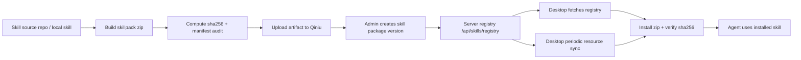

# Lily 技能平台顶级化与七牛下发方案

审计时间：2026-06-14

## 目标

不围绕现有技能做保守整理，而是围绕 Lily 的平台能力目标重建技能体系：

- 弱一点的模型也能准确识别用户意图。
- 普通用户做编程、网页、小工具、自动化时，一次通过率高。
- 生成的文档、代码、图片、UI、交互都能实际使用。
- 产物必须本地落地、可预览、可打开。
- 技能由服务器管理版本、渠道、灰度、下架和回滚。
- 技能包 artifact 上传七牛云，通过服务器 registry 下发。

## 核心判断

现有 144 个技能不能按“有用就保留”处理。必须按平台能力价值分三类：

1. **替换**：现有技能粒度太散、触发边界模糊、无法提升一次通过率的，替换成 Lily 自研能力包。
2. **新增**：现有缺少的关键闭环能力，必须新增内部技能。
3. **删除/下架**：和主线弱相关、风险高、普通用户不该看到的，从默认 registry 删除，最多放到专业市场。

技能不是内容库，而是平台质量控制系统。一个顶级技能必须包含：

- 触发条件
- 禁用条件
- 输入 schema
- 执行步骤
- 固定工具/脚本
- 输出格式
- 验证方式
- 失败自救
- 视觉/交互/创意标准

只有“说明模型应该怎么想”的技能不够；必须让模型知道怎么做、用什么做、怎么验收。

## 能力层重建

### 1. Intent Router：意图识别和任务分流

这是最重要的新增能力。目标是让差一点的模型也不乱选技能。

新增 `lily-intent-router`，强制注入，不让用户关闭。

落地状态（2026-06-14）：已作为平台强制内置技能加入 `resources/skills/lily-intent-router/`，
并纳入 `MANDATORY_PLATFORM_SKILL_IDS`。它不出现在用户可管理技能列表中，但会注入每个会话的
AGENT.md，优先级位于工作台基础规则之后、上下文规则之前。

能力：

- 判断任务类型：文档、表格、PPT、PDF、编程、网页、UI、图片、视频、音频、查资料、部署、排障。
- 判断是否混合任务：例如“上传 Excel 生成可视化网页”必须拆成 Excel 解析 + 前端 + 图表 + 浏览器验证。
- 判断是否需要问问题：只问阻塞性问题。
- 判断技能优先级：网页/应用优先 Coding + Design + Browser，不走营销模板。
- 输出任务路线：`task_type`、`required_capabilities`、`verification_required`、`deliverable_type`。

现有技能替代情况：

- 替换零散的“问问题/计划/流程”类提示为统一路由规则。
- 保留少量底层技能，但不直接暴露给用户。

### 2. Coding Core：普通用户编程创作

目标：普通用户说“帮我做个网页/小工具/脚本/自动化”，结果能跑、少 bug、交互合理。

新增/重包：

- `lily-coding-core`
- `lily-app-builder`
- `lily-browser-qa`
- `lily-code-repair`

应吸收或替换：

- 吸收 `superpowers-writing-plans`
- 吸收 `superpowers-systematic-debugging`
- 吸收 `superpowers-test-driven-development`
- 吸收 `superpowers-verification-before-completion`
- 吸收 `anthropics-webapp-testing`
- 吸收 `anthropics-frontend-design`

保留原则：

- 这些来源质量高，但名称和颗粒度不适合普通用户。
- 不要让用户看到一堆 `superpowers-*`。
- 对用户展示为“编程创作增强”“网页/小工具一次跑通”。

必须内置验收：

- 能启动就启动。
- 有 UI 就截图验证。
- 有表单就实际输入。
- 有文件生成就检查路径和打开。
- 有错误就自动修复一轮以上。

### 3. Design Core：UI/交互/审美

目标：生成物不是“能用就行”，而是看起来专业。

新增 `lily-ui-quality`。

能力：

- 信息层级。
- 表单/按钮/菜单/状态/错误/空状态。
- 移动端和桌面端响应式。
- 不重叠、不溢出、不粗糙。
- 避免廉价渐变、模板卡片堆叠、AI 味强的视觉。
- 浏览器截图和像素级检查。

替换/补强：

- 保留 `anthropics-frontend-design` 的设计原则。
- 新增 Lily 自己的产品审美规则。
- 不建议只依赖营销 landing page 技能。

### 4. Media Core：图片、视频、音频、创意生成

目标：图片漂亮、视频可用、语音自然，结果本地可见。

保留并强化：

- `lily-vision`
- `lily-image-generation`
- `lily-video-generation`
- `lily-speech-generation`

新增：

- `lily-creative-director`
- `lily-image-qa`
- `lily-prompt-enhancer`

能力：

- 用户一句“做张图”，技能要补齐构图、光线、风格、镜头、用途、比例。
- 生成后必须本地保存为绝对路径。
- 必须在对话里预览。
- 对海报、产品图、封面、头像、插画分别有不同提示模板。
- 图片不满意时能根据用户反馈迭代，而不是重写随机提示词。

### 5. Office Core：办公文档

目标：Word/Excel/PPT/PDF 是 Lily 的核心壁垒。

保留：

- `anthropics-docx`
- `anthropics-xlsx`
- `anthropics-pptx`
- `anthropics-pdf`
- `anthropics-doc-coauthoring`
- `lily-template-fill`
- `lily-pdf-form`
- `lily-document-verify`
- `lily-runtime-packs`

新增：

- `lily-office-intent`
- `lily-excel-data-analysis`
- `lily-ppt-design-qa`
- `lily-pdf-extraction-router`

重点：

- 文档读取不是简单 OCR。
- 复杂 PDF 自动建议安装 runtime pack。
- PPT 不只是生成文字，要检查版式和溢出。
- Excel 不只是读表，要识别字段、公式、异常值、可视化需求。

### 6. Research Core：联网检索和事实校验

保留：

- `websearch`
- `webfetch`

新增：

- `lily-research-synthesis`
- `lily-source-quality`

能力：

- 国内稳定搜索。
- 资料来源可信度判断。
- 最新信息必须联网。
- 多来源交叉验证。
- 输出引用来源。

### 7. Runtime / Connector Core

目标：技能包不应该承载所有工具能力；长期要区分 Skill、Runtime Pack、Connector/MCP。

建议：

- Skill：教模型怎么完成任务。
- Runtime Pack：本地重型能力，如 Docling、OCR、文档渲染、图像处理。
- Connector/MCP：连接外部系统，如 GitHub、Figma、Vercel、Stripe、Sentry、数据库、浏览器。

MCP 排行榜只能用于发现连接能力，不应直接混入技能包。

## 替换 / 新增 / 删除建议

### 立即替换

| 当前类型 | 问题 | 替换方案 |
| --- | --- | --- |
| 大量 `superpowers-*` 直接展示 | 名称和流程偏开发者，不适合普通用户理解 | 聚合为 `lily-coding-core`，底层引用或吸收 |
| `anthropics-frontend-design` 单独暴露 | 好用但不够 Lily 化 | 加 `lily-ui-quality`，作为设计门禁 |
| PM 49 个技能平铺 | 用户选择成本高 | 合并为 3-4 个 PM Pack |
| Marketing 42 个技能平铺 | 普通用户干扰大 | 合并为 3-4 个 Marketing Pack |
| Trail of Bits 默认可见 | 垂直专业，风险和认知成本高 | 移到 Security Pro Pack |

### 必须新增

- `lily-intent-router`
- `lily-coding-core`
- `lily-app-builder`
- `lily-ui-quality`
- `lily-browser-qa`
- `lily-code-repair`
- `lily-creative-director`
- `lily-image-qa`
- `lily-prompt-enhancer`
- `lily-office-intent`
- `lily-pdf-extraction-router`
- `lily-excel-data-analysis`
- `lily-ppt-design-qa`
- `lily-research-synthesis`
- `lily-intent-eval`
- `lily-skill-quality-gate`

这些新增技能比继续增加 PM/Marketing 模板更重要。

### 建议删除/默认下架

不是从代码仓库删除，而是从默认 registry 和默认推荐中下架：

- 绝大多数细分 `pm-*`
- 绝大多数细分 `marketing-*`
- 区块链合约安全类 `tob-building-secure-contracts-*`
- `tob-culture-index-*`
- `tob-claude-in-chrome-troubleshooting-*`

保留到专业市场即可。

## 外部更好来源

更好来源现在只应该作为候选池，不是最终改动清单。下面这些来源是“值得持续观察和筛选”的入口，不代表已经逐个验证过，也不代表应该直接替换现有技能。

优先级：

1. `anthropics/skills`：官方 Agent Skills 基线，文档、Office、设计、测试类值得持续跟进。
2. `VoltAgent/awesome-agent-skills`：聚合 1000+ agent skills，强调来自真实团队和官方开发团队，适合作为候选池。
3. 官方团队 skills：Cloudflare、Stripe、Vercel、Sentry、Figma、Hugging Face、Firecrawl、Netlify、Google Labs 等。
4. MCP 生态：Context7、Playwright、Firecrawl、GitHub、数据库、Figma、Vercel 等作为 connector 候选，不作为 skill 默认包。

筛选原则：

- 官方来源优先。
- 有脚本的必须安全审计。
- 能提升 Lily 核心闭环才引入。
- 不能只因 stars 高导入。
- 不引入没有验证路径的“提示词模板”。

外部技能进入 Lily 前必须经过验证：

1. 真实任务复测：至少覆盖编程、UI、文档、媒体、检索中的目标场景。
2. 弱模型复测：用较弱模型验证是否仍能正确触发、执行和验收。
3. 输出质量对比：和现有技能或无技能基线比一次通过率、错误率、耗时和产物美观度。
4. 安全审计：检查脚本、网络、文件写入、凭据访问和供应链来源。
5. 本地落地验证：生成物必须能预览、能打开、路径正确。
6. 失败路径验证：网络失败、依赖缺失、输入不完整时必须能自救或给出清晰下一步。

只有通过这些验证，才进入“替换/新增”的正式执行清单。

## 七牛云和服务器下发架构

### 现状

客户端已经具备：

- 读取远程 registry。
- 支持 `sourceType: zip`。
- 下载 skillpack zip。
- 校验 `sha256`。
- 解压安装。
- 防 zip slip。
- 限制 skillpack 大小。

服务端旧链路曾经有：

- `/api/plugins/registry`
- `plugins` 表
- 后台插件管理页面
- runtime pack 的独立管理表和接口
- 七牛上传能力用于反馈附件

问题：

- skill 被混在 `plugins` 表里，字段太粗。
- registry 只按 plugin 映射，缺少分类、评分、渠道、灰度、风险级别。
- 没有专门的 skill package 生命周期。
- 缺少 server-side Qiniu artifact 构建/上传/校验流程。
- 不能按版本、渠道、客户端版本、用户策略下发。

### 目标架构



### 数据模型

新增 `skill_packages`：

- `id`
- `skill_id`
- `name`
- `description`
- `version`
- `category`
- `capability_layer`
- `publisher`
- `source_kind`
- `source_repo`
- `artifact_url`
- `sha256`
- `size_bytes`
- `min_app_version`
- `channel`
- `risk_level`
- `default_eligible`
- `featured`
- `enabled`
- `created_at`

新增 `skill_package_rollouts`：

- `id`
- `skill_id`
- `version`
- `channel`
- `percentage`
- `min_app_version`
- `max_app_version`
- `config_group_id`
- `enabled`

新增 `skill_package_audit_logs` 或复用现有 audit：

- 创建、启用、禁用、回滚、删除、上传、校验失败。

### API

新增：

- `GET /api/skills/registry`
- `GET /api/admin/skill-packages`
- `POST /api/admin/skill-packages`
- `PATCH /api/admin/skill-packages/:id`
- `POST /api/admin/skill-packages/:id/publish`
- `POST /api/admin/skill-packages/:id/rollback`

不保留旧入口：

- 新版本未发布，不继续兼容 `/api/plugins/registry`。
- 技能下发只以 `/api/skills/registry` 为准。

客户端同步规则：

- 启动后和后台周期任务会拉取 `/api/skills/registry`。
- 服务端 registry 非空时，它就是权威技能目录，不再混入内置 100+ 技能。
- `defaultEligible: true` 的技能自动安装并启用，类似游戏首包资源。
- 已由服务端安装过的远程技能发现新版本时自动更新。
- 服务端不可用或 registry 为空时，才回退内置目录。

### Registry 输出

新增字段，不破坏客户端可识别字段：

```json
{
  "schemaVersion": 1,
  "publisher": "Lily Workbench",
  "updatedAt": "2026-06-14T00:00:00.000Z",
  "categories": [],
  "skills": [
    {
      "id": "lily-coding-core",
      "name": "编程创作增强",
      "description": "让普通用户生成网页、小工具、脚本时更容易一次跑通。",
      "latestVersion": "1.0.0",
      "sourceType": "zip",
      "downloadUrl": "https://cdn.example.com/skills/lily-coding-core-1.0.0.skillpack.zip",
      "sha256": "...",
      "sizeBytes": 123456,
      "category": "coding",
      "categoryLabel": "编程创作",
      "publisher": "Lily Workbench",
      "channel": "stable",
      "capabilityLayer": "coding-core",
      "riskLevel": "low",
      "defaultEligible": true,
      "featured": true
    }
  ]
}
```

客户端当前会忽略未知字段，因此可以渐进加入。

### 七牛 artifact 规范

路径：

```text
skills/{skill_id}/{version}/{skill_id}-{version}.skillpack.zip
skills/{skill_id}/{version}/{skill_id}-{version}.manifest.json
```

要求：

- zip 必须包含 `SKILL.md`。
- 必须包含 `skill.manifest.json`。
- manifest version 必须等于 registry version。
- zip sha256 必须和 registry 一致。
- 禁止 `node_modules`。
- 禁止过大文件。
- 脚本权限必须在 manifest 里声明。
- 默认能力包最好无网络权限，除非明确需要。

### 发布流程

1. 本地或 CI 构建 skillpack。
2. 静态扫描：
   - manifest schema
   - 权限声明
   - forbidden files
   - zip slip
   - 大小限制
   - 脚本入口
3. 计算 sha256。
4. 上传七牛。
5. 写入 `skill_packages`。
6. 管理后台发布到 `beta`。
7. 内部客户端拉取验证。
8. 灰度到 `stable`。
9. 监控安装失败率、校验失败率、技能触发失败率。

### 安全边界

必须坚持：

- 客户端只信任服务器 registry。
- 服务器 registry 只引用七牛或受信任 HTTPS。
- skillpack 必须 sha256 校验。
- 高风险技能默认不自动安装。
- 带网络/文件写/子进程权限的技能必须显示风险。
- 可以远程下架技能。
- 可以按客户端版本禁用不兼容技能。

## 推荐实施顺序

### Phase 1：先治理，不大迁移

- 新增 `docs/skill-platform-strategy.md`。
- 保留现有 registry 兼容。
- 设计 `skill_packages` 表和 `/api/skills/registry`。
- 做 skillpack 构建和七牛上传脚本。
- 选 6 个 Lily 自研核心技能做第一批。

第一批：

- `lily-intent-router`（已落地为强制内置技能）
- `lily-coding-core`（已落地为默认可安装的 Lily 包装技能）
- `lily-ui-quality`（已落地为默认可安装的 UI 质量门禁）
- `lily-browser-qa`（已落地为默认可安装的浏览器验收门禁）
- `lily-creative-director`（已落地为默认可安装的媒体创意导演）
- `lily-office-intent`（已落地为默认可安装的办公任务路由）
- `lily-app-builder`（已落地为默认可安装的普通用户应用构建流程）
- `lily-code-repair`（已落地为默认可安装的代码/网页/构建/部署失败修复流程）
- `lily-research-synthesis`（已落地为默认可安装的研究事实核验能力）
- `lily-prompt-enhancer`（已落地为默认可安装的创意提示增强能力）
- `lily-image-qa`（已落地为默认可安装的图片验收能力）
- `lily-pdf-extraction-router`（已落地为默认可安装的 PDF 解析路由能力）
- `lily-excel-data-analysis`（已落地为默认可安装的表格分析能力）
- `lily-ppt-design-qa`（已落地为默认可安装的 PPT 设计验收能力）
- `lily-skill-quality-gate`（已落地为可安装的技能发布质量门禁，不进入普通推荐包）
- `lily-intent-eval`（已落地为可安装的意图路由评测规范，不进入普通推荐包）
- `resources/skills-catalog/lily-intent-eval/references/golden.jsonl`（已落地为意图路由黄金样例库）
- `scripts/run-intent-eval.mjs`（已落地为可运行的意图评测 runner，并纳入 `npm run test:skills`）
- 服务端 `skill_packages` 创建/上传质量门禁（已接入 `evaluateSkillPackageQuality`，阻断低质量或高风险默认发布）

### Phase 2：默认能力重排

- 默认推荐改为 Core 能力。
- PM/Marketing/Security 下架到专业包。
- Superpowers 不直接展示，吸收到 Coding Core。
- 后台增加 featured/defaultEligible/riskLevel。

### Phase 3：替换外部技能

- 从 Anthropic 官方和 VoltAgent 候选池挑选更强技能。
- 每个外部技能必须经过 Lily 包装：
  - 中文说明
  - 触发条件
  - 验证方式
  - 权限声明
  - 失败处理

### Phase 4：质量闭环

- 记录技能触发、安装、失败、回滚。
- 建立技能质量评分。
- 低质量技能自动降级到实验区。
- 热门高质量技能进入默认推荐。

## 最终建议

不要再把技能包当“资源市场”来做。它应该是 Lily 的能力操作系统。

应该做的是：

1. 删除默认列表里的噪声。
2. 新增 Lily 自己的核心质量技能。
3. 用官方和高质量社区技能补强，不盲目导入。
4. 所有技能包 artifact 走七牛。
5. 服务器统一管理 registry、版本、灰度、风险和回滚。
6. 客户端只负责安全安装、验证和执行。

这样 Lily 才能做到：模型弱一点也不乱，普通人做编程也能跑，生成结果漂亮，交互合理，文件可见，错误能自救。
