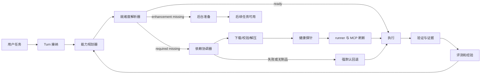
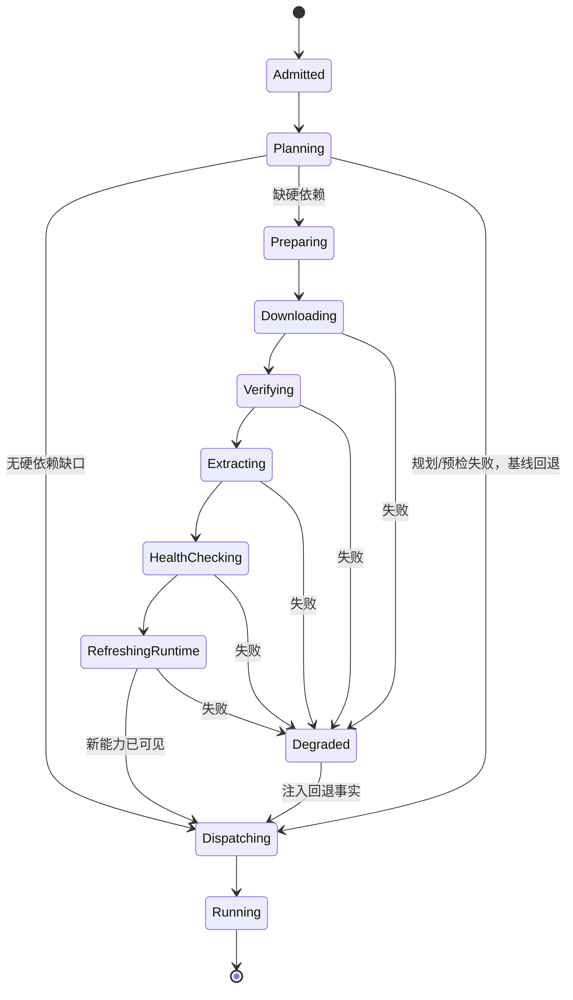

# Lily 平台能力增益与依赖就绪设计

日期：2026-07-11  
状态：架构方向已确认，待书面规格复核

## 目标

把 Lily 从“按模型等级删减工具、遇到缺依赖再临时处理”升级为统一的能力增益平台：

- 小模型获得更多确定性脚手架、参数补全、恢复和验证能力，但不丢失可执行能力。
- 标准和强模型保留当前模型、上下文、工具、并行度和判断空间，并获得额外的能力状态、依赖就绪信息和证据支持。
- 用户默认授权 Lily 安装受平台管理的本地依赖；安装按实际任务懒触发，不在首次启动或技能预设应用时批量下载。
- 缺依赖、安装失败或平台制品缺失时，当前任务仍回到今天的强默认路径，不吞消息、不静默换弱模型、不伪造验证结果。

## 已确认原则

### 1. 模型等级只影响脚手架，不影响能力上限

能力是否可用由工具、运行包、权限和当前环境决定，不能由 `lite`、`standard` 或 `full` 直接决定。

- `lite`：增加紧凑步骤、确定性参数、进度约束、恢复提示和高层能力入口。
- `standard`：保持当前默认执行面，增加能力状态与验证证据。
- `full`：保持当前完整执行面、上下文和并行能力；平台提示是信息，不是强制配方。
- 任一分档、规划或探针不确定时回到当前强默认配置。

禁止通过删除 Playwright、邮件、进程任务、文件智能、已学习系统或其他 MCP 服务来“帮助”小模型。

### 2. 机械工作交给代码，判断工作交给模型

确定性代码负责：

- 任务信号与文件类型收集；
- 依赖状态和平台制品检查；
- 安装去重、重试、校验、解压和环境刷新；
- 参数格式、状态转换、超时、断点续传和证据记录；
- 发布制品覆盖和回归门禁。

模型负责：

- 用户意图中的歧义和优先级；
- 是否值得使用增强能力；
- 设计、推理、审美、内容组织和风险判断；
- 在多个可行工具链之间取舍；
- 根据真实验证结果继续修改。

### 3. 新能力必须增益，失败必须回到基线

所有新增模块遵守 `CAPABILITY-GATE.md`：

- 能力规划器失败：按今天的原始 turn 路径发送。
- 依赖预检失败：按今天的原始能力继续，并注入最小诊断信息。
- 自动安装失败：继续当前任务的可用回退路径。
- runner/MCP 刷新失败：不宣称新能力已就绪；回到基线执行或明确阻塞。
- 进度 UI 失败：安装本身继续，错误仍可从任务结果和日志看到。

## 当前审计结论

### 能力依赖栈

现有类别选择已经覆盖主要本地能力，不需要新增第二套重型引擎：

| 能力 | 当前核心依赖 | 结论 |
|---|---|---|
| Office 转换与视觉渲染 | LibreOffice | 保留 |
| 复杂 PDF 与版面结构 | Docling | 保留为可选增强 |
| 大数据与大文件 | DuckDB、Polars、Arrow、PyMuPDF、Calamine | 保留 |
| 浏览器自动化 | Playwright + Playwright MCP + Chromium | 保留，版本必须配套 |
| OCR | RapidOCR + ONNX Runtime，OpenCV | 保留，不引入 Torch 默认依赖 |
| 图片基础处理 | Pillow、Sharp、OpenCV | 保留 |
| 音视频 | FFmpeg、FFprobe | 保留 |
| 文档格式转换 | Pandoc | 保留为高级转换依赖 |

基础 Python 运行时直接导入 `python-pptx` 和 `pdfplumber`，但当前主要通过 `markitdown` extras 间接获得。实施时应把直接依赖显式写入运行时清单，避免上游 extras 变化导致能力消失。

### 制品覆盖

正式发布目标是 `darwin-arm64`、`darwin-x64` 和 `win32-x64`。2026-07-11 对生产公开解析接口的检查显示：

- Windows x64 的十类目录包都有线上制品。
- macOS ARM 的主要制品基本存在，但接口查询出现过瞬时失败，需要重试和缓存。
- macOS Intel 只有少数制品存在，缺少 Docling、Playwright、FFmpeg、Pandoc、图片/OCR 等多个包。
- Linux 当前没有运行包制品，但不属于当前 `dist:all` 正式发布目标，不纳入本轮发布阻塞矩阵。

目录中声明依赖不等于用户实际可安装。发布门禁必须验证生产解析接口、制品 URL、SHA-256、大小和目标平台健康探针。

### 首用链路

当前链路存在五个根因：

1. Office 首次引导按预设技能汇总依赖，可能串行安装 LibreOffice、Docling、大文件、OCR 和 OpenCV，普通任务也可能下载超过 1GB。
2. 主聊天进度组件只显示 `failed`，解析、下载、校验、解压和成功阶段对用户不可见。
3. `runtime_pack_install` 在活跃 turn 中完成后不会刷新忙碌 runner；新 PATH、PYTHONPATH、NODE_PATH 和 Playwright MCP 往往要下一 runner 才可见。
4. 客户端下载失败会删除临时包，不支持 HTTP Range 断点续传，大包中断后从头开始。
5. 生产 artifact 查询缺少面向首用的缓存、批量解析和稳定重试，网络波动会被放大为安装失败。

## 平台架构



### 能力合同

每项可执行能力统一声明：

```js
{
  capabilityId,
  skillIds,
  executionSurfaces,
  requiredRuntimePacks,
  enhancementRuntimePacks,
  readinessProbe,
  fallbackCapabilityIds,
  verificationContract,
  risk,
}
```

- `requiredRuntimePacks`：缺失时无法诚实完成该执行路径，例如真实 Playwright 浏览器验证。
- `enhancementRuntimePacks`：缺失时仍有基础路径，例如普通数字 PDF 可先用 pypdf/pdfplumber，复杂版面再使用 Docling。
- `fallbackCapabilityIds`：安装不可用时可继续的明确基线，不让模型临时发明替代方案。
- `verificationContract`：成功必须满足的证据，例如截图、渲染页、输出文件、健康探针或测试结果。

现有 manifest 和注册表继续作为技能来源；能力合同只引用它们，不创建第二份技能身份。

### 能力规划器

规划器输出有序的最小能力链，而不是直接执行：

```js
{
  taskId,
  capabilityChain,
  requiredPackIds,
  enhancementPackIds,
  fallbackChain,
  verification,
  confidence,
}
```

规则：

- 文件类型、已选择技能和明确动作使用确定性映射。
- 创建/审查、审美取向、复杂度和是否值得使用增强引擎由模型判断。
- 不确定或规划失败时返回 `null`，turn orchestrator 使用当前原始路径。
- 小模型获得更紧凑的链和高层入口；强模型获得同一事实，但不被禁止访问原始工具。

### 就绪度解析器

统一返回：

```js
{
  status: "ready" | "preparing" | "degraded" | "unavailable",
  readyCapabilityIds,
  missingRequiredPackIds,
  missingEnhancementPackIds,
  installingPackIds,
  unavailablePackIds,
  refreshRequired,
}
```

状态必须来自同一真实来源：基础运行时探针、有效安装目录、安装状态、目标平台 artifact 解析和 MCP 实际注册结果。禁止 UI、预检和 spawn 环境分别推断。

## 首次使用与自动安装

### 技能预设

应用技能预设只安装/启用技能内容，不安装运行包。依赖面板可以解释将来可能用到的能力，但应用按钮应立即完成。

### Turn 准备状态机



关键约束：

- 用户消息先持久化和显示，再开始准备，不让界面看起来没有响应。
- 默认授权，不弹依赖确认框。
- 硬依赖在 engine 首次 dispatch 前准备；这样安装完成后可以安全重建 runner/MCP，再发送同一个 turn。
- 增强依赖不阻塞 dispatch，可在后台准备供后续步骤或后续任务使用。
- 准备失败仍 dispatch；payload 中携带结构化失败和回退链。
- 同一用户消息只 dispatch 一次，避免安装完成后的重复副作用。

### 安装协调器

协调器属于 main process，不交给模型拼装脚本：

- 相同 pack 全局单飞，多个请求加入同一 job。
- 默认最大并发为 2；同一磁盘根目录最多一个解压任务。
- artifact 解析支持批量请求、短期缓存和带抖动的指数退避。
- 下载使用稳定 `.part` 文件、ETag/Last-Modified 和 HTTP Range；校验通过前不进入正式目录。
- 提前检查下载大小、解压空间和目标根目录可写性。
- SHA-256 不匹配立即删除错误制品并失败，不在同一 URL 上无限重试。
- 解压到 staging，健康检查通过后原子替换。
- 安装成功后写入精确版本、哈希、制品来源和健康状态。

### 当前任务续跑

安装成功不等于能力就绪。dispatch 前必须：

1. 重新计算 spawn env；
2. 终止或重建尚未开始执行该 turn 的 runner；
3. 重新生成 MCP 配置；
4. 验证目标 MCP server/可执行文件/模块已出现；
5. 使用原 turn ID 和原用户 payload 进行首次 dispatch。

对已经执行中的 turn 不做透明重放。运行中安装的增强包只服务于安全的后续工具进程或下一个 turn，除非执行面明确支持热更新。

## 用户体验

不新增独立业务面板，继续使用聊天与现有依赖设置页。

### 聊天进度

当前 turn 显示一个紧凑的能力准备状态：

- `正在准备网页验证能力`；
- `下载 86 MB / 267 MB`；
- `正在校验`；
- `正在安装`；
- `正在刷新浏览器工具`；
- `能力已就绪，继续处理`。

多个包时显示总数和当前包，可展开查看单包明细。普通安装成功后短暂收起；失败保留可理解的原因和自动回退说明。设置页继续提供完整列表、健康检查、位置和修复操作。

### 错误语言

用户看到能力和影响，不看到内部异常堆栈：

- 制品缺失：`当前设备暂时没有可用的网页验证组件，已继续完成代码检查；本次没有生成真实浏览器证据。`
- 空间不足：说明所需空间、当前目录和更换依赖位置入口。
- 网络中断：显示已保留的下载进度和自动重试状态。
- 校验失败：说明已丢弃不可信下载并继续安全回退。

## 依赖版本治理

### 显式直接依赖

基础运行时必须显式声明其直接导入的第三方包。至少补齐 `python-pptx` 和 `pdfplumber`，不依赖 `markitdown` extras 偶然带入。

### 运行包锁

增加生成式运行包锁文件，按 pack/platform 记录：

```json
{
  "packId": "web-automation",
  "platform": "darwin-arm64",
  "version": "playwright-1.61.1_mcp-0.0.77",
  "components": {
    "playwright": "1.61.1",
    "@playwright/mcp": "0.0.77"
  },
  "sha256": "7a8848ad0efa1f5b41ae62dc505148659a150c8c21e3bf6608d222567b3308e7",
  "sizeBytes": 266897377,
  "healthProbe": "playwright-chromium-launch"
}
```

`PACK_SPECS` 继续表达兼容范围和能力元数据；锁文件表达一次发布实际构建出的精确组合。

### 发布矩阵

每次桌面发布必须验证三目标平台：

- 所有 `required` 运行包存在启用制品；
- URL 可访问并支持期望的 Range 行为；
- SHA-256、大小、版本和锁文件一致；
- 目标平台健康探针通过；
- Playwright 包中的库、MCP 和 Chromium 版本配套；
- 缺任一必需制品时阻止“全能力可用”发布。

可选增强包缺失可以发布，但注册表、UI 和能力状态必须明确为 `unavailable`，不能显示可安装按钮。

## 让平台持续变聪明

### 小模型

- 使用能力规划器给出的短链和高层入口；
- 自动填充确定性参数和安装动作；
- 一步一验证，失败使用结构化恢复动作；
- 只在确认无进展时终止循环；
- 始终保留完整执行能力和强默认逃生路径。

### 强模型

- 保留当前完整工具、上下文、并行度和模型选择；
- 额外获得能力就绪事实、依赖差异、历史健康和验证合同；
- 可以覆盖规划器建议，但不能覆盖安全校验和事实状态；
- 可以组合更复杂能力链，不受小模型步骤模板限制。

### 学习闭环

记录匿名、结构化运行事实：

- 任务能力链；
- 依赖命中、缓存、下载、重试和耗时；
- 安装后是否真正出现在 runner/MCP；
- 使用了基线还是增强路径；
- 验证是否通过；
- 模型是否偏离建议以及结果是否更好。

这些数据只进入离线评测和候选规则。规则变化必须先通过基线对比、强模型不变门禁和小模型任务完成率门禁，不能在线自动改写核心路由。

## 测试与门禁

### 单元与契约测试

- 能力合同 schema 和技能/运行包引用完整性；
- required/enhancement/fallback 分类；
- 同一 pack 安装单飞和并发上限；
- artifact 缓存、重试、Range、空间检查和 checksum；
- 安装 staging、原子替换和失败回滚；
- runner env 与 MCP 刷新后的真实可见性；
- 强模型的基础模型、runtime、工具和共享配置字节级不变；新增就绪事实只走已有的有界 per-turn 平台上下文；
- lite 模型执行面与强默认能力集合一致。

### 首用集成测试

1. 新用户应用 Office 预设，不下载任何运行包。
2. 新用户创建普通 DOCX，只准备真正需要的最小能力。
3. 新用户要求浏览器截图，自动安装 Playwright、刷新 MCP、同一 turn 仅 dispatch 一次并完成截图。
4. 下载中断后从 `.part` 继续，而不是从零开始。
5. macOS Intel 制品缺失时不反复安装，任务进入明确回退。
6. checksum 错误时正式 pack 目录保持原样。
7. 安装进行中第二个任务加入同一 job，并各自只 dispatch 一次。
8. 增强包后台失败不影响已运行的基线 turn。

### 发布门禁

- 三平台 artifact 矩阵；
- 基础 runtime 直接依赖导入探针；
- runtime-pack 锁与服务端记录一致；
- 完整 `npm run test:unit`；
- capability gate；
- 小模型与强模型基线 eval 对比。

## 实施边界

本轮包含：

- 能力合同与就绪度模型；
- task-aware 自动准备；
- 首用懒安装；
- 下载可靠性；
- runner/MCP 刷新后首次 dispatch；
- 聊天进度；
- 运行包锁和发布矩阵；
- 显式基础依赖与相关测试。

本轮不包含：

- 新增第二套 PDF、浏览器、OCR 或媒体重型引擎；
- Linux 桌面正式发布；
- 在线自动改写路由；
- 为依赖安装新增独立业务面板；
- 在已经产生副作用的 turn 中自动重放用户请求。

## 实施顺序

1. 建立能力合同、依赖分类和强模型不变门禁。
2. 修复技能预设批量安装，改为任务级最小依赖规划。
3. 建立 pre-dispatch 准备状态机与单次 dispatch 不变量。
4. 打通安装后 runner env/MCP 刷新。
5. 增加聊天全过程进度。
6. 增加断点续传、空间检查、批量 artifact 解析和稳定重试。
7. 增加显式基础依赖、运行包锁和三平台发布矩阵。
8. 补齐 macOS Intel 生产制品并跑完整首用验证。

任何阶段失败都必须保持当前对话和强默认能力可用；不能为了完成新架构而让今天可工作的任务先失效。
