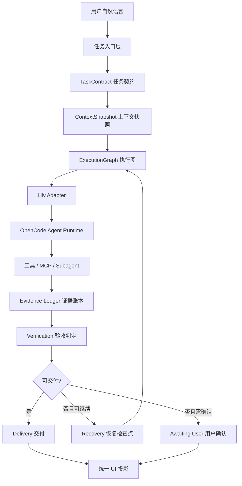
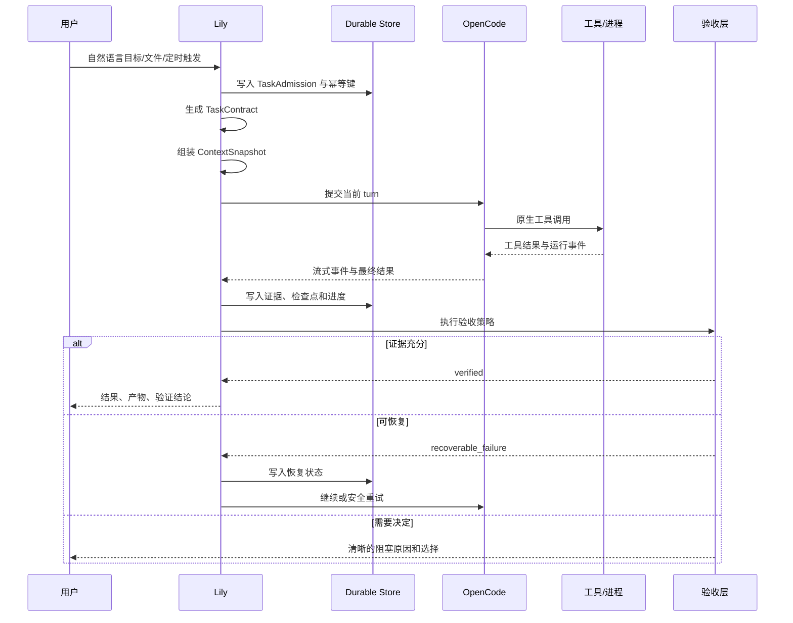

# Lily 与 OpenCode 任务完成内核边界设计

日期：2026-08-05

状态：阶段 0/1/2/3 第一条生产闭环已落地；阶段 4/5 仍按迁移计划推进

## 1. 摘要

Lily Workbench 不应重新实现一个 Agent CLI。OpenCode 已经负责模型驱动的执行循环、原生工具调用、运行时会话、MCP、插件、权限、流式事件和原生上下文压缩。

Lily 的核心价值是把用户的自然语言目标变成一个**可隔离、可恢复、可验证、可交付的任务**，并为 OpenCode 提供正确的输入、能力和边界。

因此本设计采用以下边界：

```text
Lily = 产品级任务操作系统
OpenCode = Agent 执行引擎
```

Lily 不拥有第二套模型循环，不复制 OpenCode 原始历史，不重新实现工具调用协议，也不替代 OpenCode 的模型规划。

## 2. 目标

### 2.1 必须达到

- 用户说出目标后，平台能形成明确的任务契约。
- 每轮执行使用一个不可变、可追溯的上下文快照。
- 普通会话、长任务、定时任务、文件任务和角色上下文遵循同一套任务生命周期。
- 任务失败、进程退出、应用重启或网络中断后，平台知道能否继续、重试还是必须确认。
- “完成”必须有证据，不由模型文字单独宣布。
- UI 展示统一的进度、阻塞原因、恢复入口和交付结果。
- 新能力失败时降级到 Lily 当前的强默认行为，不能让平台变笨。

### 2.2 不追求

- 不在 Lily 内重新实现 OpenCode 的 Agent Loop。
- 不复制 OpenCode 的原始会话历史和压缩算法。
- 不因为增加角色、世界书或记忆而改变普通任务的默认路径。
- 不用大量面板替代自然语言操作。
- 不把“生成了计划”当成“完成了任务”。

## 3. 核心边界

| 能力 | OpenCode 负责 | Lily 负责 |
|---|---|---|
| 模型对话循环 | 是 | 否 |
| 原生工具调用协议 | 是 | 只提供工具和边界 |
| OpenCode session history | 是 | 不复制 |
| Agent/Subagent 执行 | 是 | 管理产品级作用域和证据 |
| MCP/插件运行 | 是 | 选择、授权、注入平台能力 |
| 原生权限交互 | 是 | 业务权限、生产保护和无人值守策略 |
| 流式事件 | 是 | 归属、过滤、持久化和 UI 投影 |
| 原生 compaction | 是 | 决定产品级上下文何时需要补充 |
| 用户任务目标和交付标准 | 否 | 是 |
| 用户、项目、会话隔离 | 否 | 是 |
| 文件拖拽、Office/PDF 预处理 | 否 | 是 |
| 运行时依赖和 runtime pack | 否 | 是 |
| 定时任务和长任务持久化 | 否 | 是 |
| 跨 OpenCode 的长期记忆 | 否 | 是 |
| 证据、验收和产物交付 | 否 | 是 |
| 业务级恢复和幂等 | 否 | 是 |

边界规则：OpenCode 负责“如何调用模型和工具完成一步”，Lily 负责“这一项工作为什么启动、属于谁、是否可以继续、是否真的完成”。

## 4. 目标架构



## 5. 分层职责

### 5.1 任务入口层

入口包括：

- 普通用户消息
- 文件或文件夹拖拽
- 定时任务
- 外部命令
- 恢复任务
- 本地助手事件

所有入口最终必须转换为同一种 `TaskAdmission`，不能为每种入口维护一套独立执行语义。

入口层只负责：

- 解析来源
- 绑定用户、项目和会话
- 记录幂等身份
- 创建任务输入
- 判断是否需要排队

入口层不负责模型规划和工具重试。

### 5.2 TaskContract 任务契约层

任务契约是 Lily 对用户目标的产品级解释，最少包含：

```text
taskId
sessionId
ownerScope
projectId
objective
inputs
constraints
requestedDeliverables
acceptanceCriteria
requiredCapabilities
permissionBoundary
externalFactRequirement
verificationPolicy
status
```

契约来源可以是模型判断，但最终结构由代码校验。模型不能伪造已完成状态、权限或证据。

契约允许逐步补全，但必须保留：

- 原始用户目标
- 当前规范化目标
- 未解决的关键问题
- 已确认的假设
- 修改记录

### 5.3 ContextSnapshot 上下文层

上下文是给 OpenCode 的输入材料，不是第二套历史系统。

上下文来源统一为带元数据的条目：

```text
sourceId
sourceKind
scope
version
trust
proof
selected
reason
budget
sourcePointers
```

可以接入：

- AGENTS.md 和项目规范
- 当前项目文件
- 文档预处理结果
- 工作区索引
- 用户确认的长期记忆
- 角色卡
- 世界设定
- 当前场景
- 已完成任务的压缩摘要
- 外部事实证据

角色、世界书和记忆都只是上下文来源，不拥有独立的回答循环。

每轮必须产生一个不可变快照：

```text
contextSnapshotId
taskId
turnId
selectedSources
omittedSources
budgetSummary
fingerprint
createdAt
```

OpenCode 收到渲染后的上下文；Lily 保存来源、版本、选择原因和指纹，不保存一份重复的 OpenCode 原始历史。

### 5.4 ExecutionGraph 执行层

执行图表示 Lily 需要管理的任务级事实，而不是替代 OpenCode 的每一步推理。

执行节点包含：

```text
nodeId
taskId
objective
dependencies
sideEffectLevel
replayPolicy
attempts
lease
checkpoint
status
```

OpenCode 负责普通回合内的工具选择和执行顺序。Lily 只在以下场景介入：

- 跨回合任务
- 长时间进程
- 定时触发
- 副作用操作
- 需要持久化检查点
- 需要多个独立执行单元
- 需要业务级幂等或恢复

Lily 不应再创建一个与 OpenCode 平行的模型规划器。

### 5.5 OpenCode Adapter 适配层

适配层的职责：

- 构造当前会话的 OpenCode 运行配置
- 注入当前 turn 的系统上下文
- 绑定正确的 OpenCode session
- 传递 Lily 允许的工具和 MCP
- 转换 OpenCode 事件为 Lily 运行事件
- 处理传输级断线、进程退出和 session 恢复

适配层不应拥有：

- 独立的任务真相
- 独立的长期记忆
- 独立的完整聊天历史
- 另一套工具调用协议
- 无证据的完成判断

### 5.6 Evidence Ledger 证据层

证据账本记录任务是否有资格被标记为完成。

证据来源包括：

- 工具成功返回
- 文件实时读取
- 文件变更指纹
- 测试结果
- 构建结果
- 页面或文档渲染结果
- 服务健康检查
- 数据库查询结果
- 生成的交付物
- 用户明确确认

证据必须带：

```text
evidenceId
taskId
turnId
kind
status
source
capturedAt
sourcePointer
replayability
```

模型回复中的“已完成”只能作为声明，不能单独作为证据。

### 5.7 Verification 验收层

验收层根据 `acceptanceCriteria` 和 `verificationPolicy` 计算：

```text
verified
observed
unverified
blocked
outcome_unknown
```

规则：

- 没有要求验证的普通问答可以直接交付。
- 用户要求生成文件时必须确认文件存在且可用。
- 用户要求修改代码时至少检查变更结果，复杂任务执行测试。
- 用户要求部署时必须有实际健康检查。
- 用户要求转换文档时必须检查输出文件和页面内容。
- 证据不足时只能说未验证，不能伪造通过。

### 5.8 Recovery 恢复层

恢复是任务状态机的一部分，不是简单的 catch/retry。

```text
admitted
running
waiting_tool
waiting_process
waiting_user
partial
recoverable_failure
outcome_unknown
verified
delivered
failed
cancelled
```

恢复判定必须由代码完成：

| 状态 | 默认动作 |
|---|---|
| 尚未开始 | 安全重试 |
| 只读工具失败 | 有界重试或替换读取路径 |
| 写入前失败 | 重试前重新读取现状 |
| 写入后结果未知 | 先检查产物和文件指纹，禁止盲目重放 |
| 外部进程仍存活 | 重新接管并读取进度 |
| 外部进程已退出且无终态 | 标记 outcome_unknown |
| 权限或生产变更 | 暂停并等待用户确认 |
| 模型连接短暂失败 | 传输级恢复，不改变任务语义 |

### 5.9 Delivery 交付层

交付层把内部状态转换为用户能理解的结果：

```text
result
artifacts
verification
knownLimitations
risks
recoveryAction
```

内部的 Objective、ExecutionGraph、lease、prompt fingerprint 等不能直接污染普通回答。

## 6. 统一任务生命周期



## 7. 当前代码映射

### 已有且应保留

- `TurnOrchestrator`：作为生命周期协调入口
- `SessionRunnerPool`：OpenCode runner 管理
- `OpencodeAgentSession`：OpenCode 适配和流式会话
- `TurnRunCoordinator`：同一会话 turn 线性化
- `turn-admission-*`：耐久输入、幂等和恢复
- `task-run-*`：任务阶段和证据投影
- `long-task/*`：长进程、租约、日志和健康检查
- `turn-terminal-finalizer`：终态、证据和交付投影
- `context-budget-manager` 和 `MemoryRegistry`：Lily 跨会话上下文层
- `character-worlds`：角色和场景作为上下文来源
- `file-staging-manager`、文档 preflight 和 workspace index：文件输入上下文

### 需要逐步收敛

1. `TurnOrchestrator` 当前聚合了太多跨层职责，后续应通过稳定接口下沉到 admission、context、execution、verification、recovery 模块。
2. 普通 turn、定时任务、长任务和外部命令需要共用 `TaskAdmission` 和 `TaskContract`，不能只靠不同的 options 字段表达差异。
3. `taskRun`、`turn state`、`process job`、`agent graph` 之间需要明确引用关系，避免多个系统各自认为自己拥有任务状态。
4. 上下文注入入口需要统一生成 `ContextSnapshot`，避免角色、记忆、文档和工作区资料分别拼接导致预算和来源不可见。
5. UI 应只订阅统一的任务事件和终态，不直接从多个内部模块推断“是否卡住”或“是否完成”。

## 8. 事件与持久化原则

### 8.1 事件必须可归属

每个运行事件至少携带：

```text
ownerScope
projectId
sessionId
taskId
turnId
attemptId
source
sequence
```

事件没有完整归属信息时，不得广播到其他会话。

### 8.2 状态必须有唯一真相

建议的所有权：

| 状态 | 唯一真相 |
|---|---|
| 用户消息是否被接收 | Turn Admission Store |
| OpenCode 是否运行 | OpenCode runner/适配层 |
| Lily 任务是否继续 | Task Run Store |
| 长进程是否存活 | Process Job Store + process identity |
| 上下文版本 | Context Snapshot |
| 是否完成 | Verification Result |
| 用户最终看到什么 | Delivery projection |

UI、模型文本和临时内存不能成为任务状态真相。

### 8.3 默认幂等

任何可能重复的入口都需要稳定身份：

- 用户 turn
- 定时 occurrence
- 外部 command
- process job
- tool side effect
- recovery attempt

重启后必须知道：已经完成、可能完成、尚未开始，不能盲目重放。

## 9. 能力与依赖边界

能力系统应采用四步协议：

```text
discover → ready → execute → verify
```

例如 PDF 转换：

1. 发现需要 PDF 运行时。
2. 检查 LibreOffice/Pandoc/浏览器是否可用。
3. 执行转换。
4. 检查 PDF 是否生成、页数、文本和渲染结果。

依赖缺失时：

- 能安装就通过 Lily runtime pack 修复。
- 不能安装就明确列出缺失依赖。
- 不能悄悄改走低质量路径。
- 不能把半成品说成完成。

OpenCode 负责调用工具，Lily 负责能力是否准备好、是否允许调用以及结果是否可交付。

## 10. 迁移策略

### 阶段 0：只建立架构契约

- 不改变用户行为。
- 画清每个状态和数据的所有权。
- 为现有 turn、scheduled task、long task、character context 建立关联关系。
- 补充跨层 trace id 和回归测试。

### 阶段 1：统一 TaskAdmission 和 TaskContract

- 将普通消息、定时消息、外部命令和恢复入口统一入场。
- 保留旧字段兼容读取。
- 不重做 OpenCode session。

### 阶段 2：统一 ContextSnapshot

- 角色、世界书、记忆、文档和项目资料统一进入上下文注册表。
- 现有注入器先作为 source adapter 接入。
- OpenCode 原始历史保持由 OpenCode 管理。

### 阶段 3：统一 Verification 和 Delivery

- 所有产物类任务统一验收状态。
- UI 统一消费证据和交付投影。
- 失败状态提供恢复入口，不再只展示“重试”。

### 阶段 4：收敛 TurnOrchestrator

- 保留协调职责。
- 将能力准备、上下文组装、长任务、证据和恢复通过接口下沉。
- 每次只迁移一个职责，并保留当前路径作为 fail-open fallback。

### 阶段 5：角色和多角色作为插件能力

- 单角色只是 Context source + prompt profile。
- 多角色是 Scene execution adapter。
- 不改变普通工作任务的默认执行路径。

## 11. 验收指标

### 正确性

- 同一任务不会跨会话、跨用户或跨项目串线。
- 重试不会重复已经发生的副作用。
- 角色、记忆和资料不会跨作用域注入。
- 旧任务在新版本中可以恢复或明确变为 outcome_unknown。

### 完成度

- 有交付物的任务都有产物指针。
- 有验收要求的任务都有验证结果。
- 未验证区域不会被标为通过。
- 依赖缺失会进入修复或明确阻塞状态。

### 体验

- 长任务持续有真实进度或明确等待原因。
- 模型连接失败不会让任务永久处于思考中。
- 用户可以看到下一步、恢复方式和是否需要确认。
- 普通问答不承担额外的索引、记忆和验证开销。

### 能力门槛

- 所有新路径的失败模式都降级到当前强默认行为。
- 不降低模型、工具或上下文能力而不告知用户。
- 不新增第二套 Agent Loop、历史系统或工具协议。
- 每个结构变化都有针对性的闭环回归测试。

## 11.1 当前实现进度

已落地的第一条生产闭环：

- `src/main/task-core-contracts.js` 提供有界、不可变的 `TaskAdmission` 与 `ContextSnapshot` 规范化快照。
- 普通 turn 与 local assistant turn 在准入后记录统一 admission；上下文编译完成后记录记忆、文件、文档、角色、世界书和能力准备摘要。
- 快照只进入 OpenCode payload trace 和 turn archive metadata，不改变 OpenCode 的历史、工具协议、Agent loop 或 prompt 正文。
- 快照指纹不包含时间字段，也不包含用户原文、任务目标、记忆正文或文档正文；来源版本变化会使指纹变化。
- 准入后的 TaskCore 已写入 `turn_inputs.task_core_json`，使用独立不可变 CAS；重复写入幂等，冲突写入拒绝，应用重启后可恢复。
- TaskCore 已持久化规范化任务目标、交付物、验收标准、能力、权限摘要和恢复来源指纹；恢复重试会携带来源任务的规范化意图，而不是只重放一段文本。
- TaskRun 引用已记录 `agentGraphId`、`leadAttemptId`、最后工具和副作用标记；这些运行时引用不参与上下文语义指纹，重试不会被误判为来源漂移。
- ContextSnapshot 已生成不含正文的来源指纹；恢复时会比较原任务与当前项目/文件/记忆/角色来源，漂移会记录为 `SOURCE_CONTEXT_CHANGED`，不会被伪装成精确重放。
- 生命周期任务身份在准入时固定为 `turnId`（或外部已提供的 taskRunId）；意图识别稍后创建的 `taskRunId` 只作为关联元数据写入，避免直聊路径出现先准入、后建任务导致的身份冲突。
- 文件来源指纹包含文件修改时间；同路径同大小但内容已更新的文件不会被错误视为原上下文。
- 已暂存的小文件额外记录 SHA-256 内容指纹；大文件不在发送路径同步读取正文，保留大小和修改时间校验。只有内容寻址 `contentRef` 才能标记 `exact`，本地路径即使有 hash 也只能标记 `revalidate`。
- 队列重启恢复会通过持久化的 `sourceTurnId` 在同一会话/作用域重新读取来源 TaskCore，再进入统一启动路径；队列 envelope 不复制任务正文或大块上下文。
- 队列恢复 envelope 会保留 `requiredSuccessfulTools` 等执行约束，重启不会把验收门槛降级成普通执行。
- TaskRun 的 VerificationResult 与 DeliveryResult 已进入独立 `task_results` 表，验证和交付不再只依赖内存或 archive metadata。
- `task_lifecycles` 已成为任务级状态真相：准入、运行、等待用户、验收、未知结果、失败和取消均使用版本化 CAS；`delivery_status` 与任务结果状态正交，未知结果不会因恢复提示已送达而被错误标成成功。
- `task_context_registry` 已登记不可变 ContextSnapshot、来源指纹和 `exact/revalidate` 能力；恢复可拿到原快照，路径型大文件明确要求重新校验，不会伪造精确重放。
- `task.lifecycle.updated` 已进入 RuntimeEvent 合约并由 renderer runtime store 接收；UI 不再必须从“思考中”或工具卡片推断任务生命周期。
- 主进程 runtime snapshot 会带回最近生命周期，renderer 重启 hydration 会恢复 `outcome_unknown`、`waiting_user` 和 `verifying` 的关注状态，不依赖进程内事件缓存才能看见恢复任务。
- 检查点创建会反向绑定当前任务的 `checkpointId`、`agentGraphId` 和 lead attempt，和 TaskCore 的任务身份保持一致。
- RuntimeEventBus 在主进程运行时为事件补齐 `ownerScope/projectId/taskId/attemptId`，并保持现有旧事件兼容。
- 失败时保留现有原生 Lily/OpenCode 路径，快照生成异常不会阻断 turn。
- `test-task-core-contracts.mjs`、`test-task-core-persistence.mjs`、`test-task-core-runtime-event-context.mjs` 与 `test-turn-orchestrator.mjs` 已覆盖纯函数边界、数据库重开、不可变冲突、事件归属、payload 注入、归档一致性和原文不泄漏。
- `test-turn-queue-recovery-task-core.mjs` 覆盖重启队列恢复时来源 TaskCore 的重新绑定。

尚未宣称完成的部分：

- 定时任务、外部命令、恢复入口还需要补齐逐入口的 TaskCore 身份矩阵和崩溃恢复测试；当前普通队列最终已走同一构造入口，但尚未完成全入口证明。
- Context Registry 已落地，但大文件和外部路径仍是 `revalidate`，尚未把所有来源内容搬入可回放的内容寻址存储；这是容量与隐私边界，不应通过同步复制大文件解决。Registry 暂时不可用时继续使用内存快照执行，并明确不声明可精确恢复，不阻断普通任务。
- Task Lifecycle 已统一准入、验收和交付状态，但旧 task-run/evidence/finalizer 的全部字段仍有兼容投影，尚未完成历史状态的单表收敛。
- renderer 已接收统一生命周期事件，但现有各类任务卡和历史页仍保留旧投影，尚未全部改成只读取 Task Lifecycle。
- AgentGraph 和 RuntimeCheckpoint 已绑定到 Task Lifecycle；独立 process job 数据库仍通过 turn scope 关联，尚未把进程节点和同一 SQLite 任务图做物理合并。
- 全量测试环境仍有 Electron SIGABRT、sandbox listener EPERM 和 LibreOffice 缺失等宿主机阻断项，必须在 CI/发布机补齐后才能成为正式发布绿灯。

## 12. 明确禁止的方向

- 在 Lily 中复制 OpenCode 的完整 Agent Loop。
- 在 Lily 中维护另一份完整聊天历史。
- 用模型重新判断代码可执行的幂等、重试和租约规则。
- 让角色系统直接操控任务状态和权限。
- 让 UI 通过“正在思考”推断任务是否活着。
- 只增加更多状态卡片而不统一状态真相。
- 只增加更多角色、技能和依赖而不接入统一能力协议。
- 为了追求自动化，默认重放未知副作用。

## 13. 最终判断

Lily 的核心竞争力不是比 OpenCode 多一个 Agent，也不是拥有更多按钮，而是：

> 在 OpenCode 已经很强的执行能力之上，Lily 让复杂任务具备清晰目标、正确上下文、严格隔离、可靠恢复、真实证据和可交付结果。

只要任务契约、上下文快照、执行生命周期、证据验收和恢复状态这五个边界稳定，角色、世界书、文件分析、长任务和定时任务都可以作为能力接入，而不会把平台继续拆成互相影响的独立系统。
