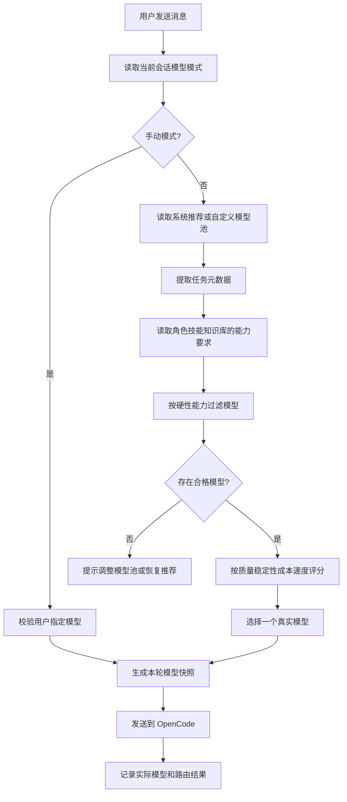

# Lily 动态模型选择与 Auto 路由设计

## 文档状态

- 状态：基础实现已落地，完整设计仍有后续项；以本节实施边界为准
- 更新日期：2026-08-29
- 范围：Lily Desktop、模型网关、模型目录、对话框模型选择器、Auto 路由、OpenCode 适配
- 默认策略：Auto
- 重要约束：模型名称和数量由服务端开放目录决定，不在客户端写死

### 当前实施边界

已实现输入框 Auto / 手动选择、可配置候选池、会话级原子保存、主进程校验、
独立供应商连接注册、每轮请求模型覆盖、续跑继承，以及持久化回执驱动的重试。
候选失效不会扩大为全部模型，保存失败不会被显示成成功；默认 Auto 在缺少
评级时保留当前模型。角色、技能和知识库没有混入模型目录。

当前 Auto 是**保守的确定性路由**：采用已发布的能力及 `routing.quality/cost`
元数据，文本长度和附件数量仅作为工作量信号。它不是语义难度分类器，也未
验证真实费用节省。未知评级不能证明某模型更弱，因此不会据此降级。

本轮进一步统一了执行配置：主请求、general/explore 子代理、压缩和标题任务
默认跟随本轮选中的模型；兼容的会话共享引擎，不同执行配置可同时运行。
准入阶段接入工具能力及保留历史用量估算，优先选择能容纳上下文的候选，
同时保留大输入暂存和历史压缩；实际压缩预算采用所选模型的上下文窗口。
图片偏好不能越过推理质量底线，同一供应商的不同模型分别发布能力。
队列恢复核对原轮模型与供应商；Token 用量按实际模型归属，失败重报不重复
累加本地统计。连接凭据仅保留在主进程，不写入公开回执。

以下内容仍是后续设计，不属于本轮已交付能力：健康/延迟实时打分、路由前
精确逐条历史核算、技能的结构化最低能力声明、独立的逐轮模型说明界面、
价格校准后的跨模型费用细分，以及内部任务各自独立选模。生产环境多供应商
实发和发行包验收尚需单独进行。本轮全量回归为 650/650 个脚本通过，不能
用单元/本地集成测试替代上述生产验收。

实现契约与回归记录见 [实施计划](../plans/2026-08-27-auto-model-selection.md)。

## 1. 设计结论

Lily 对话框支持两种执行模式：`自动` 和 `手动`。默认使用 `自动`。

`自动` 不是一个模型名称，也不是一组固定的业务角色。它是一层路由策略：
从当前用户有权使用、当前可用、满足任务能力要求的真实模型中选择一个模型，
用于本轮请求。

模型列表必须由服务端开放模型目录动态驱动。`fdeepseek1`、`fdeepseek2` 等名称
只能作为示例，不能写入产品设计前提，也不能在客户端虚构不存在的模型。

业务能力与模型严格分层：

```text
模型 Model       实际执行推理的引擎
角色 Character   以什么身份工作
技能 Skill       用什么流程完成任务
知识库 KB        依据哪些资料回答
应用 App         提供什么产品入口或外部连接
```

例如法律工作应当是：

```text
法律角色卡 + 合同审查技能 + 法律知识库 + Auto 选中的真实模型
```

法律不是默认的模型类别。只有当后台明确接入并验证了专门法律模型，模型目录
才可以把它作为模型的客观属性或独立模型名称展示。

## 2. 目标

### 2.1 用户目标

- 普通用户打开对话框即可使用 Auto，不需要理解供应商和模型 ID。
- 高级用户可以手动指定当前开放的真实模型。
- 用户可以配置 Auto 允许使用的模型集合。
- 模型选择发生在对话框附近，发送前可确认执行方式。
- 同一会话的不同轮次可以使用不同模型，不丢失历史。
- 用户能够知道某一轮实际使用了哪个模型，以及模型发生切换的原因。

### 2.2 系统目标

- 模型目录由服务端统一管理，支持增删、下线、替代和套餐控制。
- Auto 只选择当前用户有权使用且健康的模型。
- Auto 先按硬性能力过滤，再按质量、稳定性、成本和速度评分。
- 角色、技能、知识库独立建模，不把业务领域写入模型名称。
- OpenCode 继续负责会话、工具、权限、事件、子代理和模型执行。
- 模型路由由 Lily 主进程控制，并记录可审计的本轮快照。
- 模型目录不可用时，系统能够回退到现有单模型路径。

### 2.3 非目标

- 不在客户端硬编码 `fdeepseek1~7` 或任何固定模型清单。
- 不默认同时调用多个模型生成同一份答案。
- 不把法律、财务、合同、产品等业务领域当成模型类型。
- 不让模型回答内容改变权限、额度、模型池或路由政策。
- 不在对话框永久展示大量复杂的供应商字段和内部路由规则。
- 不在已经开始工具副作用后自动切换模型并重做任务。
- 不为了 Auto 路由上传用户完整文件或完整对话内容。

## 3. 对外产品原则

### 3.1 借鉴 ChatGPT 的部分

ChatGPT 的公开模型选择设计体现了几个有效原则：

1. 模型选择入口放在消息编辑器附近，发送前即可切换。
2. 默认提供简单的自动或能力层级选择，隐藏不必要的底层复杂度。
3. 更细的自动切换、旧模型、推理强度等设置放入配置入口。
4. 用户可以使用推荐模型，也可以在权限允许时手动切换。
5. 模型更新或下线时，系统提供替代模型，而不是让旧会话直接失效。

OpenAI 的模型选择更新说明显示，ChatGPT 将模型选择放入 composer，并把自动
切换和高级推理控制放进 Configure；模型更新说明也说明了旧模型下线后的替代
策略。[模型选择更新](https://help.openai.com/en/articles/6825453-how-can-i-subscribe-to-chatgpt-plus)
和[模型变更说明](https://help.openai.com/en/articles/20001053-what-to-expect-when-models-change)
是本设计的交互参考。

Lily 借鉴的是层次和控制方式，不复制 ChatGPT 的具体模型名称。

### 3.2 Lily 的产品原则

```text
默认 Auto
模型目录动态
业务能力分离
手动选择可接管
本轮模型可追踪
模型更新可迁移
失败回退可解释
```

## 4. 概念模型

### 4.1 模型 Model

模型是实际发送推理请求的执行引擎。模型实体包含：

- 稳定模型 ID
- 用户显示名称
- 供应商 ID
- 供应商真实模型 ID
- 当前状态
- 客观能力
- 上下文和输出上限
- 质量与稳定性指标
- 成本和延迟等级
- 套餐与区域可用性

示例：

```json
{
  "id": "provider-model-stable-id",
  "displayName": "实际模型名称",
  "providerId": "gateway-provider",
  "backendModelId": "供应商真实模型ID",
  "status": "active",
  "capabilities": {
    "reasoning": true,
    "vision": false,
    "toolCall": true,
    "structuredOutput": true,
    "longContext": true
  },
  "limits": {
    "contextTokens": 1000000,
    "outputTokens": 384000
  },
  "economics": {
    "costClass": "medium",
    "latencyClass": "normal"
  }
}
```

### 4.2 角色 Character

角色卡描述身份、目标、语气、边界和工作方法。例如：

```text
法律顾问
产品经理
会议执行助理
深度研究员
```

角色可以声明完成任务所需的最低能力，例如需要引用、长上下文或结构化输出，
但角色名称不应改变模型实体的业务分类。

### 4.3 技能 Skill

技能是可执行的工作流程，例如：

```text
合同审查
图片识别
表格分析
会议纪要
网页操作
代码修改
```

技能可以声明工具、输入格式、输出格式和最小模型能力。

### 4.4 知识库 Knowledge Base

知识库是检索依据，不是模型配置。例如：

```text
法律知识库 V23.3
企业制度库
项目资料库
产品手册库
```

知识库必须单独管理版本、索引状态、来源、权限和引用信息。

### 4.5 应用 App

应用是外部系统或产品入口，例如邮件、日历、CRM、网页操作等。应用可能提供
工具，但不会把对应业务领域变成模型类型。

## 5. 用户体验设计

### 5.1 Composer 主入口

对话框底部显示一个紧凑的模型控制器：

```text
[ 自动 ▾ ]
```

当 Auto 已配置多个候选模型时显示：

```text
[ 自动 · 4 个模型 ▾ ]
```

手动选择后显示模型的用户名称：

```text
[ 实际模型名称 ▾ ]
```

不要在主对话框显示完整的 provider、endpoint、backendModelId 等技术字段。

### 5.2 模型弹层

弹层分为两个层次。

第一层是普通用户能够立即理解的执行方式：

```text
执行方式

● 自动
○ 手动
```

第二层是模型配置：

```text
Auto 使用的模型

● 系统推荐
○ 自定义模型池
```

自定义模型池展示服务端实际下发的模型：

```text
☑ 实际模型 A
☑ 实际模型 B
☐ 实际模型 C
```

模型行可以显示客观属性：

```text
实际模型 A
推理增强 · 支持工具 · 上下文 1M
```

不显示以下虚构分类：

```text
法律模型
合同模型
财务模型
行业专家模型
```

### 5.3 手动模式

手动模式只显示当前用户有权限且当前可用的模型：

```text
选择一个模型

实际模型 A
实际模型 B
实际模型 C
```

不可用模型可以在高级展开中显示原因，但不能让用户选择后才失败。

### 5.4 Auto 模型池配置

系统推荐是默认配置。用户可以在弹层中修改当前会话的模型池，也可以在设置中
修改全局默认模型池。

推荐交互：

```text
系统推荐
自定义模型池

[恢复系统推荐] [保存]
```

如果用户只保留一个模型，仍然允许 Auto，但界面应提示：

```text
Auto 当前只有一个可用模型
```

### 5.5 会话与本轮范围

- 对话框选择默认作用于当前会话后续轮次。
- 高级操作提供“仅本次使用”。
- 本轮发送后，模型配置变化不影响正在执行的请求。
- 正在执行任务时不允许切换本轮模型。
- 下一轮可以切换，不丢失会话历史。

## 6. Auto 路由设计

### 6.1 路由输入

路由器只接收完成选择所需的最小元数据：

```json
{
  "mode": "auto",
  "candidateModelIds": ["开放模型ID"],
  "messageLength": 1200,
  "hasImages": false,
  "hasFiles": true,
  "fileTypes": ["pdf"],
  "estimatedContextTokens": 18000,
  "requiresTools": true,
  "requiresStructuredOutput": false,
  "characterRequirements": {
    "minimumReasoning": true,
    "minimumContextTokens": 100000
  },
  "skillRequirements": [],
  "riskLevel": "normal"
}
```

法律角色、技能和知识库可以贡献能力要求，但不会贡献一个叫“法律模型”的模型
类别。

### 6.2 路由步骤



### 6.3 硬性能力过滤

硬性能力必须先于成本和速度判断：

| 场景 | 最低要求 |
|---|---|
| 图片或截图 | `vision` 或兼容附件输入 |
| 长文档 | 上下文上限满足估算值 |
| 工具操作 | `toolCall` |
| 结构化结果 | `structuredOutput` 或兼容协议 |
| 角色要求 | 满足角色声明的最低推理能力 |
| 技能要求 | 满足技能声明的输入和工具能力 |
| 高风险任务 | 不得低于产品定义的最低质量等级 |

法律任务的处理方式是提高最低能力要求、启用对应技能和检索知识库，而不是
创建“法律模型”标签。

### 6.4 评分顺序

过滤后按以下优先级评分：

```text
能力满足度
> 任务复杂度匹配
> 服务稳定性
> 输出质量
> 成本
> 延迟
```

Auto 必须选择一个模型，不默认做多模型并行。多模型复核属于未来明确开启的
只读工作流，不属于普通对话默认行为。

### 6.5 路由可解释性

消息详情中展示简短结果：

```text
本轮使用：实际模型名称
选择原因：支持当前文件类型，推理能力满足任务要求
```

不展示内部权重、完整规则或敏感成本数据。

## 7. 数据模型

### 7.1 服务端模型目录

服务端是模型目录唯一来源。客户端不能自行注册开放模型。

模型目录至少包含：

```json
{
  "catalogVersion": "2026-08-27.1",
  "models": [],
  "recommendedModelIds": [],
  "updatedAt": "2026-08-27T00:00:00Z",
  "signature": "signed-catalog-signature"
}
```

服务端根据以下条件过滤下发结果：

- 用户套餐
- 组织权限
- 区域和供应商可用性
- 模型健康状态
- 产品发布状态
- 供应商凭据和额度

### 7.2 用户模型偏好

```json
{
  "mode": "auto",
  "autoPolicy": {
    "source": "recommended",
    "allowedModelIds": []
  },
  "manualModelId": null
}
```

用户自定义 Auto 模型池时：

```json
{
  "mode": "auto",
  "autoPolicy": {
    "source": "custom",
    "allowedModelIds": [
      "服务端实际开放的模型ID-1",
      "服务端实际开放的模型ID-2"
    ]
  },
  "manualModelId": null
}
```

保存前必须重新和服务端目录求交集，防止客户端提交已经下线或越权的 ID。

### 7.3 会话配置

```json
{
  "modelMode": "auto",
  "autoPolicySnapshot": {
    "catalogVersion": "2026-08-27.1",
    "modelIds": ["model-id-1", "model-id-2"]
  },
  "manualModelId": null
}
```

会话保存的是用户意图和目录版本，不把供应商密钥放入会话。

### 7.4 本轮模型快照

```json
{
  "routeId": "route-uuid",
  "mode": "auto",
  "requestedModelId": null,
  "candidateModelIds": ["model-id-1", "model-id-2"],
  "selectedModelId": "model-id-2",
  "catalogVersion": "2026-08-27.1",
  "reasonCodes": ["tool_required", "complexity_high"],
  "fallback": null,
  "createdAt": "2026-08-27T00:00:00Z"
}
```

本轮快照必须在 OpenCode 请求发出前持久化或进入可靠的 turn admission 状态。

## 8. Lily 与 OpenCode 的集成

### 8.1 当前代码事实

当前 Lily 路径大致是：

```text
model-presets.js
  -> resolveLilyEnv()
  -> opencode-model-config.js
  -> session-runner-pool.js
  -> OpenCode shared serve
  -> session.promptAsync()
```

当前主要限制：

- [src/main/model-presets.js](/Users/zhangqin/aicode/ceshitermianl/src/main/model-presets.js)
  主要保存单个活动预设和单个模型配置。
- [resources/models.default.json](/Users/zhangqin/aicode/ceshitermianl/resources/models.default.json)
  当前默认目录只有一个 DeepSeek Pro 预设。
- [src/main/runtime/opencode-model-config.js](/Users/zhangqin/aicode/ceshitermianl/src/main/runtime/opencode-model-config.js)
  当前将多个 OpenCode tier 映射到同一个模型。
- [src/main/runtime/opencode-message-parts.js](/Users/zhangqin/aicode/ceshitermianl/src/main/runtime/opencode-message-parts.js)
  已经支持在 prompt body 中传入 `providerID` 和 `modelID`。

结论：OpenCode 请求层已经具备部分按轮次指定模型的能力，缺少的是 Lily 的
动态目录、权限过滤、Auto 模型池和本轮路由契约。

### 8.2 OpenCode 配置策略

OpenCode shared serve 的配置应注册当前会话可能用到的模型池。单轮最终选择的
模型通过 prompt body 明确传入。

```js
{
  model: {
    providerID: selected.providerId,
    modelID: selected.backendModelId
  }
}
```

模型池发生变化时，沿用现有配置指纹和空闲 runner 回收机制。单轮模型变化不应
因为无意义的重启破坏正在运行的会话。

### 8.3 多供应商

同一供应商下的多个模型可以复用一个 provider 配置。跨供应商时，模型目录必须
明确记录 `providerId`，不能依赖模型 ID 字符串猜测供应商。

跨供应商需要：

- provider 连接配置
- 凭据和权限校验
- provider 健康检查
- 统一协议适配
- 供应商级限流和错误映射

### 8.4 子代理与内部任务

普通对话使用本轮选择模型。探索、摘要、标题生成等内部任务可以使用独立的
轻量模型，但必须由 OpenCode Agent 或 Lily 明确配置，不得让 Auto 随意改变
有副作用的子任务模型。

## 9. 角色、技能、知识库的协同

### 9.1 法律场景

法律任务的配置示例：

```json
{
  "characterId": "legal-advisor",
  "skillIds": ["contract-review"],
  "knowledgeBaseIds": ["legal-kb-v23-3"],
  "modelMode": "auto"
}
```

路由只读取它们提供的能力要求：

```text
需要长上下文
需要较强推理
需要引用和结构化输出
```

它不会把当前模型显示成“法律模型”。

### 9.2 知识库优先级

模型选择和知识库检索是两个阶段：

```text
先确定允许使用的模型
再根据角色和技能检索知识库
最后把检索结果交给模型执行
```

知识库是否存在、是否完成索引、是否有权限，不能由模型名称推断。

## 10. 故障与回退

### 10.1 模型目录不可用

按以下顺序处理：

1. 使用最近一次验证通过的本地目录缓存。
2. 使用当前会话已保存且仍可验证的模型。
3. 回退到现有单模型配置。
4. 如果无法验证任何模型，明确提示用户，不伪造模型可用状态。

### 10.2 选中模型下线

记录原模型和替代模型：

```json
{
  "requestedModelId": "retired-model",
  "selectedModelId": "replacement-model",
  "fallback": "retired_model_replacement"
}
```

向用户显示：

```text
原模型暂不可用，本轮已使用系统推荐的替代模型。
```

### 10.3 没有满足能力的模型

不能静默降级。显示：

```text
当前 Auto 模型池没有满足本任务要求的模型。
[恢复系统推荐] [调整模型池] [手动选择]
```

### 10.4 请求失败

- 在模型开始产生副作用前失败，可以按明确的幂等规则重试或切换。
- 已经执行工具、副作用或外部写入后失败，禁止自动换模型重做。
- 失败必须保留 route receipt、工具状态和恢复信息。

## 11. 安全与隐私

- 模型目录由服务端签名或可信配置提供。
- 客户端提交的模型 ID 必须服务端重新授权。
- 不向路由器发送完整附件内容，优先使用文件类型、大小和上下文估算。
- 路由器不能修改用户权限、额度、技能授权或知识库访问权。
- 供应商密钥不能进入 renderer、会话消息或路由快照。
- 高风险角色可以声明最低能力等级和禁止降级规则。
- 模型切换不能绕过工具确认或审批流程。

## 12. 成本与延迟

Auto 的优化目标不是永远选择最便宜的模型，而是选择满足要求的最低成本模型。

```text
先满足能力
再比较质量和稳定性
最后优化成本与速度
```

用户可以在高级配置中设置偏好：

```text
优先质量
均衡
优先速度
```

该偏好只能影响合格模型之间的排序，不能让不合格模型越过硬性能力过滤。

## 13. 实施拆分

### Phase 0：目录契约

- 定义服务端模型目录 schema。
- 增加模型状态、能力、套餐和推荐模型字段。
- 确定真实开放模型清单。
- 明确稳定 ID 与供应商 backend ID 的映射。

### Phase 1：客户端动态展示

- 客户端读取服务端目录。
- 对话框显示动态模型。
- 默认显示 Auto。
- 支持手动选择真实开放模型。
- 不可用模型显示明确状态。

### Phase 2：Auto 模型池

- 增加系统推荐模型池。
- 增加自定义候选模型。
- 保存用户配置并进行服务端求交集。
- 支持恢复系统推荐。

### Phase 3：单轮路由

- 增加 turn admission 中的路由快照。
- 实现能力过滤和评分。
- 将选中的 provider/model 传给 OpenCode prompt。
- 在消息详情显示实际模型和简要原因。

### Phase 4：迁移与观测

- 支持模型下线替代。
- 记录目录版本、路由结果、失败和回退。
- 增加成本、延迟和质量指标。
- 对比 Auto 与当前单模型的任务成功率。

## 14. 测试设计

### 14.1 单元测试

- 模型目录 schema 校验。
- 套餐和权限过滤。
- 自定义模型池与服务端目录求交集。
- 图片任务过滤不支持视觉的模型。
- 长上下文任务过滤上下文不足的模型。
- 工具任务过滤不支持工具调用的模型。
- 评分排序稳定且可解释。
- 目录不可用时回退单模型。
- 模型下线时选择替代模型。

### 14.2 集成测试

- Auto 请求向 OpenCode 传入正确的 provider/model。
- 手动请求只使用指定模型。
- 同一会话连续两轮可以使用不同模型。
- 切换模型不丢失会话历史。
- 配置变化不影响正在执行的 turn。
- 多供应商模型不会串用 provider 配置。
- 角色、技能、知识库不会污染模型目录。

### 14.3 故障测试

- 目录请求超时。
- 模型健康检查失败。
- 当前模型在发送前下线。
- 模型在工具执行前失败。
- 模型在工具执行后失败。
- 所有候选模型都不满足能力。
- 用户提交未开放模型 ID。
- 会话恢复时目录版本发生变化。

### 14.4 UI 验收

- 首次打开默认显示 Auto。
- Auto 和手动模式清晰可切换。
- 模型名称来自服务端，不显示虚构行业分类。
- 自定义模型池可保存、恢复和取消。
- 移动窗口不溢出。
- 正在执行时控制器状态稳定，不允许误改本轮配置。
- 实际使用模型在消息详情可见。

## 15. 验收标准

1. 客户端不写死任何固定模型名称。
2. 对话框默认模式为 Auto。
3. 手动模式只显示当前用户可用的真实模型。
4. Auto 只能从用户允许的模型池中选择。
5. Auto 每轮选择一个模型。
6. 同一会话允许不同轮次使用不同模型。
7. 角色、技能、知识库与模型目录完全分离。
8. 法律任务不会被错误建模成“法律模型”。
9. 真实模型能力由目录字段描述，不能靠名称猜测。
10. 模型下线、目录失败和能力不足都有明确处理。
11. 有副作用的任务不会因为模型切换被自动重复执行。
12. 每一轮都能追踪请求模型、实际模型、目录版本和回退原因。
13. 现有单模型配置在 Auto 不可用时仍能工作。

## 16. 最终决策

Lily 采用：

```text
默认 Auto
服务端动态模型目录
对话框附近选择
高级入口配置候选模型
手动模型可接管
每轮单模型执行
角色技能知识库独立
本轮路由可解释
模型下线可迁移
```

不采用：

```text
固定 fdeepseek1~7
固定法律模型分类
固定快速/标准/专家模型名称
所有模型同时回答
让模型自己决定权限和路由
```

当前最先需要确定的不是前端模型下拉框，而是服务端到底开放哪些模型，以及每
个模型的真实 provider、backend model ID 和能力字段。目录契约确定后，前端和
Auto 路由都可以动态实现，不会因为供应商换模型而重新设计界面。
