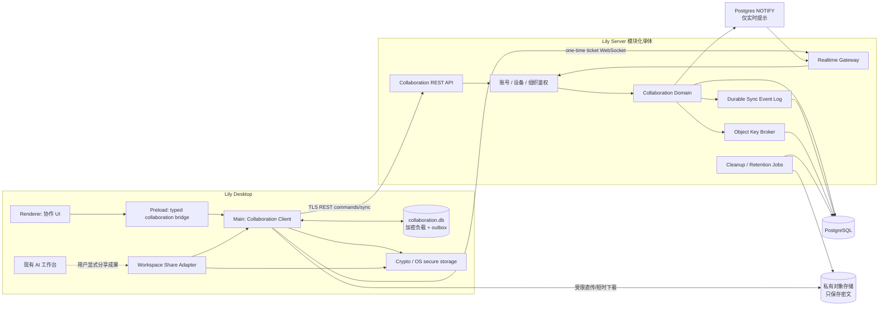
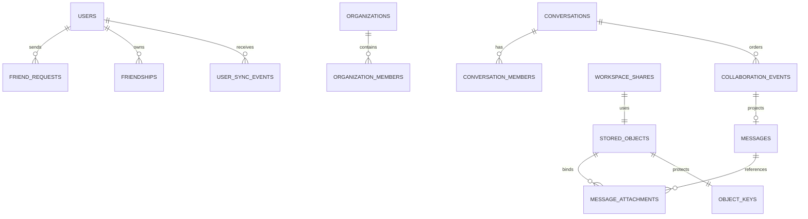

# Lily 协作中心闭环设计

> 好友、Team、消息、加密附件与本地工作空间交接

- 日期：2026-08-29
- 状态：待产品负责人审阅
- 适用范围：Lily Workbench 桌面端、Lily Server、对象存储
- 设计目标：给出可直接进入工程计划的产品、交互、架构、安全、故障与验收闭环

## 0. 最终决策

Lily 新增一个与“AI 工作台”并列的顶级模块：**协作中心**。协作中心以人与人沟通为主，支持两套同时存在但所有权明确分离的关系：

1. 个人关系：好友、好友私聊、好友群。
2. 企业关系：Team 成员、Team 私聊、公开频道、私密频道。

协作中心采用**同仓库、同服务部署、独立领域边界**的模块化单体架构。第一版不拆独立微服务，也不复用现有移动设备配对中继作为 IM；消息规模达到明确阈值后，才抽离实时网关和消息服务。

Lily 的本地工作空间继续是事实源。系统不做多人实时共享、不做远程挂载、不做文件实时同步。工作成果与工作空间通过以下方式交接：

1. 发送方在本地预检并生成 `.lilyspace.zip` 或成果包。
2. 客户端生成随机数据密钥并在本地加密。
3. 密文直传私有对象存储。
4. 消息只引用已完成、已校验、受权限控制的对象。
5. 接收方获得短时下载凭证，下载、校验、解密、预览。
6. 接收方始终导入为新的本地副本，不覆盖任何现有工作空间。

普通消息的收发、历史、未读和通知绝不依赖 AI。AI 只提供显式触发的总结、翻译、交接摘要、内容整理和自然语言操作；AI 或模型服务故障时，人与人通信必须保持完整可用。

## 1. 为什么做，以及不做什么

### 1.1 用户问题

Lily 已经能在本地完成复杂工作，但成果仍主要停留在单人工作台。用户要把成果交给同事或朋友时，需要手工寻找文件、解释背景、确认版本、重新发送依赖，接收方也不知道怎样安全接手。

协作中心解决的不是“再造一个聊天软件”，而是让以下闭环发生在 Lily 内部：

> 沟通需求 → 本地 AI/工具完成工作 → 分享成果或工作空间 → 对方安全接手 → 反馈或返回新版本。

### 1.2 产品目标

- 支持任何用户通过 Lily ID、二维码或邀请链接添加好友。
- 支持用户加入多个 Team，并复用现有组织成员与角色体系。
- 支持个人私聊、个人群、Team 私聊、公开频道和私密频道。
- 支持可靠的文本、引用、@、附件、工作成果和工作空间包消息。
- 支持断网发送队列、断线续传、离线同步、去重、顺序和已读状态。
- 支持可撤销、可过期、可审计的加密对象分享。
- 支持接收方预览后导入新的本地工作空间，并保留来源和版本谱系。
- 保证协作模块故障不会降低当前 AI 工作台和本地文件能力。

### 1.3 第一版明确不做

- 音视频通话、直播、屏幕共享。
- 在线文档共同编辑、CRDT、多人实时文件同步。
- 远程控制或直接挂载另一台电脑的工作空间。
- 朋友圈、动态广场、陌生人推荐和公开内容分发。
- 开放机器人市场、第三方机器人主动入群。
- 完整端到端加密聊天协议；第一版使用 TLS、服务端存储加密和对象信封加密。
- 跨组织共享频道和复杂企业联合租户。
- 服务端自动读取工作空间密文并调用 AI。
- 手机推送与独立移动 IM 客户端；首发通知由已登录的 Lily 桌面端提供，现有移动命令通道保持不变。

### 1.4 成功指标

上线后以可测量结果判断，而不是以页面数量判断：

- 文本消息服务端持久化成功率不低于 99.99%。
- 已持久化消息在双方在线时 P95 可见延迟不高于 800 ms。
- 断线重连后同步 P95 不高于 2 秒（1,000 个待同步事件以内）。
- 客户端重复发送、超时重试或重连不得产生重复可见消息。
- 工作空间分享从“选择发送”到“对方成功导入”的闭环成功率不低于 98%，用户主动取消和源内容超限不计失败。
- 未经授权的附件下载、Team 历史读取和私密频道访问必须为零容忍安全事件。
- 协作服务完全不可用时，现有本地 AI 会话、文件操作和工作空间导出仍可正常运行。

## 2. 不可破坏的产品与架构原则

### 2.1 本地优先，不伪装成云盘

- 工作空间的权威版本永远在发送方或接收方本地。
- 服务端只保存消息、授权元数据、密文对象和版本关系。
- “分享”是生成一个不可变版本；“导入”是创建一个新副本。
- 第一版不承诺增量同步。再次分享产生新的完整版本，并通过 `parent_share_id` 建立谱系。

### 2.2 个人资产与企业资产必须显式区分

- 个人好友私聊和个人群属于个人域。
- Team 私聊和频道属于组织域，受组织状态、成员状态、保留与审计策略控制。
- 界面始终显示会话作用域；不得仅凭头像或成员名称让用户猜测。
- 同一对用户可以同时存在个人私聊和某个 Team 内的企业私聊，它们是两个不同会话。

### 2.3 AI 是增强层，不是消息基础设施

- 消息发送、拉取、已读、下载和通知由确定性代码完成。
- AI 不决定权限，不分配消息序号，不重试网络协议，不生成对象授权。
- AI 只能读取用户当前有权访问且明确选择的消息范围。
- AI 代表用户发送消息属于外部副作用，必须经过明确收件人和内容确认。

### 2.4 失败不拖累今天的 Lily

- 协作模块拥有独立本地数据库、网络客户端和 UI 状态。
- 协作数据库损坏时允许丢弃缓存并从服务端重建，不能触碰 `messages.db`、OpenCode transcript 或本地工作空间。
- 协作服务不可用时隐藏在线状态并进入离线模式，不得阻止本地 Agent 启动或继续。
- 所有新能力受 `LILY_COLLABORATION_V1` 总开关控制；关闭后回到今天的产品行为。

## 3. 产品信息架构

### 3.1 顶级导航

应用保留现有 AI 工作台，同时新增“协作中心”入口：

```text
Lily
├── AI 工作台
│   ├── 项目
│   ├── 本地 AI 会话
│   └── 本地文件与成果
└── 协作中心
    ├── 收件箱
    ├── 好友
    ├── 个人群
    └── Team
        ├── Team 私聊
        ├── 公开频道
        └── 私密频道
```

入口只增加一个，不为好友、群、频道、文件分享分别增加顶级页面。协作中心内部使用统一的会话列表和消息阅读区。

### 3.2 会话类型

| 作用域 | 类型 | 所有者 | 成员来源 | 历史可见性 | 审计 |
|---|---|---|---|---|---|
| `personal` | `direct` | 两名用户 | 已接受好友 | 双方全部保留历史 | 用户级安全审计 |
| `personal` | `group` | 群成员 | 群主/管理员邀请 | 新成员从加入序号开始 | 群管理事件 |
| `organization` | `direct` | Team | 两名有效成员 | Team 保留策略内全部历史 | Team 管理员可审计 |
| `organization` | `channel_public` | Team | 所有有效 Team 成员 | 保留期内全部历史 | Team 管理员可审计 |
| `organization` | `channel_private` | Team | 显式频道成员且仍为 Team 成员 | 加入后可见保留历史 | Team 管理员可审计 |

个人屏蔽会阻止好友请求、个人私聊和双方 Team 私聊，但不隐藏双方都参与的公共 Team 频道消息；共享频道内可使用静音与举报。

### 3.3 身份发现

现有账号以手机号登录，但手机号不能默认成为公开搜索标识。新增：

- `lily_id`：全局唯一、可更改次数受限的公开标识。
- 显示名与头像。
- 好友二维码和短期邀请链接。
- 手机通讯录发现为明确 opt-in，服务端只处理规范化手机号的不可逆匹配令牌，不公开手机号。
- Team 成员可从 Team 通讯录发起 Team 私聊，不要求先成为个人好友。

## 4. 核心用户旅程

### 4.1 添加好友并私聊

1. 用户输入 Lily ID、扫描二维码或打开邀请链接。
2. 客户端显示对方最小公开资料及来源，用户发送好友申请。
3. 对方在收件箱看到申请，可接受、忽略或屏蔽。
4. 接受操作幂等地创建好友关系和唯一个人私聊。
5. 双方进入同一会话；离线一方上线后通过同步游标获得全部事件。

禁止仅凭手机号枚举用户；重复申请折叠为同一条状态记录；被屏蔽方得到通用结果，不暴露屏蔽事实。

### 4.2 加入 Team 并进入频道

1. 组织 owner/admin 通过现有企业管理能力添加成员。
2. 成员桌面端刷新组织列表，协作中心出现该 Team。
3. 默认公开频道自动可见；私密频道需显式邀请。
4. Team 被禁用、成员离职或被停用后，服务端立即拒绝新读取、发送和下载授权。
5. 客户端在下次鉴权或实时撤权事件后清除 Team 会话密钥和敏感缓存索引。

已经导出到用户控制范围的文件无法被服务器物理召回；产品和企业协议必须明确这一客观边界。

### 4.3 发送普通附件

1. 用户拖入文件或使用附件选择器。
2. 主进程检查文件类型、大小、可读性和路径稳定性。
3. 客户端生成缩略信息、哈希和随机数据密钥，在本地流式加密。
4. 客户端获取受限上传会话，密文直传对象存储。
5. 服务端完成对象校验后，客户端提交带附件引用的消息。
6. 只有消息持久化成功后，其他成员才能看到附件卡片。

上传失败不会生成“别人看得到但下载不了”的消息；用户可保留发送草稿并断点续传。

### 4.4 分享 AI 工作成果

1. 用户在 AI 回答、生成文件或成果卡片上选择“发送到协作中心”。
2. 系统只选中用户明确看到的最终成果；内部提示、工具入参、密钥、隐藏上下文和完整 OpenCode transcript 默认不分享。
3. 用户选择收件人/频道并确认标题、说明和文件范围。
4. 文件按普通加密附件流程上传，消息标记为 `artifact`。
5. 接收方可预览、下载或“保存到我的工作空间”。

### 4.5 分享完整工作空间

发送方闭环：

1. 从项目菜单、消息输入框或自然语言命令发起“分享工作空间”。
2. 主进程调用现有 `previewExport`，展示文件数、总大小、排除项、敏感信息预警、应用数据目录、技能、自动化和角色世界。
3. 高风险项必须由用户处理或明确确认；真实 `.env`、私钥和依赖缓存继续强制排除。
4. 自动化默认不分享；用户选择分享时，定义可进入包，但接收后始终暂停。
5. 本地生成 `.lilyspace.zip`，计算明文哈希，再流式加密为版本化密文容器。
6. 上传完成、对象校验和密钥封装成功后，服务端创建不可变 `workspace_share` 记录。
7. 客户端发送工作空间卡片消息；本地临时文件按策略清理。

接收方闭环：

1. 卡片显示发送者、来源作用域、名称、版本、文件数、大小、有效期和安全提示。
2. 用户点击“预览”，客户端请求短时下载票据和对象密钥。
3. 主进程流式下载密文，校验密文哈希，解密到隔离临时目录，校验明文哈希。
4. 使用现有 `workspace-package-inspector` 和导入限制检查 manifest、zip-slip、文件数、总大小及未来 schema。
5. 预览成功后才显示“导入为新工作空间”。
6. 用户选择新名称和本地目录；导入先落入临时目录，全部成功后原子移动到目标路径。
7. 目标已存在时禁止覆盖，必须改名或取消。
8. 导入完成后记录来源 share、发送者、会话、版本、哈希和导入时间；打开新的本地项目。

再次发送同一工作空间会产生新版本，卡片显示“基于版本 N”。第一版始终发送完整包，不生成文件 delta，避免错配基线造成不可恢复的工作空间。

## 5. 顶级交互设计

### 5.1 桌面布局

常规宽度采用三栏结构，详情为按需抽屉：

```text
┌──────────┬────────────────────┬─────────────────────────────────┬──────────────┐
│ 顶级模块 │ 会话与 Team 导航    │ 当前会话                         │ 详情抽屉      │
│          │                    │                                 │              │
│ AI       │ 收件箱             │ 作用域徽标 + 标题 + 成员          │ 成员/文件     │
│ 协作 ●3  │ 好友               │ ─────────────────────────────── │ 权限/通知     │
│          │ 个人群             │ 消息时间线                        │ 共享版本      │
│          │ Team A             │                                 │              │
│          │  # 项目            │ 未读分界                          │              │
│          │  🔒 财务           │                                 │              │
│          │ Team B             │ 输入框 + 附件 + 分享工作空间      │              │
└──────────┴────────────────────┴─────────────────────────────────┴──────────────┘
```

- 顶级模块栏只负责在 AI 工作台和协作中心之间切换。
- 会话栏顶部提供统一搜索和新建按钮；好友、个人群和 Team 不是彼此割裂的应用。
- 当前会话标题左侧固定显示“个人”或 Team 名称徽标。
- 详情抽屉默认关闭，避免压缩消息阅读区。
- 小窗口隐藏详情抽屉；更窄时会话列表与消息区切换显示，但输入草稿不能丢失。

### 5.2 收件箱与会话列表

排序规则确定为：置顶优先，其次未读提及，再其次最近活动。列表行包含：

- 头像或频道图标。
- 名称与个人/Team 作用域标记。
- 最后一条消息摘要；密文未解密或无权限时显示稳定占位。
- 时间、未读数、@ 标记、发送失败标记和静音状态。

不会用在线状态改变排序。正在输入和在线状态是易失提示，丢失不影响消息正确性。

空状态提供三个明确入口：添加好友、创建个人群、进入已有 Team。网络离线时，空状态不能误导为“没有消息”，而应显示“离线，正在展示本地缓存”。

### 5.3 消息时间线

- 消息按服务端 `conversation_seq` 排序，不按客户端时间排序。
- 客户端发送后立即显示乐观气泡，状态依次为“发送中、已发送、失败”。
- 服务端确认后用同一 `client_message_id` 原位更新，不新增第二条气泡。
- 历史分页向上加载时保持滚动锚点，不能跳动。
- 新消息到达而用户停留在历史位置时显示“有 N 条新消息”，不强制滚到底部。
- 未读分界由 `last_read_seq` 决定；阅读回执只发送最大已读序号。
- 编辑消息显示“已编辑”；撤回保留不可展开的审计占位，不在客户端假装物理消失。
- 引用回复保存目标消息 ID 和发送时的有限快照；原消息撤回后仍显示“原消息已撤回”。

首发策略固定为：文本消息发送后 15 分钟内可编辑，24 小时内可由发送者撤回；Team 管理员可以依据组织规则移除违规内容，但不能冒充发送者编辑原文。保留策略删除与用户撤回是两个不同的审计事件。

### 5.4 输入区

输入区支持：文本、表情、文件、工作成果、工作空间和引用回复。第一版不内置复杂富文本编辑器。

- `Enter` 发送、`Shift+Enter` 换行；用户可在设置中交换。
- 每个会话拥有独立本地草稿，切换会话不丢失。
- 离线可发送，消息进入 outbox；恢复网络后按创建顺序提交。
- 上传中的附件有独立进度、暂停、继续和取消，不冻结文本输入。
- 工作空间包未完成上传前，发送按钮表现为“准备并发送”，用户可随时取消。
- 超限、敏感项和权限错误使用靠近操作对象的行内说明，不只弹一次 toast。

### 5.5 好友与 Team 交互

- “添加好友”支持 Lily ID、二维码和邀请链接；手机号发现单独授权。
- 好友请求集中在收件箱，可接受、忽略、举报、屏蔽。
- Team 直接复用现有组织，不再创建第二套 Team 实体。
- Team 页面显示成员目录、公开频道和用户有权访问的私密频道。
- 创建频道时先选择公开或私密；创建后修改可见性不在第一版开放，避免历史授权歧义。
- 从 Team 成员资料点击“发消息”时，界面先明确选择“Team 私聊”或已有的“个人私聊”，不静默替用户决定资产归属。

### 5.6 工作空间分享卡片

发送前确认页必须展示：

- 工作空间名称、文件数、原始总大小、预计上传大小。
- 会被排除的文件和原因。
- 敏感信息预警及对应路径。
- 是否包含工作空间技能、自动化定义、角色/世界资料和应用数据。
- 接收者/频道、个人或 Team 作用域、默认有效期。
- 明确文案：“接收方获得独立副本，不会与你的本地工作空间同步。”

消息卡片有五种稳定状态：

1. 可下载：显示预览和导入。
2. 正在本机下载：显示进度、暂停和取消。
3. 已导入：显示本地项目名称和“打开”。
4. 已过期或发送者撤销：保留元数据，不显示下载。
5. 无权限：只显示通用不可用状态，不泄漏对象细节。

### 5.7 错误与恢复体验

| 场景 | 用户看到什么 | 可执行恢复 |
|---|---|---|
| WebSocket 断开 | 顶部“正在重连”，历史仍可读 | 自动退避重连并用游标补同步 |
| REST 暂时失败 | 气泡保持“发送中/失败” | 自动安全重试或手动重试 |
| 登录过期 | 协作区锁定，不清空本地 AI 工作 | 重新登录后续传和同步 |
| 附件上传中断 | 进度暂停并说明网络原因 | 使用原上传会话续传 |
| 分享包含敏感项 | 发送前阻断并列出路径 | 返回本地处理或明确确认可确认项 |
| 密文哈希不符 | 卡片显示“文件校验失败” | 删除临时内容并重新下载 |
| 解密失败 | 不产生任何导入文件 | 刷新授权后重试；仍失败则报告稳定错误码 |
| 导入目标冲突 | 保持预览，不覆盖目标 | 改名或选择新目录 |
| Team 成员被移除 | Team 区显示权限已撤销 | 清除密钥与缓存索引，保留个人区 |

### 5.8 通知、键盘与可访问性

- 桌面通知默认只显示发送者和会话，不显示 Team 敏感正文；用户可选择显示预览。
- 静音、仅 @、全部通知按会话设置。
- 支持键盘切换未读会话、聚焦输入框、搜索、关闭详情抽屉。
- 所有图标有可访问名称；未读不能只依赖颜色；作用域使用文字和图标双重表达。
- 消息状态、上传进度和错误通过 `aria-live` 适度播报，避免流式进度刷屏。
- 尊重系统减少动画设置；乐观消息重排只做短距离、可关闭的过渡。

## 6. 总体技术架构



### 6.1 边界说明

- Renderer 只负责展示和收集意图，不直接持有账号令牌、对象密钥或文件系统权限。
- Preload 暴露有限、类型化的协作 API，不提供任意网络或任意文件访问。
- Electron main 负责网络、缓存、加解密、工作空间打包与安全导入。
- Server 复用账号、`user_sessions`、`organizations` 和 `organization_members`，但消息领域拥有独立表、路由和服务。
- PostgreSQL 是消息与同步事件的唯一权威存储。
- WebSocket 只推送“有新事件”的低延迟信号；任何丢包都由 REST 游标同步补回。
- 对象存储永远不是权限系统；每次下载都先经过 Lily Server 授权。
- 现有 `mobile-relay` 保持设备配对用途，不改变协议、不共享 registry。

### 6.2 模块位置建议

```text
server/src/collaboration/
├── routes/              # REST 与 WS ticket
├── domain/              # 好友、会话、成员、消息、读取指针
├── sync/                # 用户游标、事件投影、补同步
├── realtime/            # WebSocket 连接与瞬时事件
├── objects/             # 上传、下载、密钥封装、生命周期
└── jobs/                # 过期、孤儿对象、保留策略

src/main/collaboration/
├── client.js            # REST/WS、鉴权刷新、重连
├── sync-engine.js       # durable cursor、应用事件
├── local-store.js       # collaboration.db
├── outbox.js            # 幂等命令队列
├── crypto.js            # 对象加密和本地负载加密
├── attachment-transfer.js
└── workspace-transfer.js

src/renderer/modules/collaboration/
├── shell.js
├── conversation-list.js
├── timeline.js
├── composer.js
├── friends.js
├── teams.js
└── share-cards.js
```

这是目标边界，不要求一开始创建大量空文件。工程实现应按切片落地，只在一个职责确实形成后拆文件。

## 7. 服务端领域模型



### 7.1 用户资料与关系

- `user_profiles(user_id PK, lily_id UNIQUE, display_name, avatar_object_id, discoverability, updated_at)`
- `friend_requests(id, sender_user_id, receiver_user_id, status, message, created_at, responded_at)`
- `friendships(user_low_id, user_high_id, status, created_at)`，使用排序后的用户 ID 保证一对用户只有一行。
- `user_blocks(blocker_user_id, blocked_user_id, created_at)`。

好友接受在单个事务内完成：请求 CAS 更新、插入 friendship、查找或创建唯一个人 direct conversation、写入双方同步事件。任何重试返回相同结果。

解除好友后，双方保留已经取得的个人私聊历史，但服务端拒绝发送新消息；重新成为好友后继续使用原 direct conversation，不创建第二段割裂历史。屏蔽在此基础上同时隐藏会话入口、阻止新请求和新下载 ticket，但无法撤回对方已经下载到其本地控制范围的文件。

### 7.2 会话与成员

- `conversations(id, scope_type, organization_id NULL, kind, title, status, next_seq, retention_days, created_by, created_at, updated_at)`。
- `conversation_members(conversation_id, user_id, role, status, joined_seq, last_read_seq, notification_level, joined_at, left_at)`。
- 唯一约束确保同一好友对只有一个有效个人 direct，同一 Team 用户对只有一个有效 Team direct。
- `scope_type=organization` 时 `organization_id` 必填，且发送、读取、下载都重新验证组织和成员 active。
- 公开频道的授权来自 active Team membership；`conversation_members` 仍保存个人读取指针和通知偏好。
- 私密频道除 active Team membership 外，还必须存在 active conversation membership。

### 7.3 有序事件与消息投影

- `collaboration_events(id, conversation_id, seq, type, actor_user_id, actor_device_id, client_command_id, payload, created_at)` 是不可变会话事件流。
- `messages(id, conversation_id, create_seq, sender_user_id, kind, body_ciphertext, body_key_version, reply_to_message_id, edited_at, revoked_at, created_at)` 是读取优化投影。
- `message_revisions(id, message_id, event_seq, body_ciphertext, key_version, created_at)` 保存编辑历史，Team 审计可见，普通成员只见最新投影。
- 唯一约束：`(conversation_id, seq)`、`(actor_device_id, client_command_id)`。

每个会话的写事务锁定 conversation 行，读取并递增 `next_seq`，写入事件、更新投影、为当前授权成员写入用户同步事件，最后提交。客户端时钟不参与权威顺序。

消息正文使用独立的 `COLLAB_MESSAGE_KEK` 做服务端信封加密后存入 PostgreSQL；密钥与对象 KEK 分离并独立轮换。第一版不建立消息明文搜索索引，也不宣称聊天内容端到端加密。

### 7.4 用户同步事件

- `user_sync_state(user_id PK, next_cursor, compacted_before_cursor, updated_at)`。
- `user_sync_events(user_id, cursor, event_id, conversation_id, created_at)`。

同一业务事务为受影响用户分配单调递增 cursor。客户端只保存最后完整应用的 cursor。事件被重复返回时必须幂等；发现游标早于压缩点时，服务端返回 `FULL_RESYNC_REQUIRED`，客户端重建协作缓存，不影响其他本地数据。

### 7.5 读取状态

- 已读使用单调最大值 `last_read_seq = max(old, submitted)`。
- 第一版会话列表展示未读数和 @ 数，不展示逐人“已读头像墙”。
- 个人 direct 可显示“对方已读到此”作为可关闭能力；Team 默认不显示个人阅读轨迹，管理员只能看聚合活跃度。

## 8. 消息命令、顺序与同步协议

### 8.1 命令与实时事件分离

- 所有持久化写操作走 HTTPS REST 命令。
- WebSocket 只承载新事件通知、输入状态、在线状态和撤权信号。
- 客户端收到 WS 通知后按 durable cursor 调用 sync；即使通知重复、乱序或丢失，最终结果一致。

这避免把连接本身当数据库，也避免重连期间复杂的 socket 命令重放。

### 8.2 发送幂等

客户端为每次用户意图生成 UUIDv7 `client_command_id`，并在 outbox 持久化：

```json
{
  "clientCommandId": "uuidv7",
  "conversationId": "conv_...",
  "kind": "text",
  "body": "...",
  "replyToMessageId": null,
  "attachmentIds": [],
  "createdAtClient": "..."
}
```

服务端以 `(actor_device_id, client_command_id)` 去重。第一次请求成功但响应丢失时，重试返回原 message/event，不创建新消息。

### 8.3 Outbox 状态机

```text
draft -> queued -> submitting -> persisted
                     |             |
                     v             v
             retryable_failed   projected
                     |
                     v
               permanent_failed
```

- 网络错误、502/503/504 和超时进入有上限的指数退避。
- 权限、成员已移除、内容超限和对象未完成为永久失败，必须让用户处理。
- 只有未产生外部副作用或拥有相同幂等键的命令可以自动重试。
- 用户点击重试沿用原 `client_command_id`；修改内容后创建新命令。

### 8.4 WebSocket 生命周期

1. 客户端通过带 Bearer access token 的 REST 请求获取 60 秒有效、单次使用的 WS ticket。
2. WebSocket URL 只携带 ticket，不携带长期 access token。
3. 连接成功后客户端发送最后应用的 sync cursor 和 device id。
4. 服务端回复 `ready`，随后只推事件提示。
5. 心跳 30 秒；网络变化触发立即重连；退避加随机抖动，上限 30 秒。
6. 每次重连都先 sync，再恢复在线/输入状态。

### 8.5 历史与同步

- 会话历史按 `conversation_seq` 分页，默认 50 条，最大 200 条。
- 全局增量同步按用户 cursor，默认 500 个事件，最大 2,000 个。
- sync 响应携带 `hasMore` 和 `nextCursor`；客户端只有在整页事务应用成功后推进游标。
- 本地应用事件也使用 SQLite 事务，避免列表已更新但消息未落盘的半状态。

## 9. 对象存储与加密设计

### 9.1 安全目标与明确边界

第一版目标是：对象存储、CDN URL 或数据库单独泄漏时，攻击者不能直接读取附件和工作空间内容。Lily Server 在授权后能够解封对象密钥，因此这不是端到端加密；产品不得使用 E2EE 文案。

采用以下保护：

- TLS 1.2+ 传输。
- 每个对象独立随机 256-bit 数据密钥（DEK）。
- 客户端使用标准 AEAD 流式加密；密文与元数据都有完整性校验。
- DEK 通过服务端 KEK/KMS 信封加密，数据库只存 wrapped DEK 与 key version。
- KEK 不进入 PostgreSQL、对象存储、日志或客户端配置；生产环境必须单独注入并支持版本轮换。
- 对象存储 bucket 必须为私有，禁止保存或返回永久公开 URL。协作对象使用独立的 `COLLAB_QINIU_*` 配置和私有 bucket，不得复用当前承载公开发行物的 bucket/域名。

### 9.2 密文容器

容器采用版本化 `LILYENC1` 格式，基于 Node 内置密码库的 AES-256-GCM 分块加密：

- 每块默认 4 MiB。
- 每块使用唯一随机 96-bit nonce，nonce 随块记录。
- header 包含格式版本、算法、块大小、明文大小、明文 SHA-256、内容类型和规范化文件名；header 作为 AAD 认证。
- trailer 包含块数和整体密文 SHA-256。
- 解密器先验证格式和边界，再逐块认证；任何块失败立即终止并删除临时文件。
- 格式必须有固定测试向量、截断测试、位翻转测试和未来版本拒绝测试。

不得把同一个 DEK/nonce 组合用于两个对象；不得自行发明加密算法。

### 9.3 服务端对象模型

- `stored_objects(id, owner_user_id, scope_type, organization_id, provider, object_key, state, ciphertext_size, ciphertext_sha256, mime_type, original_name, expires_at, revoked_at, created_at)`。
- `object_keys(object_id PK, wrapped_dek, kek_version, algorithm, created_at)`。
- `message_attachments(message_id, object_id, purpose, sort_order)`。
- `workspace_shares(id, object_id, source_name, source_manifest_summary, plaintext_sha256, parent_share_id, expires_at, created_by, created_at)`。

对象状态机：

```text
initiated -> uploading -> uploaded -> verified -> bound
     |           |           |
     v           v           v
  expired      aborted     rejected

bound -> revoked | expired | deleted
```

只有 `verified` 对象可以绑定消息。孤儿对象 24 小时后清理。消息事务绑定后进入 `bound`。

### 9.4 上传协议

1. 客户端生成 DEK 并完成本地加密；`POST /collaboration/objects/init` 通过 TLS 提交 DEK、密文大小、哈希、类型、作用域和过期策略。DEK 不进入 outbox 日志或普通业务对象。
2. 服务端 key broker 在请求内立即使用当前 KEK/KMS 封装 DEK，只持久化 wrapped DEK 和 key version；随后清除请求期明文引用，生成不含用户信息的随机 object key、受限上传凭证和 upload id。
3. 客户端将密文直传对象存储；大文件使用可续传分块上传。
4. `POST /objects/:id/complete`：提交对象存储 etag、密文大小和 SHA-256。
5. 服务端通过对象存储 HEAD/元数据确认 key、大小和状态，再标记 verified。
6. 消息发送命令绑定对象；服务端再次校验对象所有者、作用域和未绑定状态。

上传凭证仅允许指定 key、指定大小范围和短期有效，不能列 bucket、覆盖别的 key 或上传任意 MIME。

`objects/init` 和 `download-ticket` 路由必须禁用请求/响应体日志并配置字段级 redaction。若 key broker 或 KEK 不可用，附件能力明确失败，文本消息仍可发送；不得把 DEK 退化为明文数据库字段。

### 9.5 下载协议

1. 客户端请求 `POST /objects/:id/download-ticket`。
2. 服务端从对象绑定的消息反查当前用户是否仍可读取对应会话。
3. 验证 Team/成员 active、对象未撤销/未过期和 retention policy。
4. 返回最多 5 分钟有效的私有下载 URL、预期密文哈希、大小和经 TLS 返回的 DEK。
5. 客户端下载后必须在解密前后分别校验密文与明文完整性。

撤销后不再签发新 ticket；已签发 URL 最多残留 5 分钟。对象 key 永不直接作为授权凭据。

### 9.6 生命周期默认值

- 普通聊天附件跟随消息保留策略。
- 个人工作空间分享默认 30 天，可选 7/30/90 天。
- Team 工作空间分享默认 90 天，owner/admin 可在 30/90/180/365 天中配置。
- 到期后消息卡片与版本元数据保留，对象与 wrapped DEK 删除。
- 法律保留不进入第一版；如果未来加入，必须是显式组织策略并有完整审计。

## 10. 本地客户端架构

### 10.1 独立本地缓存

新增独立 `collaboration.db`，不得向当前 AI `messages.db` 加表。缓存包含：

- 会话与成员投影。
- 已接收 collaboration events。
- 加密后的消息正文和附件元数据。
- 用户 sync cursor。
- outbox、上传会话、下载会话和草稿。
- 工作空间 share 与本地导入映射。

消息正文和草稿采用每账户本地缓存密钥做 AES-GCM 字段加密；缓存密钥由 Electron `safeStorage`/系统凭据存储保护。退出账号时保留密文以便同账号重新登录，切换账号不能解密其他账号缓存。设备撤销或 Team 撤权时删除相应密钥材料和可搜索索引。

第一版不构建包含明文的持久本地全文索引，也不承诺全历史消息正文搜索。统一搜索首发只覆盖 Lily ID、好友、Team、频道、会话标题以及附件/工作空间卡片的安全元数据；离线搜索范围相同。后续如加入消息正文搜索，必须单独设计服务端受权解密索引、泄漏边界、删除一致性和 Team 策略，不能在本功能内偷偷落一份明文索引。

### 10.2 Main 与 Renderer 信任边界

- access token、refresh token、DEK、KEK 交互结果和本地工作空间路径只存在 main。
- Renderer 接收已授权、已解密、为显示裁剪后的 view model。
- preload 对每个输入做 schema 校验和大小限制。
- Renderer 发来的 conversation id、object id 和本地 path 都是不可信输入，main/server 必须重新验证。
- 工作空间导入由 main 在隔离目录执行，Renderer 不能指定任意覆盖策略。

### 10.3 本地临时文件

- 使用 appData 下专用 `collaboration-transfer` 目录，不写入工作空间根目录。
- 每次传输使用随机子目录和 mode 0700（平台允许时）。
- 临时清理必须只针对经过根路径验证的专用目录，不接受未解析路径或 glob。
- 崩溃恢复扫描只处理带有效 transfer manifest 的目录；无法确认归属的内容保留并报告，不盲删。

## 11. 权限、安全与隐私

### 11.1 授权矩阵

| 操作 | 个人 direct | 个人 group | Team direct | 公开频道 | 私密频道 |
|---|---|---|---|---|---|
| 读取 | active member | active member | active org + member | active org member | active org + channel member |
| 发送 | 好友有效且未屏蔽 | active member | 双方 active org member | active org member | active org + channel member |
| 邀请 | 不适用 | owner/admin | 不适用 | org admin 创建/管理 | channel owner/admin |
| 下载对象 | 当前可读且对象有效 | 同左 | 当前 Team 授权 | 当前 Team 授权 | 当前私密频道授权 |
| 审计 | 用户安全事件 | 群管理事件 | org owner/admin | org owner/admin | org owner/admin |

所有权限在每次写命令和下载 ticket 签发时重新计算，不能相信客户端缓存或 WebSocket 连接建立时的旧权限。

### 11.2 Team 撤权

- 组织或成员禁用事务写入撤权 sync event。
- 服务端立即拒绝新读取、发送、搜索和对象 ticket。
- WebSocket 尽力推送 `scope.revoked`，客户端收到后锁定 Team 区并清除密钥。
- 未收到实时事件的客户端在下一次任何 API 请求时仍会被拒绝。
- 本地已导出的文件无法远程删除；界面和企业政策不得承诺做不到的“绝对召回”。

### 11.3 滥用与风控

- 好友申请按发送者、接收者、设备和 IP 限流。
- Lily ID 查询返回最少公开资料并防批量枚举。
- 屏蔽结果对被屏蔽方返回通用状态。
- 消息、输入状态和附件 init 各自有用户/会话级限流，不复用当前全局内存 IP 桶作为唯一防线。
- 举报保存消息 ID、有限上下文和审计链；不会把整个个人历史默认上送。
- 文件名、MIME、长度和 manifest 都按不可信输入处理。

### 11.4 日志与秘密

日志禁止记录：消息正文、DEK、wrapped DEK、签名 URL、access token、refresh token、邀请 token、完整本地路径和工作空间文件名列表。

允许记录：稳定错误码、用户/会话/对象的不可逆或内部 ID、大小桶、时延、重试次数、状态迁移和权限判定结果。

### 11.5 保留、删除与账号注销

- 个人消息默认保留，用户“从我的列表删除”只改变其本地/个人投影，不伪装成对方数据已删除。
- Team 默认保留 365 天；owner 可配置 30/90/180/365 天或长期保留。策略只影响到期后的服务端内容与对象，不改变已下载副本的现实边界。
- 消息正文到期后删除密文和附件绑定，时间线保留最小 tombstone 以维持 seq、引用和审计一致性。
- 普通安全审计保留 365 天；Team 可在合同允许范围内配置更长时间。审计不保存被删除的正文副本。
- 账号注销先进入 30 天可恢复期并立即撤销 session。期满后个人资料匿名化、未绑定个人对象删除；Team 消息按 Team 策略保留并把发送者显示为“已注销用户”。
- 删除任务必须幂等、可重试并记录对象删除结果；数据库元数据与对象存储删除不一致时进入补偿队列，不提前声称物理删除完成。

## 12. AI 与自然语言协作

### 12.1 可用能力

- “总结这个频道最近一周的决定。”
- “把这份报告发给张三，附上三条交接说明。”
- “把当前工作空间打包发到 Team A 的项目频道。”
- “将这段消息翻译成英文，先给我预览。”
- “把群里提到的任务整理成待办文件，保存到本地工作空间。”

### 12.2 工具边界

提供确定性 collaboration 工具：

- `list_contacts`
- `list_conversations`
- `read_conversation`
- `draft_message`
- `send_message`
- `prepare_workspace_share`
- `send_workspace_share`
- `download_shared_artifact`

模型负责理解用户想做什么和生成草稿；代码负责解析 ID、验证权限、上传、发送、重试、校验和导入。

### 12.3 外部副作用确认

- `draft_message` 无外部副作用，可直接执行。
- `send_message` 必须带明确 conversation id 和用户确认过的最终正文。
- 在当前协作会话输入框直接按发送视为用户确认。
- 从 AI 工作台自然语言发起跨模块发送时，必须显示收件人、作用域、正文和附件预览卡；用户确认后才能调用发送。
- 收件人重名、个人/Team 作用域歧义、附件仍上传中或权限过期时必须停下询问，不能猜。
- 发送必须以服务端持久化 ACK 为完成条件；生成了本地文件或草稿不能冒充“已经发出”。

### 12.4 上下文最小化

- AI 只读取用户明确指定的会话和时间/消息范围。
- 默认最大范围受字符、消息数和时间窗口共同约束，超限先机械分页/提取，再由模型总结。
- Team 管理员权限不会自动扩大 AI 的日常读取范围。
- 密文工作空间包不会上传给服务端模型；接收方导入后才可由其本地 Agent 按现有权限读取。

## 13. API 与事件契约

以下为稳定资源边界，不是最终 OpenAPI 的全部字段。

### 13.1 Bootstrap 与同步

- `GET /api/collaboration/bootstrap`：当前资料、好友摘要、Team 摘要、会话列表和当前 cursor。
- `GET /api/collaboration/sync?after=<cursor>&limit=<n>`：按用户 cursor 增量同步。
- `POST /api/collaboration/ws-ticket`：创建单次短期连接票据。

### 13.2 好友

- `GET /api/collaboration/users/by-lily-id/:id`
- `POST /api/collaboration/friend-requests`
- `POST /api/collaboration/friend-requests/:id/accept`
- `POST /api/collaboration/friend-requests/:id/reject`
- `DELETE /api/collaboration/friends/:userId`
- `POST /api/collaboration/blocks`
- `DELETE /api/collaboration/blocks/:userId`

### 13.3 会话与消息

- `GET /api/collaboration/conversations`
- `POST /api/collaboration/conversations`
- `GET /api/collaboration/conversations/:id/messages?beforeSeq=&limit=`
- `POST /api/collaboration/conversations/:id/messages`
- `PATCH /api/collaboration/messages/:id`
- `POST /api/collaboration/messages/:id/revoke`
- `POST /api/collaboration/conversations/:id/read`
- `POST /api/collaboration/conversations/:id/members`
- `DELETE /api/collaboration/conversations/:id/members/:userId`

### 13.4 对象与分享

- `POST /api/collaboration/objects/init`
- `POST /api/collaboration/objects/:id/complete`
- `POST /api/collaboration/objects/:id/abort`
- `POST /api/collaboration/objects/:id/download-ticket`
- `POST /api/collaboration/objects/:id/revoke`
- `POST /api/collaboration/workspace-shares`
- `GET /api/collaboration/workspace-shares/:id`

### 13.5 WebSocket 事件

持久事件只发送提示和 cursor：

```json
{ "type": "sync.available", "cursor": 1842 }
```

瞬时事件可包含：

- `presence.changed`
- `typing.started`
- `typing.stopped`
- `scope.revoked`
- `server.draining`

所有事件都有 `schemaVersion`。未知事件类型必须忽略并记录诊断，不能让整个同步停止。

### 13.6 错误形状

统一返回：

```json
{
  "ok": false,
  "code": "COLLAB_CONVERSATION_FORBIDDEN",
  "retryable": false,
  "requestId": "req_..."
}
```

客户端文案根据稳定 code 本地化；服务端 detail 不直接显示给用户。权限错误不说明对象或私密频道是否存在。

## 14. 可靠性、扩展性与运行架构

### 14.1 第一版运行拓扑

沿用现有 Fastify + PostgreSQL + Qiniu 部署，不引入 Redis 作为首发硬依赖：

- PostgreSQL 保存权威消息、事件、读取指针和对象元数据。
- 单 API 实例内使用内存连接表做 WebSocket fanout。
- 多 API 实例时使用 PostgreSQL `LISTEN/NOTIFY` 发送“用户有新 cursor”的轻量提示。
- NOTIFY 丢失不影响正确性，因为客户端周期同步和重连同步都读取 durable event log。

### 14.2 拆服务阈值

满足任一条件才评估独立实时/消息服务：

- 单实例稳定保持超过 20,000 个 WebSocket 连接。
- 消息写入持续超过 300 次/秒。
- fanout 导致 API P95 延迟连续一周超过目标。
- 独立扩容需求明确且 Postgres NOTIFY 成为可测瓶颈。

抽离时保持 REST、sync cursor 和事件 schema 不变，客户端无感迁移。

### 14.3 数据库与归档

- `collaboration_events` 按月或哈希分区的需求在实测数据量达到阈值后启用，首版不预先复杂化。
- 所有高频查询有 `(conversation_id, seq)`、`(user_id, cursor)`、成员状态和对象状态索引。
- 大群 fanout 不在消息事务内逐行做重计算；成员集合先由授权投影确定，再批量写 user sync events。
- 超大公开 Team 频道未来可改为按组织 cursor 投影，第一版设置 Team 成员上限，避免过早引入双游标模型。

首发默认上限：单 Team 1,000 人、个人群 200 人、私密频道 500 人、单条文本 32 KiB、普通附件 1 GiB、工作空间包密文 256 MiB、包内最多 20,000 个文件且明文总量 512 MiB。超过工作空间限制时必须让用户选择子目录或仅分享成果，不能静默漏文件。

## 15. 可观测性与运营

### 15.1 指标

- REST 命令成功率、P50/P95/P99 时延、按 code 的失败率。
- 消息持久化到接收端 sync 应用的端到端时延。
- WebSocket 在线连接、重连率、心跳超时和连接时长。
- sync backlog、每页事件数、full resync 次数。
- outbox 年龄、自动重试次数、永久失败率。
- 上传/下载吞吐、续传率、哈希失败和解密失败。
- 孤儿对象数量、过期清理延迟和对象存储成本。
- 工作空间预检阻断、发送、下载、预览、导入各阶段转化率。

### 15.2 审计

Team 审计记录：成员/频道变更、消息撤回、对象上传/下载授权、工作空间分享/撤销、保留策略变化和管理员读取行为。审计内容不保存明文消息副本，引用稳定 ID 和结果。

个人域只保留安全必需事件，不向 Team 管理员暴露。

### 15.3 运维开关

- `LILY_COLLABORATION_V1=0`：桌面与服务端关闭协作能力。
- `LILY_COLLAB_REALTIME=0`：关闭 WS，客户端退化为定期 sync，消息仍可用。
- `LILY_COLLAB_OBJECT_SHARING=0`：禁止新上传，文本消息仍可用，已有对象仍按授权下载。
- `LILY_COLLAB_AI_TOOLS=0`：关闭 AI 协作工具，人工聊天不受影响。

开关不得改变既有本地 AI 模型、工具、记忆或工作空间行为。

## 16. 故障模型与 Capability Gate

| 故障 | 必须发生 | 禁止发生 |
|---|---|---|
| 协作服务宕机 | 协作区离线、outbox 保留、本地 AI 正常 | 阻止应用启动或 AI 对话 |
| WS 丢事件 | REST cursor sync 补齐 | 永久缺消息 |
| 命令响应丢失 | 同幂等键重试返回原消息 | 重复消息 |
| 本地协作库损坏 | 隔离、备份、重建协作缓存 | 修改/删除 AI `messages.db` |
| 对象上传失败 | 草稿可重试、别人不可见 | 创建不可下载的正式消息 |
| 对象存储不可用 | 文本消息可继续、附件明确失败 | 整个聊天不可用 |
| 密文损坏 | 校验失败、删除临时明文 | 导入部分工作空间 |
| 包格式未知 | 显式拒绝未来 schema | 猜测解压或普通附件误导入 |
| Team 权限失效 | 立即拒绝、清密钥、锁 Team | 回退到个人权限继续访问 |
| AI 总结失败 | 用户仍可正常读写消息 | 阻断消息或伪造总结 |
| AI 发送工具失败 | 明确显示未发送 | 把草稿/本地文件说成已发送 |

新增 Capability Gate 注册项应证明：协作不可用时现有 AI 行为保持字节级/路径级不变；所有安全授权失败则 fail closed，而不是错误地 fail open。

## 17. 分阶段交付

“第一版产品”包含好友、Team、可靠消息和工作空间分享，但工程按可验证切片交付，避免一次性大爆炸。

### Slice 0：协议与安全地基

- 用户公开资料和 Lily ID。
- collaboration feature flags。
- 独立本地数据库、账号隔离、sync cursor 和 outbox 骨架。
- 服务端事件表、幂等命令、WS ticket 和权限公共函数。
- 私有对象存储配置、KEK 注入和加密格式测试向量。

出口门：在无 UI 情况下通过双客户端协议测试，证明重复、乱序、断线和撤权正确。

### Slice 1：好友与个人私聊

- 好友申请、接受、忽略、屏蔽。
- 个人 direct、文本、引用、编辑、撤回、未读和离线同步。
- 协作中心基础三栏 UI、草稿、outbox 和桌面通知。

出口门：两个真实桌面客户端完成在线、离线、重连和重复请求测试。

### Slice 2：个人群与 Team

- 个人群成员管理。
- 复用 organizations 和 organization_members。
- Team direct、公开/私密频道、作用域标记、撤权和 Team 审计。

出口门：跨个人/多个 Team 的权限矩阵自动化测试全部通过；离职成员不能读、发或取附件。

### Slice 3：加密附件与工作空间交接

- 普通附件加密直传、续传、下载和撤销。
- 复用现有 workspace preview/export/import。
- 分享确认、敏感预警、工作空间卡片、隔离预览和原子导入。
- 版本谱系、过期和孤儿清理。

出口门：发送者在线/离线不影响已发送包下载；损坏、过期、撤销、超限、zip-slip 和权限变化全部闭环。

### Slice 4：AI 增强与自然语言

- 对话范围读取与总结。
- AI 成果发送。
- 自然语言选择收件人、生成草稿和工作空间分享预检。
- 外部副作用确认与 required-tool completion。

出口门：AI 服务完全关闭时全部人工 IM 功能仍通过；任何未获得持久化 ACK 的操作不能报告成功。

### Slice 5：灰度与运营

- 内部 Team 灰度、容量和故障演练。
- 对象成本、保留策略和审计验证。
- 逐组织灰度开关、回滚和数据迁移检查。

## 18. 测试策略

### 18.1 纯逻辑测试

- 好友状态机、重复/交叉请求、屏蔽优先级。
- 会话作用域与角色权限矩阵。
- seq 分配、client command 去重、读取指针单调性。
- outbox 重试分类与非幂等保护。
- retention、对象状态机和下载授权。
- 加密固定向量、nonce 唯一、截断、位翻转和错误密钥。
- 工作空间 share 版本谱系和过期规则。

### 18.2 PostgreSQL 集成测试

- 两个并发发送者获得唯一连续 seq。
- 同命令并发重试只产生一个可见消息。
- 消息、projection 和 user sync event 同事务提交或回滚。
- 成员在下载 ticket 请求前被移除时必然 403。
- 好友接受并发只创建一个 friendship 和一个 direct conversation。
- 对象完成但消息事务失败时对象进入可清理孤儿状态。

### 18.3 WebSocket 与同步测试

- 丢弃、重复和乱序 WS 通知后，sync 结果一致。
- 服务重启、连接替换、token 过期和 ticket 重放。
- full resync 只重建 collaboration cache。
- presence/typing 丢失不改变消息投影。

### 18.4 Electron 主进程测试

- 多账号缓存密钥隔离。
- Renderer 不能获得 token、DEK 或任意文件读取能力。
- 离线草稿、outbox、上传续传和重启恢复。
- 协作 DB 损坏不触碰 AI 数据。
- Team 撤权清除对应缓存密钥。

### 18.5 工作空间闭环测试

- 现有 `.lilyspace.zip` 导出/导入能力全部保留。
- 敏感文件排除和内容预警。
- 自动化导入后暂停，旧客户端兼容镜像仍有效。
- 加密上传、下载、密文/明文双哈希和错误密钥。
- zip-slip、symlink、文件数、总大小、单文件和压缩炸弹限制。
- 目标存在时绝不覆盖；失败导入不留下半工作空间。
- 同一 share 重复导入产生明确选择，不静默覆盖。

### 18.6 交互与无障碍测试

- 个人/Team 作用域在会话列表、标题、发送确认和通知中始终可辨。
- 各窗口宽度的布局、滚动锚定、输入草稿与未读分界。
- 键盘全流程和屏幕阅读器标签。
- 发送中、失败、撤销、过期、无权限、离线和重新登录状态。

## 19. 发布验收清单

只有以下条件全部满足才能称为闭环完成：

1. 两名用户可通过 Lily ID 加好友，并在一方离线时可靠收发消息。
2. 同一用户可同时加入多个 Team，个人与 Team 会话数据不会串域。
3. 公开频道、私密频道和 Team direct 的权限矩阵经过自动化证明。
4. 重复请求、超时重试和重连不产生重复可见消息。
5. 消息历史顺序只由服务端 seq 决定。
6. 对象存储中只有密文，没有永久公开 URL和明文 DEK。
7. 未授权用户即使知道 object id/key 也不能取得有效下载 ticket。
8. 发送方可预检并发送工作空间，接收方可在发送方离线时下载和导入。
9. 工作空间导入始终创建新目录，任何失败不修改既有工作空间。
10. 分享包撤销、过期、损坏、超限和权限撤销都有明确用户状态。
11. AI 代表用户发送前有收件人和内容确认，未 ACK 不报告成功。
12. 关闭 AI 后所有人工 IM 功能正常。
13. 关闭协作功能或停止协作服务后，现有 AI 工作台全部回归测试通过。
14. 日志扫描证明不包含消息正文、密钥、token、签名 URL 和完整本地路径。
15. 对象孤儿、保留删除、密钥轮换和服务重启经过演练。

## 20. 被拒绝的方案

### 20.1 把人类消息塞进现有 AI Session

拒绝原因：OpenCode transcript 是本地 Agent 会话事实源，远程人类消息是服务端协作事实源。合并后会混淆所有权、权限、重放、工具事件和多端同步，也可能让协作故障拖累 AI。

### 20.2 复用 mobile relay

拒绝原因：现有 relay 绑定一个 pairing grant 的桌面与移动设备，是不持久化的哑管道；它没有好友/Team 权限、消息序号、离线存储、成员 fanout 或 durable sync。保持原协议更安全。

### 20.3 第一版做实时共享工作空间

拒绝原因：这要求云端权威文件系统、冲突合并、锁、版本向量和远程执行安全，会推翻 Lily 本地工作台边界。加密快照交接已经能完成主要价值闭环。

### 20.4 第一版拆多个微服务并引入 Redis/Kafka

拒绝原因：当前部署以 Fastify + PostgreSQL 为主，尚无消息规模证据。durable event log + Postgres NOTIFY 足够完成首发且保持可抽离接口。

### 20.5 把对象 key 或公开 CDN URL直接放进消息

拒绝原因：对象存储不是授权系统；URL泄漏、Team 撤权和消息转发都会造成数据泄露。必须每次经服务端授权签发短时下载 ticket。

### 20.6 第一版宣称端到端加密

拒绝原因：完整 E2EE 需要设备密钥、群组密钥轮换、多设备恢复、成员变化、企业审计和搜索策略。当前设计保护对象存储泄漏但服务端可解封 DEK，必须诚实描述。

## 21. 与现有代码的连接点

| 现有能力 | 复用方式 | 不允许的做法 |
|---|---|---|
| `server/src/routes/public/enterprise*.js` | 复用组织与成员鉴权 | 新建第二套 Team/成员表 |
| `server/src/services/enterprise.js` | 复用角色与状态规则 | 从客户端角色字符串直接授权 |
| `src/main/workspace-share.js` | 复用预检、导出和安全导入 | 在 JS 另写一套 zip 逻辑 |
| `src/main/workspace-package-inspector.js` | 复用拖入包识别与 fail-open 边界 | 把普通 zip 自动当工作空间 |
| `src/main/ipc-workspace-export.js` | 抽取可复用 main adapter | 从 Renderer 直接读取工作空间 |
| `server/src/services/qiniu-upload.js` | 复用 Qiniu 配置/签名基础 | 复用 public URL 作为协作下载 |
| `server/src/services/qiniu-download.js` | 参考短时私有 URL | 跳过会话级授权直接签名 |
| `server/src/services/mobile-relay.js` | 只参考 WebSocket 运行经验 | 扩展现有 grant relay 为多人 IM |
| `src/main/store/message-store.js` | 参考 SQLite 封装与迁移纪律 | 把协作表加入 AI message DB |
| `src/renderer/modules/message.js` | 复用 Markdown/附件展示组件思想 | 共享状态或直接复用 AI session store |

## 22. 完成定义

本设计已对产品范围、所有权、交互、服务边界、数据模型、消息顺序、离线同步、对象加密、工作空间交接、安全、故障、扩展、分期与验收做出明确选择，没有依赖实时共享工作空间，也没有把 AI 当作确定性通信基础设施。

用户审阅并确认本文后，下一步才是编写实施计划。实施计划需要把每个 slice 进一步拆成数据库迁移、服务端路由/领域、Electron main/preload、Renderer、测试和灰度步骤；未获得设计确认前不进入代码实现。
