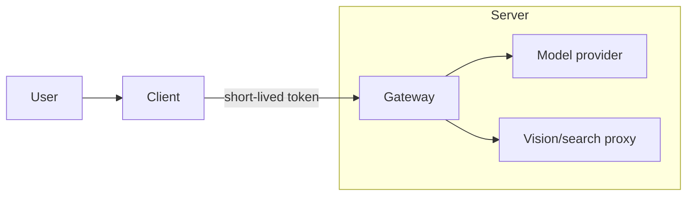
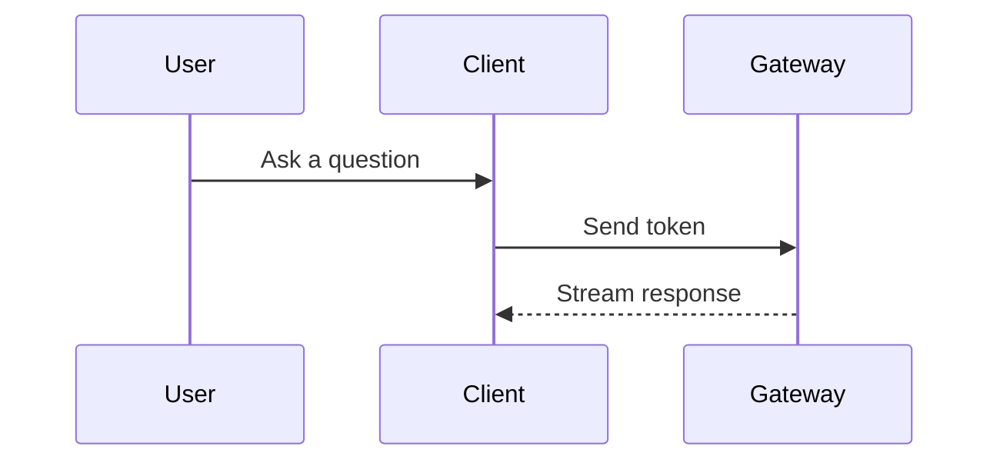

# Diagram generation (Mermaid first, SVG fallback)

For structural diagrams such as relationships, processes, systems, and data, do
**not** use bitmap image generation. Bitmap diagrams blur when scaled and are not
editable. Use one of these vector paths instead.

## Decision

1. **Can Mermaid express it → use Mermaid**. The chat UI renders
   ` ```mermaid ` blocks natively. Mermaid is clear, theme-aware, scalable, and
   does not require generating a separate file. It covers most flowcharts,
   sequence diagrams, state diagrams, architecture diagrams, ER diagrams, Gantt
   charts, mind maps, class diagrams, and pie charts.
2. **Mermaid cannot express the required custom layout → write SVG** for precise
   layout, custom icons, information graphics, geometric/spatial diagrams, or
   branded visuals.
3. Not a diagram? Defer to the intent router's "Visual / graphic output" rubric:
   perceptual/creative work (people, scenes, posters, textures) → `lily-image-generation`;
   a real, usable UI or web page → `frontend-design` (code), not a diagram or a picture.

## Mermaid (preferred)

Output a ` ```mermaid ` code block directly. Do not save a file and do not
convert it to an image. Choose the diagram type based on the task:

| Need | Mermaid type |
|---|---|
| Process / decision / steps | `flowchart TD` or `flowchart LR` |
| Interaction / call sequence | `sequenceDiagram` |
| State transitions | `stateDiagram-v2` |
| System / module architecture | `flowchart` with `subgraph` |
| Database entity relationships | `erDiagram` |
| Project schedule | `gantt` |
| Mind map / outline | `mindmap` |
| Class / object structure | `classDiagram` |
| Ratios | `pie` |

Quality requirements: keep node labels concise; use `subgraph` for hierarchy or
grouping; label important edges, for example `A -->|yes| B`; keep direction
consistent. Use the user's current language for diagram labels unless the user
asks otherwise.

Architecture example:



Sequence example:



## SVG (only when Mermaid cannot express it)

Write a valid, self-contained SVG to `generated-assets/<name>.svg` in the
workspace. When using Bash to create the file, print a generated-media
declaration after the file is written:

```xml
<generated_media type="image">
  <file path="/absolute/path/to/generated-assets/name.svg" />
</generated_media>
```

Reply with a local preview such as ``; do not give
only a path.

Rules:

- Include a `viewBox`; do not hard-code `width` or `height`.
- Use a system font stack such as
  `font-family="-apple-system, 'PingFang SC', 'Microsoft YaHei', system-ui, sans-serif"`.
- Use a restrained palette, consistent spacing, and enough whitespace.
- Define reusable arrows with `<marker>`.
- Keep text aligned and readable, font size at least 12.
- Treat text layout as a first-class constraint: every visible label must have
  its own safe text box, and labels must not overlap nodes, arrows, or each
  other. Never stack multiple labels at the same `x,y` coordinate.
- For labels longer than roughly 12 CJK characters or 22 Latin characters, wrap
  them into multiple `<tspan>` lines with explicit `x` and increasing `dy`
  values, or widen the node. Do not rely on SVG auto-wrap; it does not exist.
- Size nodes from the text they contain: leave at least 12 px horizontal padding
  and 8 px vertical padding around every label. Prefer taller nodes over dense
  text.
- After writing the SVG, inspect it visually or run the platform verification
  hook. If any text overlaps, overflows, or becomes unreadable, revise the
  layout before replying.
- Use static SVG only: no scripts and no external resource references.

Minimal skeleton:

```svg
<svg xmlns="http://www.w3.org/2000/svg" viewBox="0 0 480 200" font-family="-apple-system,'PingFang SC','Microsoft YaHei',sans-serif">
  <defs>
    <marker id="arrow" markerWidth="10" markerHeight="10" refX="8" refY="3" orient="auto">
      <path d="M0,0 L8,3 L0,6 Z" fill="#475569"/>
    </marker>
  </defs>
  <rect x="24" y="70" width="120" height="56" rx="10" fill="#eff6ff" stroke="#3b82f6"/>
  <text x="84" y="103" text-anchor="middle" font-size="14" fill="#1e293b">Input</text>
  <line x1="144" y1="98" x2="320" y2="98" stroke="#475569" stroke-width="1.5" marker-end="url(#arrow)"/>
  <rect x="320" y="70" width="120" height="56" rx="10" fill="#ecfdf5" stroke="#10b981"/>
  <text x="380" y="103" text-anchor="middle" font-size="14" fill="#1e293b">Output</text>
</svg>
```

## Do not

- Do not use `lily-image-generation` for flowcharts, architecture diagrams, or
  data charts.
- Do not hand-write SVG when Mermaid can express the diagram. SVG is only for
  custom layouts Mermaid cannot handle.
