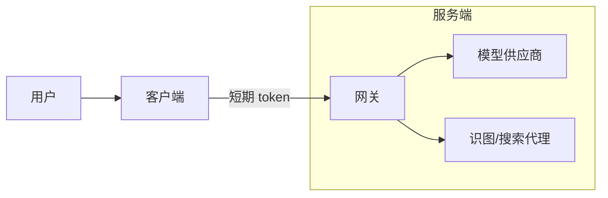
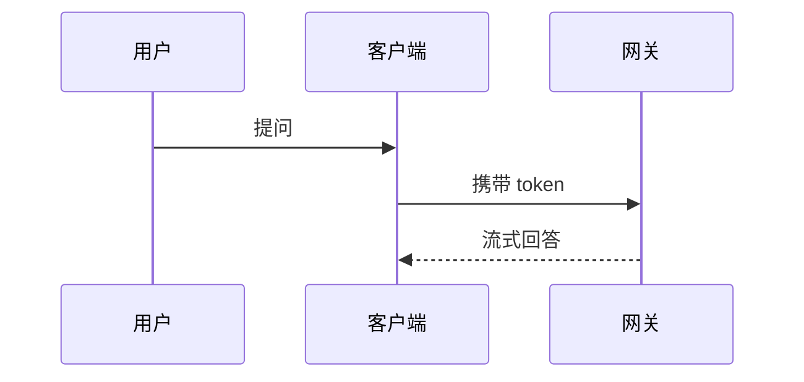

# 图示生成（Mermaid 优先，SVG 兜底）

“结构 / 关系 / 流程 / 数据”类图示**不要用位图模型**（线条糊、不可编辑、不可缩放）。本技能给出当前产品下最优的两条矢量路径。

## 决策

1. **能用 Mermaid 表达 → 用 Mermaid**（首选）。聊天界面会把 ` ```mermaid ` 代码块**原生渲染成图**，清晰、自动适配主题、无需生成文件。覆盖绝大多数：流程、时序、状态、架构、ER、甘特、思维导图、类图、饼图。
2. **Mermaid 表达不了的自定义矢量 → 写 SVG**：精确版式、自定义图标/信息图、几何/空间示意、品牌化图形。
3. 画面/质感（人物、海报、插画、产品图）才用 `lily-image-generation` 位图。

## 一、Mermaid（首选）

直接输出一个 ` ```mermaid ` 代码块即可，**不要**保存文件、不要转图片。按需求选类型：

| 需求 | Mermaid 类型 |
|---|---|
| 流程 / 决策 / 步骤 | `flowchart TD`（竖）/ `LR`（横） |
| 交互 / 调用时序 | `sequenceDiagram` |
| 状态流转 | `stateDiagram-v2` |
| 系统 / 模块架构 | `flowchart` + `subgraph` 分组 |
| 数据库实体关系 | `erDiagram` |
| 项目排期 | `gantt` |
| 思维导图 / 大纲 | `mindmap` |
| 类 / 对象结构 | `classDiagram` |
| 占比 | `pie` |

质量要求：节点文字简洁；用 `subgraph` 表达分层/分组；关键边加文字标签（`A -->|是| B`）；方向统一；中文直接写在节点里。

示例（架构）：



示例（时序）：



## 二、SVG（Mermaid 表达不了时）

写**规范、自包含**的 SVG，存到工作区 `generated-assets/<名称>.svg`，回复用本地预览 ``（与图片一致：给预览，别只给路径；界面能渲染本地 SVG）。

规范：

- 必带 `viewBox`，**不要**写死 `width/height`（保证可缩放）。
- 字体用通用族，确保中文可渲染：`font-family="-apple-system, 'PingFang SC', 'Microsoft YaHei', system-ui, sans-serif"`。
- 配色克制（1 个主色 + 1 个强调色 + 中性灰），统一圆角与间距，留白充足。
- 箭头用 `<marker>` 定义复用；文字与图形对齐居中、字号 ≥ 12。
- 纯静态、无脚本、无外部资源引用。

最小骨架：

```svg
<svg xmlns="http://www.w3.org/2000/svg" viewBox="0 0 480 200" font-family="-apple-system,'PingFang SC','Microsoft YaHei',sans-serif">
  <defs>
    <marker id="arrow" markerWidth="10" markerHeight="10" refX="8" refY="3" orient="auto">
      <path d="M0,0 L8,3 L0,6 Z" fill="#475569"/>
    </marker>
  </defs>
  <rect x="24" y="70" width="120" height="56" rx="10" fill="#eff6ff" stroke="#3b82f6"/>
  <text x="84" y="103" text-anchor="middle" font-size="14" fill="#1e293b">输入</text>
  <line x1="144" y1="98" x2="320" y2="98" stroke="#475569" stroke-width="1.5" marker-end="url(#arrow)"/>
  <rect x="320" y="70" width="120" height="56" rx="10" fill="#ecfdf5" stroke="#10b981"/>
  <text x="380" y="103" text-anchor="middle" font-size="14" fill="#1e293b">输出</text>
</svg>
```

## 不要做

- 不要用 `lily-image-generation` 画流程图/架构图/图表——位图不可编辑、缩放即糊。
- 能 Mermaid 就别手写 SVG（Mermaid 更快更一致）；SVG 只用于 Mermaid 做不到的自定义版式。
